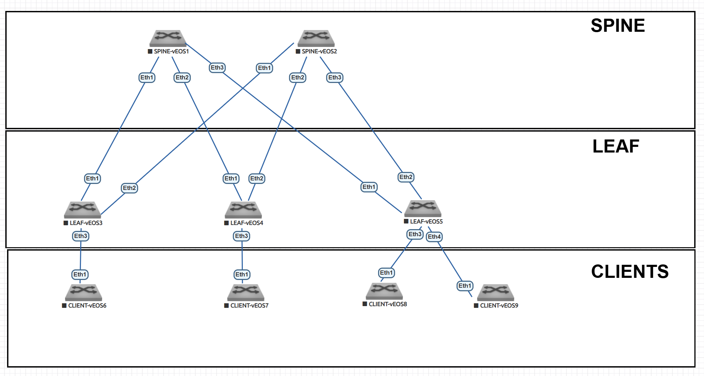

# Проектирование адресного пространства

---

## 1. План работ  

### Настройка Underlay сети  
- [ ] Настройка интерфейсов (порт, IP, MTU)  
- [ ] Настройка Loopback
- [ ] Настройка Hostname


### Тестирование и проверка  
- [ ] Проверка связности PtP между всеми узлами  
- [ ] Проверка таблиц маршрутизации  

---

## 2. Адресное пространство  

### 2.1. Loopback интерфейсы  
**Формат:** `10.255.255.X/32`  

| Устройство | IP-адрес       |
|------------|----------------|
| Spine-1    | 10.255.255.1/32  |
| Spine-2    | 10.255.255.2/32  |
| Leaf-1     | 10.255.255.11/32 |
| Leaf-2     | 10.255.255.12/32 |
| Leaf-3     | 10.255.255.13/32 |

### 2.2. Point-to-Point линки  
**Подсеть:** `10.0.0.0/24`  
**Маска:** `/31`  

| Соединение        | Подсеть       | Устройство | IP-адрес     |
|-------------------|---------------|------------|--------------|
| Spine-1 ↔ Leaf-1  | 10.0.0.0/31   | Spine-1    | 10.0.0.0/31  |
|                   |               | Leaf-1     | 10.0.0.1/31  |
| Spine-1 ↔ Leaf-2  | 10.0.0.2/31   | Spine-1    | 10.0.0.2/31  |
|                   |               | Leaf-2     | 10.0.0.3/31  |
| Spine-1 ↔ Leaf-3  | 10.0.0.4/31   | Spine-1    | 10.0.0.4/31  |
|                   |               | Leaf-3     | 10.0.0.5/31  |
| Spine-2 ↔ Leaf-1  | 10.0.0.6/31   | Spine-2    | 10.0.0.6/31  |
|                   |               | Leaf-1     | 10.0.0.7/31  |
| Spine-2 ↔ Leaf-2  | 10.0.0.8/31   | Spine-2    | 10.0.0.8/31  |
|                   |               | Leaf-2     | 10.0.0.9/31  |
| Spine-2 ↔ Leaf-3  | 10.0.0.10/31  | Spine-2    | 10.0.0.10/31 |
|                   |               | Leaf-3     | 10.0.0.11/31 |

---

### 3 Топология  



### 3.1 Таблица интерфейсов  

| Устройство | Интерфейс | Назначение | IP адрес       |
|------------|-----------|------------|----------------|
| **Spine-1**| Eth1/1    | К Leaf-1   | 10.0.0.0/31    |
|            | Eth1/2    | К Leaf-2   | 10.0.0.2/31    |
|            | Eth1/3    | К Leaf-3   | 10.0.0.4/31    |
|            | Lo0       | Loopback   | 10.255.255.1/32|
| **Spine-2**| Eth1/1    | К Leaf-1   | 10.0.0.6/31    |
|            | Eth1/2    | К Leaf-2   | 10.0.0.8/31    |
|            | Eth1/3    | К Leaf-3   | 10.0.0.10/31   |
|            | Lo0       | Loopback   | 10.255.255.2/32|
| **Leaf-1** | Eth1/1    | К Spine-1  | 10.0.0.1/31    |
|            | Eth1/2    | К Spine-2  | 10.0.0.7/31    |
|            | Lo0       | Loopback   | 10.255.255.11/32|
| **Leaf-2** | Eth1/1    | К Spine-1  | 10.0.0.3/31    |
|            | Eth1/2    | К Spine-2  | 10.0.0.9/31    |
|            | Lo0       | Loopback   | 10.255.255.12/32|
| **Leaf-3** | Eth1/1    | К Spine-1  | 10.0.0.5/31    |
|            | Eth1/2    | К Spine-2  | 10.0.0.11/31   |
|            | Lo0       | Loopback   | 10.255.255.13/32|


## 4. Конфигурация интерфейсов 

### 4.1. SPINE-1 
```
SPINE-1#show running-config interfaces ethernet 1
interface Ethernet1
   description TO-LEAF-1
   mtu 9000
   no switchport
   ip address 10.0.0.0/31
SPINE-1#show running-config interfaces ethernet 2
interface Ethernet2
   description TO-LEAF-2
   mtu 9000
   no switchport
   ip address 10.0.0.2/31
SPINE-1#show running-config interfaces ethernet 3
interface Ethernet3
   description TO-LEAF-3
   mtu 9000
   no switchport
   ip address 10.0.0.4/31
SPINE-1#show running-config interfaces loopback 0
interface Loopback0
   ip address 10.255.255.1/32

```
### 4.2. SPINE-2
```
SPINE-2#show running-config interfaces ethernet 1
interface Ethernet1
   description TO-LEAF-1
   mtu 9000
   no switchport
   ip address 10.0.0.6/31
SPINE-2#show running-config interfaces ethernet 2
interface Ethernet2
   description TO-LEAF-2
   mtu 9000
   no switchport
   ip address 10.0.0.8/31
SPINE-2#show running-config interfaces ethernet 3
interface Ethernet3
   description TO-LEAF-3
   mtu 9000
   no switchport
   ip address 10.0.0.10/31
SPINE-2#show running-config interfaces loopback 0
interface Loopback0
   ip address 10.255.255.2/32

```
### 4.3. LEAF-1
```
LEAF-1#show running-config interfaces ethernet 1
interface Ethernet1
   description TO-SPINE-1
   mtu 9000
   no switchport
   ip address 10.0.0.1/31
LEAF-1#show running-config interfaces ethernet 2
interface Ethernet2
   description TO-SPINE-2
   mtu 9000
   no switchport
   ip address 10.0.0.7/31
LEAF-1#show running-config interfaces loopback 0
interface Loopback0
   ip address 10.255.255.11/32

```
### 4.4. LEAF-2
```
LEAF-2#show running-config interfaces ethernet 1
interface Ethernet1
   description TO-SPINE-1
   mtu 9000
   no switchport
   ip address 10.0.0.3/31
LEAF-2#show running-config interfaces ethernet 2
interface Ethernet2
   description TO-SPINE-2
   mtu 9000
   no switchport
   ip address 10.0.0.9/31
LEAF-2#show running-config interfaces loopback 0
interface Loopback0
   ip address 10.255.255.12/32

```
### 4.5. LEAF-3
```
LEAF-3#show running-config interfaces ethernet 1
interface Ethernet1
   description TO-SPINE-1
   mtu 9000
   no switchport
   ip address 10.0.0.5/31
LEAF-3#show running-config interfaces ethernet 2
interface Ethernet2
   description TO-SPINE-2
   mtu 9000
   no switchport
   ip address 10.0.0.11/31
LEAF-3#show running-config interfaces loopback 0
interface Loopback0
   ip address 10.255.255.13/32

```
