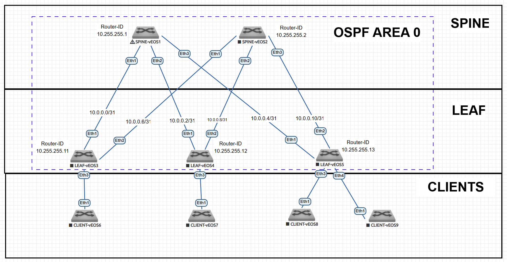

# Underlay. OSPF
## ЦЕЛЬ: Настроить OSPF для Underlay сети.

---

## 1. План работ  

### Этап 1: Настройка Underlay сети на OSPF
- [ ] Настройка OSPF  
- [ ] Настройка BFD  
- [ ] Проверка смежности OSPF  

### Этап 2: Тестирование и проверка  
- [ ] Проверка связности между всеми Loopback адресами   
- [ ] Проверка таблиц маршрутизации  
- [ ] Тестирование отказоустойчивости  
- [ ] Документирование конфигураций  

---

## 2. Адресное пространство  

### 2.1. Loopback интерфейсы  
**Формат:** `10.255.255.X/32`  

| Устройство | IP-адрес       | Router ID      |
|------------|----------------|----------------|
| Spine-1    | 10.255.255.1/32  | 10.255.255.1    |
| Spine-2    | 10.255.255.2/32  | 10.255.255.2    |
| Leaf-1     | 10.255.255.11/32 | 10.255.255.11   |
| Leaf-2     | 10.255.255.12/32 | 10.255.255.12   |
| Leaf-3     | 10.255.255.13/32 | 10.255.255.13   |

### 2.2. Point-to-Point линки  
**Подсеть:** `10.0.0.0/24`  
**Маска:** `/31`  

| Соединение        | Подсеть       | Устройство | IP-адрес     |
|-------------------|---------------|------------|--------------|
| Spine-1 ↔ Leaf-1  | 10.0.0.0/31   | Spine-1    | 10.0.0.0/31  |
|                   |               | Leaf-1     | 10.0.0.1/31  |
| Spine-1 ↔ Leaf-2  | 10.0.0.2/31   | Spine-1    | 10.0.0.2/31  |
|                   |               | Leaf-2     | 10.0.0.3/31  |
| Spine-1 ↔ Leaf-3  | 10.0.0.4/31   | Spine-1    | 10.0.0.4/31  |
|                   |               | Leaf-3     | 10.0.0.5/31  |
| Spine-2 ↔ Leaf-1  | 10.0.0.6/31   | Spine-2    | 10.0.0.6/31  |
|                   |               | Leaf-1     | 10.0.0.7/31  |
| Spine-2 ↔ Leaf-2  | 10.0.0.8/31   | Spine-2    | 10.0.0.8/31  |
|                   |               | Leaf-2     | 10.0.0.9/31  |
| Spine-2 ↔ Leaf-3  | 10.0.0.10/31  | Spine-2    | 10.0.0.10/31 |
|                   |               | Leaf-3     | 10.0.0.11/31 |

---

## 3. Схема Underlay сети на OSPF  

### 3.1. Топология  




### 3.2. Параметры OSPF 

#### Общие настройки:  
- **OSPF Process:** `1`  
- **Router ID:** Соответствует Loopback адресу  
- **Все интерфейсы:** 
   - Area 0 (Backbone)
   - По умолчанию в режиме passive (не устанавливают соседство)   
- **Таймеры:**  
  - Hello-interval: `1 сек` (по умолчанию)
  - Dead-interval: `4 сек`  (по умолчанию)
  - BFD: Включен 
- **Все линки Spine-Leaf:** Point-to-Point  

### 3.3. Таблица интерфейсов и OSPF настроек  

| Устройство | Интерфейс | Назначение | IP адрес       | OSPF настройки                    |
|------------|-----------|------------|----------------|-----------------------------------|
| **Spine-1**| Eth1/1    | К Leaf-1   | 10.0.0.0/31    | network point-to-point |
|            | Eth1/2    | К Leaf-2   | 10.0.0.2/31    | network point-to-point |
|            | Eth1/3    | К Leaf-3   | 10.0.0.4/31    | network point-to-point |
|            | Lo0       | Loopback   | 10.255.255.1/32| passive               |
| **Spine-2**| Eth1/1    | К Leaf-1   | 10.0.0.6/31    | network point-to-point |
|            | Eth1/2    | К Leaf-2   | 10.0.0.8/31    | network point-to-point |
|            | Eth1/3    | К Leaf-3   | 10.0.0.10/31   | network point-to-point |
|            | Lo0       | Loopback   | 10.255.255.2/32| passive               |
| **Leaf-1** | Eth1/1    | К Spine-1  | 10.0.0.1/31    | network point-to-point |
|            | Eth1/2    | К Spine-2  | 10.0.0.7/31    | network point-to-point |
|            | Lo0       | Loopback   | 10.255.255.11/32| passive              |
| **Leaf-2** | Eth1/1    | К Spine-1  | 10.0.0.3/31    | network point-to-point |
|            | Eth1/2    | К Spine-2  | 10.0.0.9/31    | network point-to-point |
|            | Lo0       | Loopback   | 10.255.255.12/32| passive              |
| **Leaf-3** | Eth1/1    | К Spine-1  | 10.0.0.5/31    | network point-to-point |
|            | Eth1/2    | К Spine-2  | 10.0.0.11/31   | network point-to-point |
|            | Lo0       | Loopback   | 10.255.255.13/32| passive              |

### 3.4. Дополнительные параметры  
- Для включения маршрутизации на коммутаторе Arista vEOS необходим ввести команду ip routing

---
### 4. Конфигурация OSPF на устройствах 

### 4.1. SPINE-1 
```
hostname SPINE-vEOS-1
interface Ethernet1
   ip ospf network point-to-point
interface Ethernet2
   ip ospf network point-to-point
interface Ethernet3
   ip ospf network point-to-point
router ospf 1
   router-id 10.255.255.1
   bfd default
   passive-interface default
   no passive-interface Ethernet1
   no passive-interface Ethernet2
   no passive-interface Ethernet3
   network 0.0.0.0/0 area 0.0.0.0
   max-lsa 12000
```
### 4.2. SPINE-2
```
interface Ethernet1
   ip ospf network point-to-point
interface Ethernet2
   ip ospf network point-to-point
interface Ethernet3
   ip ospf network point-to-point
router ospf 1
   router-id 10.255.255.2
   bfd default
   passive-interface default
   no passive-interface Ethernet1
   no passive-interface Ethernet2
   no passive-interface Ethernet3
   network 0.0.0.0/0 area 0.0.0.0
   max-lsa 12000
```
### 4.3. LEAF-1
```
interface Ethernet1
   ip ospf network point-to-point
interface Ethernet2
   ip ospf network point-to-point
router ospf 1
   router-id 10.255.255.11
   bfd default
   passive-interface default
   no passive-interface Ethernet1
   no passive-interface Ethernet2
   network 0.0.0.0/0 area 0.0.0.0
   max-lsa 12000
```
### 4.4. LEAF-2
```
interface Ethernet1
   ip ospf network point-to-point
interface Ethernet2
   ip ospf network point-to-point
router ospf 1
   router-id 10.255.255.12
   bfd default
   passive-interface default
   no passive-interface Ethernet1
   no passive-interface Ethernet2
   network 0.0.0.0/0 area 0.0.0.0
   max-lsa 12000
```
### 4.5. LEAF-3
```
interface Ethernet1
   ip ospf network point-to-point
interface Ethernet2
   ip ospf network point-to-point
router ospf 1
   router-id 10.255.255.13
   bfd default
   passive-interface default
   no passive-interface Ethernet1
   no passive-interface Ethernet2
   network 0.0.0.0/0 area 0.0.0.0
   max-lsa 12000
```
### 5. Проверка состояния OSPF 

### 5.1. SPINE-1 
Соседство OSPF
```
SPINE-vEOS-1#show ip ospf neighbor
Neighbor ID     Instance VRF      Pri State                  Dead Time   Addrese
10.255.255.11   1        default  0   FULL                   00:00:38    10.0.01
10.255.255.12   1        default  1   FULL                   00:00:31    10.0.02
10.255.255.13   1        default  0   FULL                   00:00:31    10.0.03
```
Соседство BFD
```
SPINE-vEOS-1#show bfd peers
VRF name: default
-----------------
DstAddr       MyDisc    YourDisc  Interface/Transport    Type           LastUp
--------- ----------- ----------- -------------------- ------- ----------------
10.0.0.1  1316004463  1824119186        Ethernet1(13)  normal   12/17/25 18:18
10.0.0.3  3278182074  2566539530        Ethernet2(14)  normal   12/17/25 18:22
10.0.0.5  2008183221   955620451        Ethernet3(15)  normal   12/17/25 18:25

   LastDown            LastDiag    State
-------------- ------------------- -----
         NA       No Diagnostic       Up
         NA       No Diagnostic       Up
         NA       No Diagnostic       Up
```
### 5.2. SPINE-2
```
SPINE-vEOS-2#show ip ospf neighbor
Neighbor ID     Instance VRF      Pri State                  Dead Time   Addrese
10.255.255.11   1        default  0   FULL                   00:00:31    10.0.01
10.255.255.12   1        default  1   FULL                   00:00:34    10.0.02
10.255.255.13   1        default  0   FULL                   00:00:37    10.0.03
```
Соседство BFD
```
SPINE-vEOS-2#show bfd peers
VRF name: default
-----------------
DstAddr        MyDisc    YourDisc  Interface/Transport    Type          LastUp
---------- ----------- ----------- -------------------- ------- ---------------
10.0.0.7   3108122612  4231125719        Ethernet1(13)  normal  12/17/25 18:21
10.0.0.9   3168495099  2747472736        Ethernet2(14)  normal  12/17/25 18:22
10.0.0.11  1307707434  2114337017        Ethernet3(15)  normal  12/17/25 18:25

   LastDown            LastDiag    State
-------------- ------------------- -----
         NA       No Diagnostic       Up
         NA       No Diagnostic       Up
         NA       No Diagnostic       Up
```
### 5.3. LEAF-1
Таблица маршрутизации на leaf-1 (виден ecmp для удалённых leaf)
```
LEAF-vEOS-1#show ip route

VRF: default
Codes: C - connected, S - static, K - kernel,
       O - OSPF, IA - OSPF inter area, E1 - OSPF external type 1,
       E2 - OSPF external type 2, N1 - OSPF NSSA external type 1,
       N2 - OSPF NSSA external type2, B - Other BGP Routes,
       B I - iBGP, B E - eBGP, R - RIP, I L1 - IS-IS level 1,
       I L2 - IS-IS level 2, O3 - OSPFv3, A B - BGP Aggregate,
       A O - OSPF Summary, NG - Nexthop Group Static Route,
       V - VXLAN Control Service, M - Martian,
       DH - DHCP client installed default route,
       DP - Dynamic Policy Route, L - VRF Leaked,
       G  - gRIBI, RC - Route Cache Route

Gateway of last resort is not set

 C        10.0.0.0/31 is directly connected, Ethernet1
 O        10.0.0.2/31 [110/20] via 10.0.0.0, Ethernet1
 O        10.0.0.4/31 [110/20] via 10.0.0.0, Ethernet1
 C        10.0.0.6/31 is directly connected, Ethernet2
 O        10.0.0.8/31 [110/20] via 10.0.0.6, Ethernet2
 O        10.0.0.10/31 [110/20] via 10.0.0.6, Ethernet2
 O        10.255.255.1/32 [110/20] via 10.0.0.0, Ethernet1
 O        10.255.255.2/32 [110/20] via 10.0.0.6, Ethernet2
 C        10.255.255.11/32 is directly connected, Loopback0
 O        10.255.255.12/32 [110/30] via 10.0.0.0, Ethernet1
                                    via 10.0.0.6, Ethernet2
 O        10.255.255.13/32 [110/30] via 10.0.0.0, Ethernet1
                                    via 10.0.0.6, Ethernet2

```
Проверка доступности лупбэк других leaf
```
LEAF-vEOS-1#ping 10.255.255.12
PING 10.255.255.12 (10.255.255.12) 72(100) bytes of data.
80 bytes from 10.255.255.12: icmp_seq=1 ttl=63 time=29.7 ms
80 bytes from 10.255.255.12: icmp_seq=2 ttl=63 time=33.0 ms
80 bytes from 10.255.255.12: icmp_seq=3 ttl=63 time=29.6 ms
80 bytes from 10.255.255.12: icmp_seq=4 ttl=63 time=24.7 ms
80 bytes from 10.255.255.12: icmp_seq=5 ttl=63 time=23.3 ms

--- 10.255.255.12 ping statistics ---
5 packets transmitted, 5 received, 0% packet loss, time 91ms
rtt min/avg/max/mdev = 23.301/28.102/33.048/3.567 ms, pipe 3, ipg/ewma 22.806/2s
LEAF-vEOS-1#
LEAF-vEOS-1#ping 10.255.255.13
PING 10.255.255.13 (10.255.255.13) 72(100) bytes of data.
80 bytes from 10.255.255.13: icmp_seq=1 ttl=63 time=58.0 ms
80 bytes from 10.255.255.13: icmp_seq=2 ttl=63 time=56.1 ms
80 bytes from 10.255.255.13: icmp_seq=3 ttl=63 time=53.4 ms
80 bytes from 10.255.255.13: icmp_seq=4 ttl=63 time=50.3 ms
80 bytes from 10.255.255.13: icmp_seq=5 ttl=63 time=47.8 ms

--- 10.255.255.13 ping statistics ---
5 packets transmitted, 5 received, 0% packet loss, time 53ms
rtt min/avg/max/mdev = 47.879/53.175/58.069/3.725 ms, pipe 5, ipg/ewma 13.459/5s

```

### 5.4. LEAF-2
Таблица маршрутизации на leaf-1 (виден ecmp для удалённых leaf)
```
LEAF-vEOS-2#show ip route

VRF: default
Codes: C - connected, S - static, K - kernel,
       O - OSPF, IA - OSPF inter area, E1 - OSPF external type 1,
       E2 - OSPF external type 2, N1 - OSPF NSSA external type 1,
       N2 - OSPF NSSA external type2, B - Other BGP Routes,
       B I - iBGP, B E - eBGP, R - RIP, I L1 - IS-IS level 1,
       I L2 - IS-IS level 2, O3 - OSPFv3, A B - BGP Aggregate,
       A O - OSPF Summary, NG - Nexthop Group Static Route,
       V - VXLAN Control Service, M - Martian,
       DH - DHCP client installed default route,
       DP - Dynamic Policy Route, L - VRF Leaked,
       G  - gRIBI, RC - Route Cache Route

Gateway of last resort is not set

 O        10.0.0.0/31 [110/20] via 10.0.0.2, Ethernet1
 C        10.0.0.2/31 is directly connected, Ethernet1
 O        10.0.0.4/31 [110/20] via 10.0.0.2, Ethernet1
 O        10.0.0.6/31 [110/20] via 10.0.0.8, Ethernet2
 C        10.0.0.8/31 is directly connected, Ethernet2
 O        10.0.0.10/31 [110/20] via 10.0.0.8, Ethernet2
 O        10.255.255.1/32 [110/20] via 10.0.0.2, Ethernet1
 O        10.255.255.2/32 [110/20] via 10.0.0.8, Ethernet2
 O        10.255.255.11/32 [110/30] via 10.0.0.2, Ethernet1
                                    via 10.0.0.8, Ethernet2
 C        10.255.255.12/32 is directly connected, Loopback0
 O        10.255.255.13/32 [110/30] via 10.0.0.2, Ethernet1
                                    via 10.0.0.8, Ethernet2

```
Проверка доступности лупбэк других leaf
```
LEAF-vEOS-2#ping 10.255.255.11
PING 10.255.255.11 (10.255.255.11) 72(100) bytes of data.
80 bytes from 10.255.255.11: icmp_seq=1 ttl=63 time=29.5 ms
80 bytes from 10.255.255.11: icmp_seq=2 ttl=63 time=31.7 ms
80 bytes from 10.255.255.11: icmp_seq=3 ttl=63 time=35.1 ms
80 bytes from 10.255.255.11: icmp_seq=4 ttl=63 time=46.7 ms
80 bytes from 10.255.255.11: icmp_seq=5 ttl=63 time=46.3 ms

--- 10.255.255.11 ping statistics ---
5 packets transmitted, 5 received, 0% packet loss, time 108ms
rtt min/avg/max/mdev = 29.528/37.898/46.735/7.286 ms, pipe 2, ipg/ewma 27.041/3s
LEAF-vEOS-2#ping 10.255.255.13
PING 10.255.255.13 (10.255.255.13) 72(100) bytes of data.
80 bytes from 10.255.255.13: icmp_seq=1 ttl=63 time=29.9 ms
80 bytes from 10.255.255.13: icmp_seq=2 ttl=63 time=35.7 ms
80 bytes from 10.255.255.13: icmp_seq=3 ttl=63 time=35.8 ms
80 bytes from 10.255.255.13: icmp_seq=4 ttl=63 time=43.5 ms
80 bytes from 10.255.255.13: icmp_seq=5 ttl=63 time=33.0 ms

--- 10.255.255.13 ping statistics ---
5 packets transmitted, 5 received, 0% packet loss, time 93ms
rtt min/avg/max/mdev = 29.930/35.620/43.521/4.504 ms, pipe 3, ipg/ewma 23.337/3s
```
### 5.5. LEAF-3
Таблица маршрутизации на leaf-1 (виден ecmp для удалённых leaf)
```
LEAF-vEOS-3#show ip route

VRF: default
Codes: C - connected, S - static, K - kernel,
       O - OSPF, IA - OSPF inter area, E1 - OSPF external type 1,
       E2 - OSPF external type 2, N1 - OSPF NSSA external type 1,
       N2 - OSPF NSSA external type2, B - Other BGP Routes,
       B I - iBGP, B E - eBGP, R - RIP, I L1 - IS-IS level 1,
       I L2 - IS-IS level 2, O3 - OSPFv3, A B - BGP Aggregate,
       A O - OSPF Summary, NG - Nexthop Group Static Route,
       V - VXLAN Control Service, M - Martian,
       DH - DHCP client installed default route,
       DP - Dynamic Policy Route, L - VRF Leaked,
       G  - gRIBI, RC - Route Cache Route

Gateway of last resort is not set

 O        10.0.0.0/31 [110/20] via 10.0.0.4, Ethernet1
 O        10.0.0.2/31 [110/20] via 10.0.0.4, Ethernet1
 C        10.0.0.4/31 is directly connected, Ethernet1
 O        10.0.0.6/31 [110/20] via 10.0.0.10, Ethernet2
 O        10.0.0.8/31 [110/20] via 10.0.0.10, Ethernet2
 C        10.0.0.10/31 is directly connected, Ethernet2
 O        10.255.255.1/32 [110/20] via 10.0.0.4, Ethernet1
 O        10.255.255.2/32 [110/20] via 10.0.0.10, Ethernet2
 O        10.255.255.11/32 [110/30] via 10.0.0.4, Ethernet1
                                    via 10.0.0.10, Ethernet2
 O        10.255.255.12/32 [110/30] via 10.0.0.4, Ethernet1
                                    via 10.0.0.10, Ethernet2
 C        10.255.255.13/32 is directly connected, Loopback0

```
Проверка доступности лупбэк других leaf
```
LEAF-vEOS-3#ping 10.255.255.11
PING 10.255.255.11 (10.255.255.11) 72(100) bytes of data.
80 bytes from 10.255.255.11: icmp_seq=1 ttl=63 time=72.7 ms
80 bytes from 10.255.255.11: icmp_seq=2 ttl=63 time=66.4 ms
80 bytes from 10.255.255.11: icmp_seq=3 ttl=63 time=64.7 ms
80 bytes from 10.255.255.11: icmp_seq=4 ttl=63 time=61.7 ms
80 bytes from 10.255.255.11: icmp_seq=5 ttl=63 time=64.7 ms

--- 10.255.255.11 ping statistics ---
5 packets transmitted, 5 received, 0% packet loss, time 48ms
rtt min/avg/max/mdev = 61.794/66.101/72.799/3.672 ms, pipe 5, ipg/ewma 12.033/6s
LEAF-vEOS-3#ping 10.255.255.12
PING 10.255.255.12 (10.255.255.12) 72(100) bytes of data.
80 bytes from 10.255.255.12: icmp_seq=1 ttl=63 time=45.5 ms
80 bytes from 10.255.255.12: icmp_seq=2 ttl=63 time=104 ms
80 bytes from 10.255.255.12: icmp_seq=3 ttl=63 time=114 ms
80 bytes from 10.255.255.12: icmp_seq=4 ttl=63 time=112 ms
80 bytes from 10.255.255.12: icmp_seq=5 ttl=63 time=67.1 ms

--- 10.255.255.12 ping statistics ---
5 packets transmitted, 5 received, 0% packet loss, time 83ms
rtt min/avg/max/mdev = 45.583/88.767/114.141/27.513 ms, pipe 4, ipg/ewma 20.902s
```

### 6. Тест отказоустойчивости 

Тест отказоустойчивости подключения LEAF к SPINE
- Отключаем SPINE-2 
- Проверяем что соседство LEAF-1 <-> SPINE-2 в состоянии DOWN
```
LEAF-vEOS-1#show ip ospf neighbor adjacency-changes
OSPF instance 1 with ID 10.255.255.11, VRF default
[2025-12-17 18:16:06] 10.255.255.1, interface 'Ethernet1' adjacency established
[2025-12-17 18:18:50] 10.255.255.1, interface 'Ethernet1' adjacency dropped: DDh
[2025-12-17 18:18:51] 10.255.255.1, interface 'Ethernet1' adjacency established
[2025-12-17 18:21:15] 10.255.255.2, interface 'Ethernet2' adjacency established
[2025-12-17 19:02:18] 10.255.255.2, interface 'Ethernet2' adjacency dropped: Bfn

LEAF-vEOS-1#show ip ospf neighbor
Neighbor ID     Instance VRF      Pri State                  Dead Time   Addrese
10.255.255.1    1        default  0   FULL                   00:00:29    10.0.01
```
- Проверяем, что доступ к LEAF-2, LEAF-3 сохранился через SPINE-1
```
LEAF-vEOS-1#show ip route

VRF: default
Codes: C - connected, S - static, K - kernel,
       O - OSPF, IA - OSPF inter area, E1 - OSPF external type 1,
       E2 - OSPF external type 2, N1 - OSPF NSSA external type 1,
       N2 - OSPF NSSA external type2, B - Other BGP Routes,
       B I - iBGP, B E - eBGP, R - RIP, I L1 - IS-IS level 1,
       I L2 - IS-IS level 2, O3 - OSPFv3, A B - BGP Aggregate,
       A O - OSPF Summary, NG - Nexthop Group Static Route,
       V - VXLAN Control Service, M - Martian,
       DH - DHCP client installed default route,
       DP - Dynamic Policy Route, L - VRF Leaked,
       G  - gRIBI, RC - Route Cache Route

Gateway of last resort is not set

 C        10.0.0.0/31 is directly connected, Ethernet1
 O        10.0.0.2/31 [110/20] via 10.0.0.0, Ethernet1
 O        10.0.0.4/31 [110/20] via 10.0.0.0, Ethernet1
 C        10.0.0.6/31 is directly connected, Ethernet2
 O        10.0.0.8/31 [110/30] via 10.0.0.0, Ethernet1
 O        10.0.0.10/31 [110/30] via 10.0.0.0, Ethernet1
 O        10.255.255.1/32 [110/20] via 10.0.0.0, Ethernet1
 C        10.255.255.11/32 is directly connected, Loopback0
 O        10.255.255.12/32 [110/30] via 10.0.0.0, Ethernet1
 O        10.255.255.13/32 [110/30] via 10.0.0.0, Ethernet1

LEAF-vEOS-1#ping 10.255.255.12
PING 10.255.255.12 (10.255.255.12) 72(100) bytes of data.
80 bytes from 10.255.255.12: icmp_seq=1 ttl=63 time=32.2 ms
80 bytes from 10.255.255.12: icmp_seq=2 ttl=63 time=32.6 ms
80 bytes from 10.255.255.12: icmp_seq=3 ttl=63 time=35.9 ms
80 bytes from 10.255.255.12: icmp_seq=4 ttl=63 time=27.2 ms
80 bytes from 10.255.255.12: icmp_seq=5 ttl=63 time=25.8 ms

--- 10.255.255.12 ping statistics ---
5 packets transmitted, 5 received, 0% packet loss, time 113ms
rtt min/avg/max/mdev = 25.833/30.788/35.995/3.728 ms, pipe 2, ipg/ewma 28.299/3s
LEAF-vEOS-1#ping 10.255.255.13
PING 10.255.255.13 (10.255.255.13) 72(100) bytes of data.
80 bytes from 10.255.255.13: icmp_seq=1 ttl=63 time=47.8 ms
80 bytes from 10.255.255.13: icmp_seq=2 ttl=63 time=66.8 ms
80 bytes from 10.255.255.13: icmp_seq=3 ttl=63 time=60.4 ms
80 bytes from 10.255.255.13: icmp_seq=4 ttl=63 time=65.4 ms
80 bytes from 10.255.255.13: icmp_seq=5 ttl=63 time=64.6 ms

--- 10.255.255.13 ping statistics ---
5 packets transmitted, 5 received, 0% packet loss, time 45ms
rtt min/avg/max/mdev = 47.854/61.058/66.853/6.944 ms, pipe 5, ipg/ewma 11.401/5s
```

Отказоустойчивость работает, у LEAF-1 по прежнему сохраняется связь со всеми LEAF