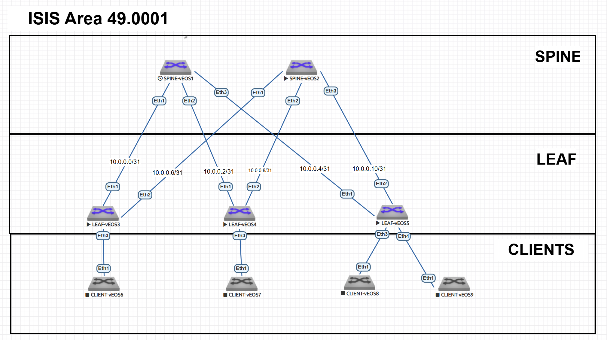

# Underlay сеть на ISIS  

---

## 1. План работ  

### Настройка Underlay сети  
- [ ] Настройка интерфейсов (порт, IP, MTU)  
- [ ] Настройка ISIS  
- [ ] Настройка BFD 
- [ ] Проверка смежности ISIS  

### Тестирование и проверка  
- [ ] Проверка связности между всеми узлами  
- [ ] Проверка таблиц маршрутизаци
- [ ] Проверка отказоустойчивости   

---

## 2. Адресное пространство  

### 2.1. Loopback интерфейсы  
**Формат:** `10.255.255.X/32`  

| Устройство | IP-адрес       |
|------------|----------------|
| Spine-1    | 10.255.255.1/32  |
| Spine-2    | 10.255.255.2/32  |
| Leaf-1     | 10.255.255.11/32 |
| Leaf-2     | 10.255.255.12/32 |
| Leaf-3     | 10.255.255.13/32 |

### 2.2. Point-to-Point линки  
**Подсеть:** `10.0.0.0/24`  
**Маска:** `/31`  

| Соединение        | Подсеть       | Устройство | IP-адрес     |
|-------------------|---------------|------------|--------------|
| Spine-1 ↔ Leaf-1  | 10.0.0.0/31   | Spine-1    | 10.0.0.0/31  |
|                   |               | Leaf-1     | 10.0.0.1/31  |
| Spine-1 ↔ Leaf-2  | 10.0.0.2/31   | Spine-1    | 10.0.0.2/31  |
|                   |               | Leaf-2     | 10.0.0.3/31  |
| Spine-1 ↔ Leaf-3  | 10.0.0.4/31   | Spine-1    | 10.0.0.4/31  |
|                   |               | Leaf-3     | 10.0.0.5/31  |
| Spine-2 ↔ Leaf-1  | 10.0.0.6/31   | Spine-2    | 10.0.0.6/31  |
|                   |               | Leaf-1     | 10.0.0.7/31  |
| Spine-2 ↔ Leaf-2  | 10.0.0.8/31   | Spine-2    | 10.0.0.8/31  |
|                   |               | Leaf-2     | 10.0.0.9/31  |
| Spine-2 ↔ Leaf-3  | 10.0.0.10/31  | Spine-2    | 10.0.0.10/31 |
|                   |               | Leaf-3     | 10.0.0.11/31 |

---

## 3. Схема Underlay сети на ISIS  

### 3.1. Топология  



### 3.2. Параметры ISIS  

#### Общие настройки:  
- **ISIS Process:** `UNDERLAY`  
- **NET Address:** `49.0001.<Loopback>.00`  
- **Уровень:** Level-2 только
- **Address family:** Ipv4   


#### NET адреса по устройствам:  
| Устройство | NET адрес         |
|------------|-------------------|
| Spine-1    | 49.0102.5525.5001.00   |
| Spine-2    | 49.0102.5525.5002.00   |
| Leaf-1     | 49.0102.5525.5011.00   |
| Leaf-2     | 49.0102.5525.5012.00   |
| Leaf-3     | 49.0102.5525.5013.00   |

#### Настройки интерфейсов:  
- **Тип интерфейса:** Point-to-Point  
- **MTU:** `9000` (для поддержки overlay)  
- **BFD:** Включен 

### 3.3. Таблица интерфейсов  

| Устройство | Интерфейс | Назначение | IP адрес       | ISIS настройки          |
|------------|-----------|------------|----------------|-------------------------|
| **Spine-1**| Eth1/1    | К Leaf-1   | 10.0.0.0/31    | ISIS ptp, metric 10     |
|            | Eth1/2    | К Leaf-2   | 10.0.0.2/31    | ISIS ptp, metric 10     |
|            | Eth1/3    | К Leaf-3   | 10.0.0.4/31    | ISIS ptp, metric 10     |
|            | Lo0       | Loopback   | 10.255.255.1/32| Passive, metric 10       |
| **Spine-2**| Eth1/1    | К Leaf-1   | 10.0.0.6/31    | ISIS ptp, metric 10     |
|            | Eth1/2    | К Leaf-2   | 10.0.0.8/31    | ISIS ptp, metric 10     |
|            | Eth1/3    | К Leaf-3   | 10.0.0.10/31   | ISIS ptp, metric 10     |
|            | Lo0       | Loopback   | 10.255.255.2/32| Passive, metric 10       |
| **Leaf-01** | Eth1/1    | К Spine-1  | 10.0.0.1/31    | ISIS ptp, metric 10     |
|            | Eth1/2    | К Spine-2  | 10.0.0.7/31    | ISIS ptp, metric 10     |
|            | Lo0       | Loopback   | 10.255.255.11/32| Passive, metric 10      |
| **Leaf-02** | Eth1/1    | К Spine-1  | 10.0.0.3/31    | ISIS ptp, metric 10     |
|            | Eth1/2    | К Spine-2  | 10.0.0.9/31    | ISIS ptp, metric 10     |
|            | Lo0       | Loopback   | 10.255.255.12/32| Passive, metric 10      |
| **Leaf-03** | Eth1/1    | К Spine-1  | 10.0.0.5/31    | ISIS ptp, metric 10     |
|            | Eth1/2    | К Spine-2  | 10.0.0.11/31   | ISIS ptp, metric 10     |
|            | Lo0       | Loopback   | 10.255.255.13/32| Passive, metric 10      |


## 4. Конфигурация протокола ISIS  

### 4.1. SPINE-1 
```
interface Ethernet1
   isis enable underlay
   isis bfd
   isis circuit-type level-2
   isis network point-to-point
interface Ethernet2
   isis enable underlay
   isis bfd
   isis circuit-type level-2
   isis network point-to-point
interface Ethernet3
   isis enable underlay
   isis bfd
   isis circuit-type level-2
   isis network point-to-point
interface Loopback0
   isis enable underlay
   isis passive
router isis underlay
   net 49.0001.0102.5525.5001.00
   is-type level-2
   log-adjacency-changes
   !
   address-family ipv4 unicast

```
### 4.2. SPINE-2
```
interface Ethernet1
   isis enable underlay
   isis bfd
   isis circuit-type level-2
   isis hello padding
   isis network point-to-point
interface Ethernet2
   isis enable underlay
   isis bfd
   isis circuit-type level-2
   isis network point-to-point
interface Ethernet3
   isis enable underlay
   isis bfd
   isis circuit-type level-2
   isis network point-to-point
interface Loopback0
   isis enable underlay
   isis passive
router isis underlay
   net 49.0001.0102.5525.5002.00
   is-type level-2
   log-adjacency-changes
   !
   address-family ipv4 unicast

```
### 4.3. LEAF-1
```
interface Ethernet1
   isis enable underlay
   isis bfd
   isis circuit-type level-2
   isis hello padding
   isis network point-to-point
interface Ethernet2
   isis enable underlay
   isis bfd
   isis circuit-type level-2
   isis hello padding
   isis network point-to-point
interface Loopback0
   isis enable underlay
   isis passive
router isis underlay
   net 49.0001.0102.5525.5011.00
   is-type level-2
   log-adjacency-changes
   !
   address-family ipv4 unicast


```
### 4.4. LEAF-2
```
interface Ethernet1
   isis enable underlay
   isis bfd
   isis circuit-type level-2
   isis hello padding
   isis network point-to-point
interface Ethernet2
   isis enable underlay
   isis bfd
   isis circuit-type level-2
   isis hello padding
   isis network point-to-point
interface Loopback0
   isis enable underlay
   isis passive
router isis underlay
   net 49.0001.0102.5525.5012.00
   is-type level-2
   log-adjacency-changes
   !
   address-family ipv4 unicast

```
### 4.5. LEAF-3
```
interface Ethernet1
   isis enable underlay
   isis bfd
   isis circuit-type level-2
   isis hello padding
   isis network point-to-point
interface Ethernet2
   isis enable underlay
   isis bfd
   isis circuit-type level-2
   isis hello padding
   isis network point-to-point
interface Loopback0
   isis enable underlay
   isis passive
router isis underlay
   net 49.0001.0102.5525.5013.00
   is-type level-2
   log-adjacency-changes
   !
   address-family ipv4 unicast


```

## 5. Тестирование и проверка ISIS  

### 5.1 Проверка смежности ISIS 
Проверяем LSDB на LEAF-01. 
```
LEAF-01#show isis database

IS-IS Instance: underlay VRF: default
  IS-IS Level 2 Link State Database
    LSPID                   Seq Num  Cksum  Life Length IS Flags
    SPINE-1.00-00               242  34124   465    147 L2 <>
    SPINE-2.00-00               247  59578   827    147 L2 <>
    LEAF-01.00-00               254  13305  1176    123 L2 <>
    LEAF-02.00-00                10  46941   714    123 L2 <>
    LEAF-03.00-00                 7  64016   910    123 L2 <>

```
Видим, что все LSP от всех коммутатор присутсвуют в базе данных LEAF-01.  

### 5.1 Проверка таблиц маршрутизаци

Проверяем таблицу маршрутизации на LEAF-01 

```
LEAF-01#show ip route

VRF: default
Codes: C - connected, S - static, K - kernel,
       O - OSPF, IA - OSPF inter area, E1 - OSPF external type 1,
       E2 - OSPF external type 2, N1 - OSPF NSSA external type 1,
       N2 - OSPF NSSA external type2, B - Other BGP Routes,
       B I - iBGP, B E - eBGP, R - RIP, I L1 - IS-IS level 1,
       I L2 - IS-IS level 2, O3 - OSPFv3, A B - BGP Aggregate,
       A O - OSPF Summary, NG - Nexthop Group Static Route,
       V - VXLAN Control Service, M - Martian,
       DH - DHCP client installed default route,
       DP - Dynamic Policy Route, L - VRF Leaked,
       G  - gRIBI, RC - Route Cache Route

Gateway of last resort is not set

 C        10.0.0.0/31 is directly connected, Ethernet1
 I L2     10.0.0.2/31 [115/20] via 10.0.0.0, Ethernet1
 I L2     10.0.0.4/31 [115/20] via 10.0.0.0, Ethernet1
 C        10.0.0.6/31 is directly connected, Ethernet2
 I L2     10.0.0.8/31 [115/20] via 10.0.0.6, Ethernet2
 I L2     10.0.0.10/31 [115/20] via 10.0.0.6, Ethernet2
 I L2     10.255.255.1/32 [115/20] via 10.0.0.0, Ethernet1
 I L2     10.255.255.2/32 [115/20] via 10.0.0.6, Ethernet2
 C        10.255.255.11/32 is directly connected, Loopback0
 I L2     10.255.255.12/32 [115/30] via 10.0.0.0, Ethernet1
                                    via 10.0.0.6, Ethernet2
 I L2     10.255.255.13/32 [115/30] via 10.0.0.0, Ethernet1
                                    via 10.0.0.6, Ethernet2

```
Видим маршруты всех коммутаторов. Дополнительно можно отметить два пути к удалённым коммутаторам, так как была использованы метрика 10 для всех интерфейсов по умолчанию. 

### 5.3 Проверка связности между всеми узлами
Проверяем доступность лупбэк интерфейсов с LEAF-01
```
LEAF-01#ping 10.255.255.1
PING 10.255.255.1 (10.255.255.1) 72(100) bytes of data.
80 bytes from 10.255.255.1: icmp_seq=1 ttl=64 time=13.4 ms
80 bytes from 10.255.255.1: icmp_seq=2 ttl=64 time=7.03 ms
80 bytes from 10.255.255.1: icmp_seq=3 ttl=64 time=7.46 ms
80 bytes from 10.255.255.1: icmp_seq=4 ttl=64 time=11.2 ms
80 bytes from 10.255.255.1: icmp_seq=5 ttl=64 time=24.4 ms

--- 10.255.255.1 ping statistics ---
5 packets transmitted, 5 received, 0% packet loss, time 74ms
rtt min/avg/max/mdev = 7.038/12.741/24.428/6.319 ms, ipg/ewma 18.665/13.502 ms

LEAF-01#ping 10.255.255.2
PING 10.255.255.2 (10.255.255.2) 72(100) bytes of data.
80 bytes from 10.255.255.2: icmp_seq=1 ttl=64 time=9.09 ms
80 bytes from 10.255.255.2: icmp_seq=2 ttl=64 time=6.72 ms
80 bytes from 10.255.255.2: icmp_seq=3 ttl=64 time=6.66 ms
80 bytes from 10.255.255.2: icmp_seq=4 ttl=64 time=10.8 ms
80 bytes from 10.255.255.2: icmp_seq=5 ttl=64 time=9.97 ms

--- 10.255.255.2 ping statistics ---
5 packets transmitted, 5 received, 0% packet loss, time 43ms
rtt min/avg/max/mdev = 6.669/8.661/10.848/1.700 ms, pipe 2, ipg/ewma 10.850/8.964 ms

```

Видим, что лупбэки SPINE-1 и SPINE-2 доступны. 

```
LEAF-01#ping 10.255.255.12
PING 10.255.255.12 (10.255.255.12) 72(100) bytes of data.
80 bytes from 10.255.255.12: icmp_seq=1 ttl=63 time=19.9 ms
80 bytes from 10.255.255.12: icmp_seq=2 ttl=63 time=24.6 ms
80 bytes from 10.255.255.12: icmp_seq=3 ttl=63 time=18.5 ms
80 bytes from 10.255.255.12: icmp_seq=4 ttl=63 time=17.5 ms
80 bytes from 10.255.255.12: icmp_seq=5 ttl=63 time=13.8 ms

--- 10.255.255.12 ping statistics ---
5 packets transmitted, 5 received, 0% packet loss, time 79ms
rtt min/avg/max/mdev = 13.889/18.911/24.636/3.499 ms, pipe 2, ipg/ewma 19.965/19.193 ms

LEAF-01#ping 10.255.255.13
PING 10.255.255.13 (10.255.255.13) 72(100) bytes of data.
80 bytes from 10.255.255.13: icmp_seq=1 ttl=63 time=32.7 ms
80 bytes from 10.255.255.13: icmp_seq=2 ttl=63 time=27.5 ms
80 bytes from 10.255.255.13: icmp_seq=3 ttl=63 time=28.1 ms
80 bytes from 10.255.255.13: icmp_seq=4 ttl=63 time=14.8 ms
80 bytes from 10.255.255.13: icmp_seq=5 ttl=63 time=13.9 ms

--- 10.255.255.13 ping statistics ---
5 packets transmitted, 5 received, 0% packet loss, time 94ms
rtt min/avg/max/mdev = 13.977/23.455/32.748/7.589 ms, pipe 3, ipg/ewma 23.615/27.570 ms

```
Видим, что лупбэки LEAF-02, LEAF-03 доступны с LEAF-01. 

### 5.4 Проверка отказоустойчивости 

Для проверки отказоустойчивости отключим SPINE-2, проверим что марушруты через SPINE-2 пропали из таблицы маршрутизации и проверим доступ до удалённых коммутаторов протоколом ISMP

```
LEAF-01#show ip route

VRF: default
Codes: C - connected, S - static, K - kernel,
       O - OSPF, IA - OSPF inter area, E1 - OSPF external type 1,
       E2 - OSPF external type 2, N1 - OSPF NSSA external type 1,
       N2 - OSPF NSSA external type2, B - Other BGP Routes,
       B I - iBGP, B E - eBGP, R - RIP, I L1 - IS-IS level 1,
       I L2 - IS-IS level 2, O3 - OSPFv3, A B - BGP Aggregate,
       A O - OSPF Summary, NG - Nexthop Group Static Route,
       V - VXLAN Control Service, M - Martian,
       DH - DHCP client installed default route,
       DP - Dynamic Policy Route, L - VRF Leaked,
       G  - gRIBI, RC - Route Cache Route

Gateway of last resort is not set

 C        10.0.0.0/31 is directly connected, Ethernet1
 I L2     10.0.0.2/31 [115/20] via 10.0.0.0, Ethernet1
 I L2     10.0.0.4/31 [115/20] via 10.0.0.0, Ethernet1
 C        10.0.0.6/31 is directly connected, Ethernet2
 I L2     10.0.0.8/31 [115/30] via 10.0.0.0, Ethernet1
 I L2     10.0.0.10/31 [115/30] via 10.0.0.0, Ethernet1
 I L2     10.255.255.1/32 [115/20] via 10.0.0.0, Ethernet1
 C        10.255.255.11/32 is directly connected, Loopback0
 I L2     10.255.255.12/32 [115/30] via 10.0.0.0, Ethernet1
 I L2     10.255.255.13/32 [115/30] via 10.0.0.0, Ethernet1

LEAF-01#ping 10.255.255.12
PING 10.255.255.12 (10.255.255.12) 72(100) bytes of data.
80 bytes from 10.255.255.12: icmp_seq=1 ttl=63 time=31.5 ms
80 bytes from 10.255.255.12: icmp_seq=2 ttl=63 time=25.3 ms
80 bytes from 10.255.255.12: icmp_seq=3 ttl=63 time=26.9 ms
80 bytes from 10.255.255.12: icmp_seq=4 ttl=63 time=15.8 ms
80 bytes from 10.255.255.12: icmp_seq=5 ttl=63 time=18.9 ms

--- 10.255.255.12 ping statistics ---
5 packets transmitted, 5 received, 0% packet loss, time 83ms
rtt min/avg/max/mdev = 15.800/23.709/31.569/5.664 ms, pipe 3, ipg/ewma 20.972/27.296 ms
LEAF-01#ping 10.255.255.13
PING 10.255.255.13 (10.255.255.13) 72(100) bytes of data.
80 bytes from 10.255.255.13: icmp_seq=1 ttl=63 time=20.7 ms
80 bytes from 10.255.255.13: icmp_seq=2 ttl=63 time=16.5 ms
80 bytes from 10.255.255.13: icmp_seq=3 ttl=63 time=14.6 ms
80 bytes from 10.255.255.13: icmp_seq=4 ttl=63 time=16.1 ms
80 bytes from 10.255.255.13: icmp_seq=5 ttl=63 time=19.2 ms

--- 10.255.255.13 ping statistics ---
5 packets transmitted, 5 received, 0% packet loss, time 72ms
rtt min/avg/max/mdev = 14.614/17.474/20.747/2.226 ms, pipe 2, ipg/ewma 18.103/19.126 ms

```
