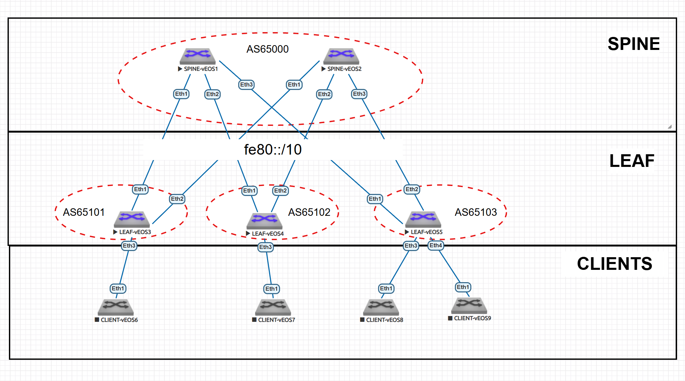

# eBGP Underlay сеть на unnumbered IPv6 

---

## 1. План работ  

### Настройка eBGP Underlay сети  
- [ ] Настройка интерфейсов (порт, IP, MTU)  
- [ ] Настройка IPv6  
- [ ] Настройка eBGP 
- [ ] Проверка сессий eBGP  

### Тестирование и проверка  
- [ ] Проверка связности между всеми узлами  
- [ ] Проверка IPv6 таблиц маршрутизаци
- [ ] Проверка отказоустойчивости   

---

## 2. Адресное пространство  

### 2.1. Loopback интерфейсы
Для уникальных локальных адресов (ULA) используется префикс FD00::/8. Мы выделим блок /48 для лупбэков из ULA. 

**Адрес сети:** `fd00:cafe:beef::/48`  

| Устройство | IPv6-адрес       |
|------------|----------------|
| Spine-1    | fd00:cafe:beef::1/128 |
| Spine-2    | fd00:cafe:beef::2/128  |
| Leaf-1     | fd00:cafe:beef:1::1/128 |
| Leaf-2     | fd00:cafe:beef:1::2/128 |
| Leaf-3     | fd00:cafe:beef:1::3/128 |

### 2.2. Point-to-Point интерфейсы   

Для IPv6 Unnumbered не требуются статические адреса. Достаточно включить ipv6 address auto-config для генерации линк-локал адресов. 

---

## 3. Схема Underlay сети на eBGP  

### 3.1. Топология  



### 3.2. Параметры eBGP  

#### Общие настройки:  
- **AS SPINE** Для спайн выделим AS `65000`
- **AS LEAF** Для лиф выделим диапазон AS `65100-65200`. Так как каждый лиф находится в своей AS
- **ipv6** Для работы ipv6 маршрутизации включим ipv6 unicast-routing
- **multi-agent** Для работы несколько AFI\SAFI включим на каждом коммутаторе - service routing protocols model multi-agent
 


### 3.3. Таблица Автономных систем  

| Устройство | AS |
|------------|-----------|
| **Spine-1**| 65000    | 
| **Spine-2**| 65000    |
| **Leaf-01** | 65101    | 
| **Leaf-02** | 65102    | 
| **Leaf-03** | 65103    | 


## 4. Конфигурация протокола eBGP и интерфейсов.  

### 4.0. SPINE
На спайн настраиваем фильтр автоновных систем лифов, с которыми будем устанавливать соединения. 
```
peer-filter LEAVES_ASN
   10 match as-range 65100-65300 result accept

```

### 4.1. SPINE-1 
```
!
interface Ethernet1
   description TO-LEAF-1
   mtu 9000
   no switchport
   ipv6 enable
   ipv6 address auto-config
!
interface Ethernet2
   description TO-LEAF-2
   mtu 9000
   no switchport
   ipv6 enable
   ipv6 address auto-config
!
interface Ethernet3
   description TO-LEAF-3
   mtu 9000
   no switchport
   ipv6 enable
   ipv6 address auto-config
!
interface Loopback0
   ipv6 enable
   ipv6 address fd00:cafe:beef::1/128
```
```
router bgp 65000
   router-id 10.255.255.1
   no bgp default ipv4-unicast
   timers bgp 1 3
   distance bgp 20 200 200
   bgp listen range fe80::/10 peer-group UNDERLAY peer-filter LEAVES_ASN
   neighbor UNDERLAY peer group
   neighbor UNDERLAY out-delay 0
   neighbor UNDERLAY bfd
   !
   address-family ipv6
      neighbor UNDERLAY activate
      network fd00:cafe:beef::1/128
!
end
```
### 4.2. SPINE-2
```
!
interface Ethernet1
   description TO-LEAF-1
   mtu 9000
   no switchport
   ipv6 enable
   ipv6 address auto-config
!
interface Ethernet2
   description TO-LEAF-2
   mtu 9000
   no switchport
   ipv6 enable
   ipv6 address auto-config
!
interface Ethernet3
   description TO-LEAF-3
   mtu 9000
   no switchport
   ipv6 enable
   ipv6 address auto-config
!
interface Loopback0
   ipv6 enable
   ipv6 address fd00:cafe:beef::2/128
```
```
router bgp 65000
   router-id 10.255.255.2
   no bgp default ipv4-unicast
   timers bgp 1 3
   distance bgp 20 200 200
   bgp listen range fe80::/10 peer-group UNDERLAY peer-filter LEAVES_ASN
   neighbor UNDERLAY peer group
   neighbor UNDERLAY out-delay 0
   neighbor UNDERLAY bfd
   !
   address-family ipv6
      neighbor UNDERLAY activate
      network fd00:cafe:beef::2/128
!
end
```
### 4.3. LEAF-1
```
!
interface Ethernet1
   description TO-SPINE-1
   mtu 9000
   no switchport
   ipv6 enable
   ipv6 address auto-config
!
interface Ethernet2
   description TO-SPINE-2
   mtu 9000
   no switchport
   ipv6 enable
   ipv6 address auto-config
!
interface Loopback0
   description Router-ID & Overlay Endpoint
   ipv6 enable
   ipv6 address fd00:cafe:beef:1::1/128
```
```
router bgp 65101
   router-id 10.255.255.11
   no bgp default ipv4-unicast
   timers bgp 1 3
   distance bgp 20 200 200
   maximum-paths 2
   neighbor UNDERLAY peer group
   neighbor UNDERLAY out-delay 0
   neighbor UNDERLAY bfd
   neighbor interface Et1-2 peer-group UNDERLAY remote-as 65000
   !
   address-family ipv6
      neighbor UNDERLAY activate
      network fd00:cafe:beef:1::1/128
!
end
```

### 4.4. LEAF-2
```
!
interface Ethernet1
   description TO-SPINE-1
   mtu 9000
   no switchport
   ipv6 enable
   ipv6 address auto-config
!
interface Ethernet2
   description TO-SPINE-2
   mtu 9000
   no switchport
   ipv6 enable
   ipv6 address auto-config
!
interface Loopback0
   description Router-ID & Overlay Endpoint
   ipv6 enable
   ipv6 address fd00:cafe:beef:1::2/128
```
```
router bgp 65102
   router-id 10.255.255.11
   no bgp default ipv4-unicast
   timers bgp 1 3
   distance bgp 20 200 200
   maximum-paths 2
   neighbor UNDERLAY peer group
   neighbor UNDERLAY out-delay 0
   neighbor UNDERLAY bfd
   neighbor interface Et1-2 peer-group UNDERLAY remote-as 65000
   !
   address-family ipv6
      neighbor UNDERLAY activate
      network fd00:cafe:beef:1::2/128
!
end
```

### 4.5. LEAF-3
```
!
interface Ethernet1
   description TO-SPINE-1
   mtu 9000
   no switchport
   ipv6 enable
   ipv6 address auto-config
!
interface Ethernet2
   description TO-SPINE-2
   mtu 9000
   no switchport
   ipv6 enable
   ipv6 address auto-config
!
interface Loopback0
   ipv6 enable
   ipv6 address fd00:cafe:beef:1::3/128
```
```
router bgp 65103
   router-id 10.255.255.13
   no bgp default ipv4-unicast
   timers bgp 1 3
   distance bgp 20 200 200
   maximum-paths 2
   neighbor UNDERLAY peer group
   neighbor UNDERLAY out-delay 0
   neighbor UNDERLAY bfd
   neighbor interface Et1-2 peer-group UNDERLAY remote-as 65000
   !
   address-family ipv6
      neighbor UNDERLAY activate
      network fd00:cafe:beef:1::3/128
!
end
```

## 5. Тестирование и проверка eBGP  

### 5.1 Проверка сессий и маршртов 
Проверяем BGP сессии на SPINE-01. 
```
SPINE-1#show ipv6 bgp summary
BGP summary information for VRF default
Router identifier 10.255.255.1, local AS number 65000
Neighbor Status Codes: m - Under maintenance
  Neighbor         V  AS           MsgRcvd   MsgSent  InQ OutQ  Up/Down State   PfxRcd PfxAcc
  fe80::5200:ff:fe03:3766%Et2 4  65102            856       856    0    0 00:14:10 Estab   1      1
  fe80::5200:ff:fe15:f4e8%Et3 4  65103            855       856    0    0 00:14:10 Estab   1      1
  fe80::5200:ff:fed5:5dc0%Et1 4  65101            856       856    0    0 00:14:09 Estab   1      1

```
Видим, что установлены 3 сессии со всем лиф. Отметим что используется IPv6 линк локал адрес + мак адрес   

### 5.1 Проверка таблиц маршрутизаци

Проверяем таблицу маршрутизации на LEAF-01 

```
LEAF-1#show ipv6 route

VRF: default
Displaying 5 of 9 IPv6 routing table entries
Codes: C - connected, S - static, K - kernel, O3 - OSPFv3,
       B - Other BGP Routes, A B - BGP Aggregate, R - RIP,
       I L1 - IS-IS level 1, I L2 - IS-IS level 2, DH - DHCP,
       NG - Nexthop Group Static Route, M - Martian,
       DP - Dynamic Policy Route, L - VRF Leaked,
       RC - Route Cache Route

 B E      fd00:cafe:beef::1/128 [20/0]
           via fe80::5200:ff:fed7:ee0b, Ethernet1
 B E      fd00:cafe:beef::2/128 [20/0]
           via fe80::5200:ff:fecb:38c2, Ethernet2
 C        fd00:cafe:beef:1::1/128 [0/0]
           via Loopback0, directly connected
 B E      fd00:cafe:beef:1::2/128 [20/0]
           via fe80::5200:ff:fed7:ee0b, Ethernet1
           via fe80::5200:ff:fecb:38c2, Ethernet2
 B E      fd00:cafe:beef:1::3/128 [20/0]
           via fe80::5200:ff:fed7:ee0b, Ethernet1
           via fe80::5200:ff:fecb:38c2, Ethernet2
```
Видим маршруты всех коммутаторов. Дополнительно можно отметить два пути к удалённым коммутаторам leaf. 

### 5.3 Проверка связности между всеми узлами
Проверяем доступность лупбэк интерфейсов с LEAF-01
```
LEAF-1#ping ipv6  fd00:cafe:beef:1::2
PING fd00:cafe:beef:1::2(fd00:cafe:beef:1::2) 52 data bytes
60 bytes from fd00:cafe:beef:1::2: icmp_seq=1 ttl=63 time=21.3 ms
60 bytes from fd00:cafe:beef:1::2: icmp_seq=2 ttl=63 time=18.2 ms
60 bytes from fd00:cafe:beef:1::2: icmp_seq=3 ttl=63 time=19.2 ms
60 bytes from fd00:cafe:beef:1::2: icmp_seq=4 ttl=63 time=18.7 ms
60 bytes from fd00:cafe:beef:1::2: icmp_seq=5 ttl=63 time=15.3 ms

LEAF-1#ping ipv6  fd00:cafe:beef:1::3
PING fd00:cafe:beef:1::3(fd00:cafe:beef:1::3) 52 data bytes
60 bytes from fd00:cafe:beef:1::3: icmp_seq=1 ttl=63 time=130 ms
60 bytes from fd00:cafe:beef:1::3: icmp_seq=2 ttl=63 time=137 ms
60 bytes from fd00:cafe:beef:1::3: icmp_seq=3 ttl=63 time=131 ms
60 bytes from fd00:cafe:beef:1::3: icmp_seq=4 ttl=63 time=86.0 ms
60 bytes from fd00:cafe:beef:1::3: icmp_seq=5 ttl=63 time=81.0 ms
```
Видим, что лупбэки LEAF-2 и LEAF-3 доступны. 

### 5.4 Проверка отказоустойчивости 

Для проверки отказоустойчивости отключим SPINE-2, проверим что марушруты через SPINE-2 пропали из таблицы маршрутизации и BFD сессии в статусе down. Проверим доступ до удалённых коммутаторов протоколом IСMP

```
LEAF-1#show bfd peers
VRF name: default
-----------------
DstAddr                      MyDisc    YourDisc   Interface/Transport     Type
------------------------ ----------- ----------- --------------------- --------
fe80::5200:ff:fecb:38c2  3221174216           0         Ethernet2(15)   normal
fe80::5200:ff:fed7:ee0b  2144272194  2999692773         Ethernet1(14)   normal

           LastUp             LastDown              LastDiag    State
-------------------- -------------------- --------------------- -----
   01/19/26 17:58       01/19/26 18:25       Detect Time Exp     Down
   01/19/26 17:58                   NA         No Diagnostic       Up

LEAF-1#show ipv6 route

VRF: default
Displaying 4 of 8 IPv6 routing table entries
Codes: C - connected, S - static, K - kernel, O3 - OSPFv3,
       B - Other BGP Routes, A B - BGP Aggregate, R - RIP,
       I L1 - IS-IS level 1, I L2 - IS-IS level 2, DH - DHCP,
       NG - Nexthop Group Static Route, M - Martian,
       DP - Dynamic Policy Route, L - VRF Leaked,
       RC - Route Cache Route

 B E      fd00:cafe:beef::1/128 [20/0]
           via fe80::5200:ff:fed7:ee0b, Ethernet1
 C        fd00:cafe:beef:1::1/128 [0/0]
           via Loopback0, directly connected
 B E      fd00:cafe:beef:1::2/128 [20/0]
           via fe80::5200:ff:fed7:ee0b, Ethernet1
 B E      fd00:cafe:beef:1::3/128 [20/0]
           via fe80::5200:ff:fed7:ee0b, Ethernet1

LEAF-1#ping fd00:cafe:beef:1::2
PING fd00:cafe:beef:1::2(fd00:cafe:beef:1::2) 52 data bytes
60 bytes from fd00:cafe:beef:1::2: icmp_seq=1 ttl=63 time=57.8 ms
60 bytes from fd00:cafe:beef:1::2: icmp_seq=2 ttl=63 time=64.8 ms
60 bytes from fd00:cafe:beef:1::2: icmp_seq=3 ttl=63 time=63.1 ms
60 bytes from fd00:cafe:beef:1::2: icmp_seq=4 ttl=63 time=58.1 ms
60 bytes from fd00:cafe:beef:1::2: icmp_seq=5 ttl=63 time=47.6 ms

--- fd00:cafe:beef:1::2 ping statistics ---
5 packets transmitted, 5 received, 0% packet loss, time 49ms
rtt min/avg/max/mdev = 47.602/58.327/64.867/6.020 ms, pipe 5, ipg/ewma 12.479/57.712 ms
LEAF-1#ping fd00:cafe:beef:1::3
PING fd00:cafe:beef:1::3(fd00:cafe:beef:1::3) 52 data bytes
60 bytes from fd00:cafe:beef:1::3: icmp_seq=1 ttl=63 time=25.9 ms
60 bytes from fd00:cafe:beef:1::3: icmp_seq=2 ttl=63 time=23.2 ms
60 bytes from fd00:cafe:beef:1::3: icmp_seq=3 ttl=63 time=15.3 ms
60 bytes from fd00:cafe:beef:1::3: icmp_seq=4 ttl=63 time=18.8 ms

--- fd00:cafe:beef:1::3 ping statistics ---
5 packets transmitted, 4 received, 20% packet loss, time 90ms
rtt min/avg/max/mdev = 15.377/20.884/25.985/4.071 ms, pipe 2, ipg/ewma 22.655/23.679 ms

```
