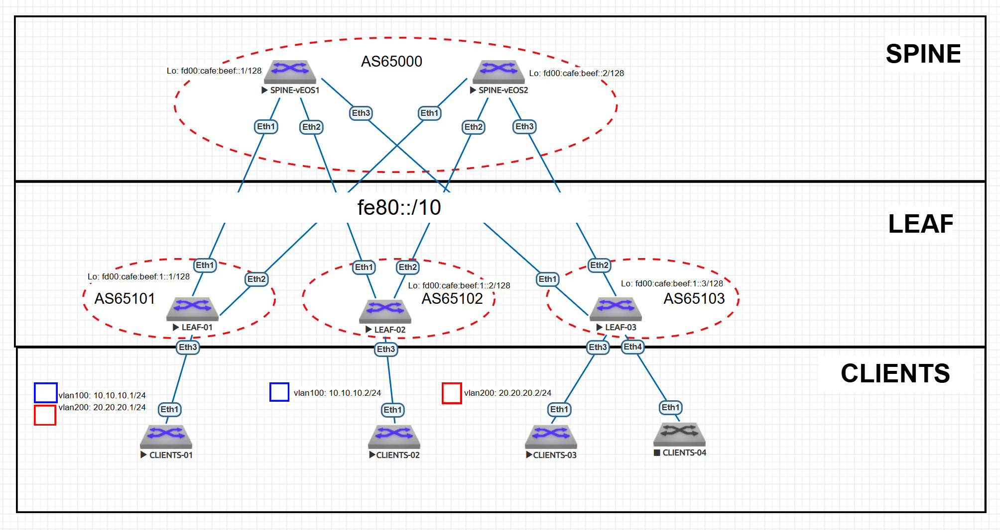

# eBGP Underlay сеть на unnumbered IPv6 

---


 и убедитесь в её наличии

## 1. План работ  

### Настройка eBGP Overlay сети  
- [ ] Настроить BGP peering между Leaf и Spine в AF l2vpn evpn
- [ ] Настроить связанность между клиентами

### Тестирование и проверка  
- [ ] Проверка связности между клиентами

---

## 2. Адресное пространство  

### 2.1. Loopback интерфейсы
Для уникальных локальных адресов (ULA) используется префикс FD00::/8. Мы выделим блок /48 для лупбэков из ULA. 

**Адрес сети:** `fd00:cafe:beef::/48`  

| Устройство | IPv6-адрес       |
|------------|----------------|
| Spine-1    | fd00:cafe:beef::1/128 |
| Spine-2    | fd00:cafe:beef::2/128  |
| Leaf-1     | fd00:cafe:beef:1::1/128 |
| Leaf-2     | fd00:cafe:beef:1::2/128 |
| Leaf-3     | fd00:cafe:beef:1::3/128 |

### 2.2. Point-to-Point интерфейсы   

Для IPv6 Unnumbered не требуются статические адреса. Достаточно включить ipv6 address auto-config для генерации линк-локал адресов. 

---

## 3. Схема Underlay и Overlay сети на eBGP  

### 3.1. Топология  



### 3.2. Параметры eBGP  

#### Общие настройки:  
- **AS SPINE** Для спайн выделим AS `65000`
- **AS LEAF** Для лиф выделим диапазон AS `65100-65200`. Так как каждый лиф находится в своей AS
- **ipv6** Для работы ipv6 маршрутизации включим ipv6 unicast-routing
 

### 3.3. Таблица Автономных систем  

| Устройство | AS |
|------------|-----------|
| **Spine-1**| 65000    | 
| **Spine-2**| 65000    |
| **Leaf-01** | 65101    | 
| **Leaf-02** | 65102    | 
| **Leaf-03** | 65103    | 


## 4. Конфигурация протокола eBGP и интерфейсов.  

### 4.0. SPINE
На спайн настраиваем фильтр автоновных систем лифов, с которыми будем устанавливать соединения. 
```
peer-filter LEAVES_ASN
   10 match as-range 65100-65300 result accept

```

### 4.1. SPINE-1 
```
!
interface Ethernet1
   description TO-LEAF-1
   mtu 9000
   no switchport
   ipv6 enable
   ipv6 address auto-config
!
interface Ethernet2
   description TO-LEAF-2
   mtu 9000
   no switchport
   ipv6 enable
   ipv6 address auto-config
!
interface Ethernet3
   description TO-LEAF-3
   mtu 9000
   no switchport
   ipv6 enable
   ipv6 address auto-config
!
interface Loopback0
   description Router-ID
   ipv6 enable
   ipv6 address fd00:cafe:beef::1/128
```
```
router bgp 65000
   router-id 10.255.255.1
   no bgp default ipv4-unicast
   timers bgp 1 3
   distance bgp 20 200 200
   maximum-paths 2
   bgp listen range fe80::/10 peer-group UNDERLAY peer-filter LEAVES_ASN
   neighbor OVERLAY peer group
   neighbor OVERLAY next-hop-unchanged
   neighbor OVERLAY out-delay 0
   neighbor OVERLAY update-source Loopback0
   neighbor OVERLAY ebgp-multihop 3
   neighbor OVERLAY send-community extended
   neighbor UNDERLAY peer group
   neighbor UNDERLAY out-delay 0
   neighbor fd00:cafe:beef:1::1 peer group OVERLAY
   neighbor fd00:cafe:beef:1::1 remote-as 65101
   neighbor fd00:cafe:beef:1::2 peer group OVERLAY
   neighbor fd00:cafe:beef:1::2 remote-as 65102
   neighbor fd00:cafe:beef:1::3 peer group OVERLAY
   neighbor fd00:cafe:beef:1::3 remote-as 65103
   !
   address-family evpn
      neighbor OVERLAY activate
   !
   address-family ipv6
      neighbor UNDERLAY activate
      network fd00:cafe:beef::1/128

```
### 4.2. SPINE-2
```
!
interface Ethernet1
   description TO-LEAF-1
   mtu 9000
   no switchport
   ipv6 enable
   ipv6 address auto-config
!
interface Ethernet2
   description TO-LEAF-2
   mtu 9000
   no switchport
   ipv6 enable
   ipv6 address auto-config
!
interface Ethernet3
   description TO-LEAF-3
   mtu 9000
   no switchport
   ipv6 enable
   ipv6 address auto-config
!
interface Loopback0
   description Router-ID
   ipv6 enable
   ipv6 address fd00:cafe:beef::2/128
```
```
router bgp 65000
   router-id 10.255.255.2
   no bgp default ipv4-unicast
   timers bgp 1 3
   distance bgp 20 200 200
   maximum-paths 2
   bgp listen range fe80::/10 peer-group UNDERLAY peer-filter LEAVES_ASN
   neighbor OVERLAY peer group
   neighbor OVERLAY next-hop-unchanged
   neighbor OVERLAY out-delay 0
   neighbor OVERLAY update-source Loopback0
   neighbor OVERLAY ebgp-multihop 3
   neighbor OVERLAY send-community extended
   neighbor UNDERLAY peer group
   neighbor UNDERLAY out-delay 0
   neighbor fd00:cafe:beef:1::1 peer group OVERLAY
   neighbor fd00:cafe:beef:1::1 remote-as 65101
   neighbor fd00:cafe:beef:1::2 peer group OVERLAY
   neighbor fd00:cafe:beef:1::2 remote-as 65102
   neighbor fd00:cafe:beef:1::3 peer group OVERLAY
   neighbor fd00:cafe:beef:1::3 remote-as 65103
   !
   address-family evpn
      neighbor OVERLAY activate
   !
   address-family ipv6
      neighbor UNDERLAY activate
      network fd00:cafe:beef::2/128

```
### 4.3. LEAF-1
```
!
interface Ethernet1
   description TO-SPINE-1
   mtu 9000
   no switchport
   ipv6 enable
   ipv6 address auto-config
!
interface Ethernet2
   description TO-SPINE-2
   mtu 9000
   no switchport
   ipv6 enable
   ipv6 address auto-config
!
interface Loopback0
   description Router-ID & Overlay Endpoint
   ipv6 enable
   ipv6 address fd00:cafe:beef:1::1/128

interface Vxlan1
   vxlan source-interface Loopback0
   vxlan udp-port 4789
   vxlan encapsulation ipv6
   vxlan vlan 100 vni 9100
   vxlan vlan 200 vni 9200

```
```
router bgp 65101
   router-id 10.255.255.11
   no bgp default ipv4-unicast
   timers bgp 1 3
   distance bgp 20 200 200
   maximum-paths 2
   neighbor OVERLAY peer group
   neighbor OVERLAY remote-as 65000
   neighbor OVERLAY out-delay 0
   neighbor OVERLAY update-source Loopback0
   neighbor OVERLAY ebgp-multihop 3
   neighbor OVERLAY send-community extended
   neighbor UNDERLAY peer group
   neighbor UNDERLAY out-delay 0
   neighbor UNDERLAY send-community extended
   neighbor fd00:cafe:beef::1 peer group OVERLAY
   neighbor fd00:cafe:beef::2 peer group OVERLAY
   neighbor interface Et1-2 peer-group UNDERLAY remote-as 65000
   !
   vlan 100
      rd auto
      route-target both 65101:100
      redistribute learned
   !
   vlan 200
      rd auto
      route-target both 65101:200
      redistribute learned
   !
   address-family evpn
      neighbor OVERLAY activate
   !
   address-family ipv6
      neighbor UNDERLAY activate
      network fd00:cafe:beef:1::1/128

```

### 4.4. LEAF-2
```
!
interface Ethernet1
   description TO-SPINE-1
   mtu 9000
   no switchport
   ipv6 enable
   ipv6 address auto-config
!
interface Ethernet2
   description TO-SPINE-2
   mtu 9000
   no switchport
   ipv6 enable
   ipv6 address auto-config
!
interface Loopback0
   description Router-ID & Overlay Endpoint
   ipv6 enable
   ipv6 address fd00:cafe:beef:1::2/128

interface Vxlan1
   vxlan source-interface Loopback0
   vxlan udp-port 4789
   vxlan encapsulation ipv6
   vxlan vlan 100 vni 9100

```
```
router bgp 65102
   router-id 10.255.255.12
   no bgp default ipv4-unicast
   timers bgp 1 3
   distance bgp 20 200 200
   maximum-paths 2
   neighbor OVERLAY peer group
   neighbor OVERLAY remote-as 65000
   neighbor OVERLAY out-delay 0
   neighbor OVERLAY update-source Loopback0
   neighbor OVERLAY ebgp-multihop 3
   neighbor OVERLAY send-community extended
   neighbor UNDERLAY peer group
   neighbor UNDERLAY out-delay 0
   neighbor UNDERLAY send-community extended
   neighbor fd00:cafe:beef::1 peer group OVERLAY
   neighbor fd00:cafe:beef::2 peer group OVERLAY
   neighbor interface Et1-2 peer-group UNDERLAY remote-as 65000
   !
   vlan 100
      rd auto
      route-target both 65101:100
      redistribute learned
   !
   address-family evpn
      neighbor OVERLAY activate
   !
   address-family ipv6
      neighbor UNDERLAY activate
      network fd00:cafe:beef:1::2/128

```

### 4.5. LEAF-3
```
!
interface Ethernet1
   description TO-SPINE-1
   mtu 9000
   no switchport
   ipv6 enable
   ipv6 address auto-config
!
interface Ethernet2
   description TO-SPINE-2
   mtu 9000
   no switchport
   ipv6 enable
   ipv6 address auto-config
!
interface Loopback0
   description Router-ID & Overlay Endpoint
   ipv6 enable
   ipv6 address fd00:cafe:beef:1::3/128

interface Vxlan1
   vxlan source-interface Loopback0
   vxlan udp-port 4789
   vxlan encapsulation ipv6
   vxlan vlan 200 vni 9200
```
```
router bgp 65103
   router-id 10.255.255.13
   no bgp default ipv4-unicast
   timers bgp 1 3
   distance bgp 20 200 200
   maximum-paths 2
   neighbor OVERLAY peer group
   neighbor OVERLAY remote-as 65000
   neighbor OVERLAY out-delay 0
   neighbor OVERLAY update-source Loopback0
   neighbor OVERLAY ebgp-multihop 3
   neighbor OVERLAY send-community extended
   neighbor UNDERLAY peer group
   neighbor UNDERLAY out-delay 0
   neighbor UNDERLAY send-community extended
   neighbor fd00:cafe:beef::1 peer group OVERLAY
   neighbor fd00:cafe:beef::2 peer group OVERLAY
   neighbor interface Et1-2 peer-group UNDERLAY remote-as 65000
   !
   vlan 200
      rd auto
      route-target both 65101:200
      redistribute learned
   !
   address-family evpn
      neighbor OVERLAY activate
   !
   address-family ipv6
      neighbor UNDERLAY activate
      network fd00:cafe:beef:1::3/128

```

### 4.6. CLIENTS-1
```
vlan 100
   name vlan-100
!
vlan 200
   name vlan-200
!
interface Ethernet1
   description TO-LEAF-01
   switchport trunk allowed vlan 100,200
   switchport mode trunk
!
interface Vlan100
   description vrf-blue
   ip address 10.10.10.1/24
!
interface Vlan200
   description vrf-red
   ip address 20.20.20.1/24

```
### 4.6. CLIENTS-2
```
vlan 100
   name vlan-100
!
interface Ethernet1
   description TO-LEAF-02
   switchport access vlan 100
interface Vlan100
   description vrf-blue
   ip address 10.10.10.2/24

```
### 4.6. CLIENTS-3
```
vlan 200
   name vlan-200
!
interface Ethernet1
   description TO-LEAF-03
   switchport access vlan 200
interface Vlan200
   ip address 20.20.20.2/24
```

## 5. Тестирование и проверка eBGP

### 5.0 Проверка eBGP OVERLAY сессий на LEAF-01

```
LEAF-1#show bgp summary
BGP summary information for VRF default
Router identifier 10.255.255.11, local AS number 65101
Neighbor                             AS Session State AFI/SAFI                AFI/SAFI State   NLRI Rcd   NLRI Acc
--------------------------- ----------- ------------- ----------------------- -------------- ---------- ----------
fd00:cafe:beef::1                 65000 Established   L2VPN EVPN              Negotiated              2          2
fd00:cafe:beef::2                 65000 Established   L2VPN EVPN              Negotiated              2          2
fe80::5200:ff:fecb:38c2%Et2       65000 Established   IPv6 Unicast            Negotiated              3          3
fe80::5200:ff:fed7:ee0b%Et1       65000 Established   IPv6 Unicast            Negotiated              3          3

LEAF-1#show bgp evpn summary
BGP summary information for VRF default
Router identifier 10.255.255.11, local AS number 65101
Neighbor Status Codes: m - Under maintenance
  Neighbor          V AS           MsgRcvd   MsgSent  InQ OutQ  Up/Down State   PfxRcd PfxAcc
  fd00:cafe:beef::1 4 65000           4174      4204    0    0 00:33:27 Estab   2      2
  fd00:cafe:beef::2 4 65000           3309      3330    0    0 00:33:23 Estab   2      2

```
Видим, что сессии на лупбэк адресах установились и AFI/SAFI = L2VPN EVPN  

### 5.1.0 Мак и IP  Client-1, Client-2, Client-3
```
CLIENTS-1#show interfaces vlan 100
Vlan100 is up, line protocol is up (connected)
  Hardware is Vlan, address is 5000.0072.8b31 (bia 5000.0072.8b31)
  Description: vrf-blue
  Internet address is 10.10.10.1/24
  Broadcast address is 255.255.255.255
  IP MTU 1500 bytes (default)
  Up 2 hours, 13 minutes, 30 seconds

CLIENTS-1#show interfaces vlan 200
Vlan200 is up, line protocol is up (connected)
  Hardware is Vlan, address is 5000.0072.8b31 (bia 5000.0072.8b31)
  Description: vrf-red
  Internet address is 20.20.20.1/24
  Broadcast address is 255.255.255.255
  IP MTU 1500 bytes (default)
  Up 2 hours, 18 minutes, 1 second

--------------------------------------------------


CLIENTS-2#show interfaces vlan 100
Vlan100 is up, line protocol is up (connected)
  Hardware is Vlan, address is 5000.00f6.ad37 (bia 5000.00f6.ad37)
  Internet address is 10.10.10.2/24
  Broadcast address is 255.255.255.255
  IP MTU 1500 bytes (default)
  Up 1 hour, 43 minutes, 24 seconds

--------------------------------------------------

```

### 5.1.1 Проверка маршрута на LEAF-01 Client-1 -> Client-2

```
LEAF-1(config)#show bgp evpn route-type mac-ip 5000.00f6.ad37
BGP routing table information for VRF default
Router identifier 10.255.255.11, local AS number 65101
Route status codes: * - valid, > - active, S - Stale, E - ECMP head, e - ECMP
                    c - Contributing to ECMP, % - Pending BGP convergence
Origin codes: i - IGP, e - EGP, ? - incomplete
AS Path Attributes: Or-ID - Originator ID, C-LST - Cluster List, LL Nexthop - Link Local Nexthop

          Network                Next Hop              Metric  LocPref Weight  Path
 * >Ec    RD: 10.255.255.12:100 mac-ip 5000.00f6.ad37
                                 fd00:cafe:beef:1::2   -       100     0       65000 65102 i
 *  ec    RD: 10.255.255.12:100 mac-ip 5000.00f6.ad37
                                 fd00:cafe:beef:1::2   -       100     0       65000 65102 i

```
Видим маршрут за некстхопом fd00:cafe:beef:1::2 (лиф-2) и ожидаемый AS-Path 65000 65102 через спайн.

### 5.1.2 Проверка связи между Client-1 -> Client-2

```
CLIENTS-1#ping 10.10.10.2
PING 10.10.10.2 (10.10.10.2) 72(100) bytes of data.
80 bytes from 10.10.10.2: icmp_seq=1 ttl=64 time=632 ms
80 bytes from 10.10.10.2: icmp_seq=2 ttl=64 time=683 ms
80 bytes from 10.10.10.2: icmp_seq=3 ttl=64 time=855 ms
80 bytes from 10.10.10.2: icmp_seq=4 ttl=64 time=1185 ms
80 bytes from 10.10.10.2: icmp_seq=5 ttl=64 time=1232 ms

--- 10.10.10.2 ping statistics ---
5 packets transmitted, 5 received, 0% packet loss, time 61ms
rtt min/avg/max/mdev = 632.564/918.059/1232.960/249.399 ms, pipe 5, ipg/ewma 15s
```
Пинг проходит через Vxlan тонель поверх ipv6 фабрики. 

### 5.1.3 Проверка маршрута на LEAF-01 Client-1 -> Client-3

```
LEAF-1(config)#show bgp evpn route-type mac-ip 5000.001b.5e8d
BGP routing table information for VRF default
Router identifier 10.255.255.11, local AS number 65101
Route status codes: * - valid, > - active, S - Stale, E - ECMP head, e - ECMP
                    c - Contributing to ECMP, % - Pending BGP convergence
Origin codes: i - IGP, e - EGP, ? - incomplete
AS Path Attributes: Or-ID - Originator ID, C-LST - Cluster List, LL Nexthop - Link Local Nexthop

          Network                Next Hop              Metric  LocPref Weight  Path
 * >Ec    RD: 10.255.255.13:200 mac-ip 5000.001b.5e8d
                                 fd00:cafe:beef:1::3   -       100     0       65000 65103 i
 *  ec    RD: 10.255.255.13:200 mac-ip 5000.001b.5e8d
                                 fd00:cafe:beef:1::3   -       100     0       65000 65103 i

```
Видим маршрут за некстхопом fd00:cafe:beef:1::3 (лиф-3) и ожидаемый AS-Path 65000 65103 через спайн.

### 5.1.4 Проверка связи между Client-1 -> Client-3

```
CLIENTS-1#ping 20.20.20.2
PING 20.20.20.2 (20.20.20.2) 72(100) bytes of data.
80 bytes from 20.20.20.2: icmp_seq=1 ttl=64 time=258 ms
80 bytes from 20.20.20.2: icmp_seq=2 ttl=64 time=254 ms
80 bytes from 20.20.20.2: icmp_seq=3 ttl=64 time=256 ms
80 bytes from 20.20.20.2: icmp_seq=4 ttl=64 time=251 ms
80 bytes from 20.20.20.2: icmp_seq=5 ttl=64 time=250 ms

--- 20.20.20.2 ping statistics ---
5 packets transmitted, 5 received, 0% packet loss, time 52ms
rtt min/avg/max/mdev = 250.559/254.062/258.084/2.884 ms, pipe 5, ipg/ewma 13.09s
```
Пинг так же проходит через Vxlan тонель поверх ipv6 фабрики.