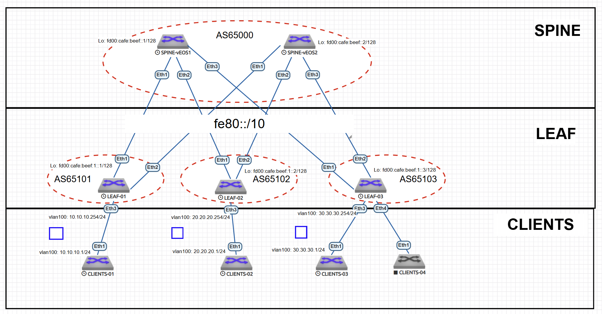

# eBGP Underlay сеть на unnumbered IPv6. L3 сервис 

---

## 1. План работ  

### Настройка eBGP Overlay сети  
- [ ] Настроить BGP peering между Leaf и Spine в AF l2vpn evpn
- [ ] Настроить связанность между клиентами на уровне L3 (в одном L3 VRF)

### Тестирование и проверка  
- [ ] Проверка связности между клиентами clients-1, clients-2
- [ ] Проверка связности между клиентами clients-1, clients-3 

---

## 2. Адресное пространство  

### 2.1. Loopback интерфейсы
Для уникальных локальных адресов (ULA) используется префикс FD00::/8. Мы выделим блок /48 для лупбэков из ULA. 

**Адрес сети:** `fd00:cafe:beef::/48`  

| Устройство | IPv6-адрес       |
|------------|----------------|
| Spine-1    | fd00:cafe:beef::1/128 |
| Spine-2    | fd00:cafe:beef::2/128  |
| Leaf-1     | fd00:cafe:beef:1::1/128 |
| Leaf-2     | fd00:cafe:beef:1::2/128 |
| Leaf-3     | fd00:cafe:beef:1::3/128 |

### 2.2. Point-to-Point интерфейсы   

Для IPv6 Unnumbered не требуются статические адреса. Достаточно включить ipv6 address auto-config для генерации линк-локал адресов. 

---

## 3. Схема Underlay и Overlay сети на eBGP  

### 3.1. Топология  



### 3.2. Параметры eBGP  

#### Общие настройки:  
- **AS SPINE** Для спайн выделим AS `65000`
- **AS LEAF** Для лиф выделим диапазон AS `65100-65200`. Так как каждый лиф находится в своей AS
- **ipv6** Для работы ipv6 маршрутизации включим ipv6 unicast-routing
 - **multi-agent** Для работы несколько AFI\SAFI включим на каждом коммутаторе - service routing protocols model multi-agent
 

### 3.3. Таблица Автономных систем  

| Устройство | AS |
|------------|-----------|
| **Spine-1**| 65000    | 
| **Spine-2**| 65000    |
| **Leaf-01** | 65101    | 
| **Leaf-02** | 65102    | 
| **Leaf-03** | 65103    | 


## 4. Конфигурация протокола eBGP и интерфейсов.  

### 4.0. SPINE
На спайн настраиваем фильтр автоновных систем лифов, с которыми будем устанавливать соединения. 
```
peer-filter LEAVES_ASN
   10 match as-range 65100-65300 result accept

```

### 4.1. SPINE-1 
```
!
interface Ethernet1
   description TO-LEAF-1
   mtu 9000
   no switchport
   ipv6 enable
   ipv6 address auto-config
!
interface Ethernet2
   description TO-LEAF-2
   mtu 9000
   no switchport
   ipv6 enable
   ipv6 address auto-config
!
interface Ethernet3
   description TO-LEAF-3
   mtu 9000
   no switchport
   ipv6 enable
   ipv6 address auto-config
!
interface Loopback0
   description Router-ID
   ipv6 enable
   ipv6 address fd00:cafe:beef::1/128
```
```
router bgp 65000
   router-id 10.255.255.1
   no bgp default ipv4-unicast
   timers bgp 1 3
   distance bgp 20 200 200
   maximum-paths 2
   bgp listen range fe80::/10 peer-group UNDERLAY peer-filter LEAVES_ASN
   neighbor OVERLAY peer group
   neighbor OVERLAY next-hop-unchanged
   neighbor OVERLAY out-delay 0
   neighbor OVERLAY update-source Loopback0
   neighbor OVERLAY ebgp-multihop 3
   neighbor OVERLAY send-community extended
   neighbor UNDERLAY peer group
   neighbor UNDERLAY out-delay 0
   neighbor fd00:cafe:beef:1::1 peer group OVERLAY
   neighbor fd00:cafe:beef:1::1 remote-as 65101
   neighbor fd00:cafe:beef:1::2 peer group OVERLAY
   neighbor fd00:cafe:beef:1::2 remote-as 65102
   neighbor fd00:cafe:beef:1::3 peer group OVERLAY
   neighbor fd00:cafe:beef:1::3 remote-as 65103
   !
   address-family evpn
      neighbor OVERLAY activate
   !
   address-family ipv6
      neighbor UNDERLAY activate
      network fd00:cafe:beef::1/128

```
### 4.2. SPINE-2
```
!
interface Ethernet1
   description TO-LEAF-1
   mtu 9000
   no switchport
   ipv6 enable
   ipv6 address auto-config
!
interface Ethernet2
   description TO-LEAF-2
   mtu 9000
   no switchport
   ipv6 enable
   ipv6 address auto-config
!
interface Ethernet3
   description TO-LEAF-3
   mtu 9000
   no switchport
   ipv6 enable
   ipv6 address auto-config
!
interface Loopback0
   description Router-ID
   ipv6 enable
   ipv6 address fd00:cafe:beef::2/128
```
```
router bgp 65000
   router-id 10.255.255.2
   no bgp default ipv4-unicast
   timers bgp 1 3
   distance bgp 20 200 200
   maximum-paths 2
   bgp listen range fe80::/10 peer-group UNDERLAY peer-filter LEAVES_ASN
   neighbor OVERLAY peer group
   neighbor OVERLAY next-hop-unchanged
   neighbor OVERLAY out-delay 0
   neighbor OVERLAY update-source Loopback0
   neighbor OVERLAY ebgp-multihop 3
   neighbor OVERLAY send-community extended
   neighbor UNDERLAY peer group
   neighbor UNDERLAY out-delay 0
   neighbor fd00:cafe:beef:1::1 peer group OVERLAY
   neighbor fd00:cafe:beef:1::1 remote-as 65101
   neighbor fd00:cafe:beef:1::2 peer group OVERLAY
   neighbor fd00:cafe:beef:1::2 remote-as 65102
   neighbor fd00:cafe:beef:1::3 peer group OVERLAY
   neighbor fd00:cafe:beef:1::3 remote-as 65103
   !
   address-family evpn
      neighbor OVERLAY activate
   !
   address-family ipv6
      neighbor UNDERLAY activate
      network fd00:cafe:beef::2/128

```
### 4.3. LEAF-1
```
!
interface Ethernet1
   description TO-SPINE-1
   mtu 9000
   no switchport
   ipv6 enable
   ipv6 address auto-config
!
interface Ethernet2
   description TO-SPINE-2
   mtu 9000
   no switchport
   ipv6 enable
   ipv6 address auto-config
!
interface Loopback0
   description Router-ID & Overlay Endpoint
   ipv6 enable
   ipv6 address fd00:cafe:beef:1::1/128

interface Vlan100
   description vrf-blue
   vrf vrf-blue
   ip address 10.10.10.254/24

interface Vxlan1
   vxlan source-interface Loopback0
   vxlan udp-port 4789
   vxlan encapsulation ipv6
   vxlan vlan 100 vni 19100
   vxlan vrf vrf-blue vni 3099

```
```
router bgp 65101
   router-id 10.255.255.11
   no bgp default ipv4-unicast
   timers bgp 1 3
   distance bgp 20 200 200
   maximum-paths 2
   neighbor OVERLAY peer group
   neighbor OVERLAY remote-as 65000
   neighbor OVERLAY out-delay 0
   neighbor OVERLAY update-source Loopback0
   neighbor OVERLAY ebgp-multihop 3
   neighbor OVERLAY send-community extended
   neighbor UNDERLAY peer group
   neighbor UNDERLAY out-delay 0
   neighbor UNDERLAY send-community extended
   neighbor fd00:cafe:beef::1 peer group OVERLAY
   neighbor fd00:cafe:beef::2 peer group OVERLAY
   neighbor interface Et1-2 peer-group UNDERLAY remote-as 65000
   !
   vlan 100
      rd auto
      route-target both 65101:19100
      redistribute learned
   !
   address-family evpn
      neighbor OVERLAY activate
   !
   address-family ipv6
      neighbor UNDERLAY activate
      network fd00:cafe:beef:1::1/128
   !
   vrf vrf-blue
      rd 10.255.255.11:3099
      route-target import evpn 65000:3099
      route-target export evpn 65000:3099
      redistribute connected

```

### 4.4. LEAF-2
```
!
interface Ethernet1
   description TO-SPINE-1
   mtu 9000
   no switchport
   ipv6 enable
   ipv6 address auto-config
!
interface Ethernet2
   description TO-SPINE-2
   mtu 9000
   no switchport
   ipv6 enable
   ipv6 address auto-config
!
interface Loopback0
   description Router-ID & Overlay Endpoint
   ipv6 enable
   ipv6 address fd00:cafe:beef:1::2/128

interface Vlan100
   description vrf-blue
   vrf vrf-blue
   ip address 20.20.20.254/24

interface Vxlan1
   vxlan source-interface Loopback0
   vxlan udp-port 4789
   vxlan encapsulation ipv6
   vxlan vlan 100 vni 19200
   vxlan vrf vrf-blue vni 3099

```
```
router bgp 65102
   router-id 10.255.255.12
   no bgp default ipv4-unicast
   timers bgp 1 3
   distance bgp 20 200 200
   maximum-paths 2
   neighbor OVERLAY peer group
   neighbor OVERLAY remote-as 65000
   neighbor OVERLAY out-delay 0
   neighbor OVERLAY update-source Loopback0
   neighbor OVERLAY ebgp-multihop 3
   neighbor OVERLAY send-community extended
   neighbor UNDERLAY peer group
   neighbor UNDERLAY out-delay 0
   neighbor UNDERLAY send-community extended
   neighbor fd00:cafe:beef::1 peer group OVERLAY
   neighbor fd00:cafe:beef::2 peer group OVERLAY
   neighbor interface Et1-2 peer-group UNDERLAY remote-as 65000
   !
   vlan 100
      rd auto
      route-target both 65102:19200
      redistribute learned
   !
   address-family evpn
      neighbor OVERLAY activate
   !
   address-family ipv6
      neighbor UNDERLAY activate
      network fd00:cafe:beef:1::2/128
   !
   vrf vrf-blue
      rd 10.255.255.12:3099
      route-target import evpn 65000:3099
      route-target export evpn 65000:3099
      redistribute connected

```

### 4.5. LEAF-3
```
!
interface Ethernet1
   description TO-SPINE-1
   mtu 9000
   no switchport
   ipv6 enable
   ipv6 address auto-config
!
interface Ethernet2
   description TO-SPINE-2
   mtu 9000
   no switchport
   ipv6 enable
   ipv6 address auto-config
!
interface Loopback0
   description Router-ID & Overlay Endpoint
   ipv6 enable
   ipv6 address fd00:cafe:beef:1::3/128

interface Vlan100
   description vrf-blue
   vrf vrf-blue
   ip address 30.30.30.254/24

interface Vxlan1
   vxlan source-interface Loopback0
   vxlan udp-port 4789
   vxlan encapsulation ipv6
   vxlan vlan 100 vni 19300
   vxlan vrf vrf-blue vni 3099
```
```
router bgp 65103
   router-id 10.255.255.13
   no bgp default ipv4-unicast
   timers bgp 1 3
   distance bgp 20 200 200
   maximum-paths 2
   neighbor OVERLAY peer group
   neighbor OVERLAY remote-as 65000
   neighbor OVERLAY out-delay 0
   neighbor OVERLAY update-source Loopback0
   neighbor OVERLAY ebgp-multihop 3
   neighbor OVERLAY send-community extended
   neighbor UNDERLAY peer group
   neighbor UNDERLAY out-delay 0
   neighbor UNDERLAY send-community extended
   neighbor fd00:cafe:beef::1 peer group OVERLAY
   neighbor fd00:cafe:beef::2 peer group OVERLAY
   neighbor interface Et1-2 peer-group UNDERLAY remote-as 65000
   !
   vlan 200
      rd auto
      route-target both 65103:19300
      redistribute learned
   !
   address-family evpn
      neighbor OVERLAY activate
   !
   address-family ipv6
      neighbor UNDERLAY activate
      network fd00:cafe:beef:1::3/128
   !
   vrf vrf-blue
      rd 10.255.255.13:3099
      route-target import evpn 65000:3099
      route-target export evpn 65000:3099
      redistribute connected

```

### 4.6. CLIENTS-1
```
vlan 100
   name vlan-100
!
interface Ethernet1
   switchport trunk allowed vlan 100,200
   switchport mode trunk

interface Vlan100
   description vrf-blue
   ip address 10.10.10.1/24
!
ip routing
!
ip route 0.0.0.0/0 10.10.10.254
!
end
```
### 4.6. CLIENTS-2
```
vlan 100
   name vlan-100
!
interface Ethernet1
   description TO-LEAF-02
   switchport access vlan 100
!
interface Vlan100
   description vrf-blue
   ip address 20.20.20.1/24
!
no ip routing
!
ip route 0.0.0.0/0 20.20.20.254

```
### 4.6. CLIENTS-3
```
vlan 100
!
interface Ethernet1
   description TO-LEAF-03
   switchport access vlan 100
!
interface Vlan100
   ip address 30.30.30.1/24
!
ip routing
!
ip route 0.0.0.0/0 30.30.30.254
!
end
```

## 5. Тестирование и проверка eBGP

### 5.0 Проверка eBGP маршрутов на LEAF-01

```
LEAF-1#show bgp evpn route-type ip-prefix ipv4
BGP routing table information for VRF default
Router identifier 10.255.255.11, local AS number 65101
Route status codes: * - valid, > - active, S - Stale, E - ECMP head, e - ECMP
                    c - Contributing to ECMP, % - Pending BGP convergence
Origin codes: i - IGP, e - EGP, ? - incomplete
AS Path Attributes: Or-ID - Originator ID, C-LST - Cluster List, LL Nexthop - Link Local Nexthop

          Network                Next Hop              Metric  LocPref Weight  Path
 * >      RD: 10.255.255.11:3099 ip-prefix 10.10.10.0/24
                                 -                     -       -       0       i
 * >Ec    RD: 10.255.255.12:3099 ip-prefix 20.20.20.0/24
                                 fd00:cafe:beef:1::2   -       100     0       65000 65102 i
 *  ec    RD: 10.255.255.12:3099 ip-prefix 20.20.20.0/24
                                 fd00:cafe:beef:1::2   -       100     0       65000 65102 i
 * >Ec    RD: 10.255.255.13:3099 ip-prefix 30.30.30.0/24
                                 fd00:cafe:beef:1::3   -       100     0       65000 65103 i
 *  ec    RD: 10.255.255.13:3099 ip-prefix 30.30.30.0/24
                                 fd00:cafe:beef:1::3   -       100     0       65000 65103 i

```
Видим, что на LEAF-01 изучены все клиентские сети. В качестве некстхопа используются лупбэк интерфейсы. 


### 5.1 Проверка таблицы маршрутизации на клиентах 

```
CLIENTS-1#show ip route

VRF: default
Codes: C - connected, S - static, K - kernel,
       O - OSPF, IA - OSPF inter area, E1 - OSPF external type 1,
       E2 - OSPF external type 2, N1 - OSPF NSSA external type 1,
       N2 - OSPF NSSA external type2, B - Other BGP Routes,
       B I - iBGP, B E - eBGP, R - RIP, I L1 - IS-IS level 1,
       I L2 - IS-IS level 2, O3 - OSPFv3, A B - BGP Aggregate,
       A O - OSPF Summary, NG - Nexthop Group Static Route,
       V - VXLAN Control Service, M - Martian,
       DH - DHCP client installed default route,
       DP - Dynamic Policy Route, L - VRF Leaked,
       G  - gRIBI, RC - Route Cache Route

Gateway of last resort:
 S        0.0.0.0/0 [1/0] via 10.10.10.254, Vlan100

 C        10.10.10.0/24 is directly connected, Vlan100

CLIENTS-2#show ip route

VRF: default
Codes: C - connected, S - static, K - kernel,
       O - OSPF, IA - OSPF inter area, E1 - OSPF external type 1,
       E2 - OSPF external type 2, N1 - OSPF NSSA external type 1,
       N2 - OSPF NSSA external type2, B - Other BGP Routes,
       B I - iBGP, B E - eBGP, R - RIP, I L1 - IS-IS level 1,
       I L2 - IS-IS level 2, O3 - OSPFv3, A B - BGP Aggregate,
       A O - OSPF Summary, NG - Nexthop Group Static Route,
       V - VXLAN Control Service, M - Martian,
       DH - DHCP client installed default route,
       DP - Dynamic Policy Route, L - VRF Leaked,
       G  - gRIBI, RC - Route Cache Route

Gateway of last resort:
 S        0.0.0.0/0 [1/0] via 20.20.20.254, Vlan100

 C        20.20.20.0/24 is directly connected, Vlan100

CLIENTS-3#show ip route

VRF: default
Codes: C - connected, S - static, K - kernel,
       O - OSPF, IA - OSPF inter area, E1 - OSPF external type 1,
       E2 - OSPF external type 2, N1 - OSPF NSSA external type 1,
       N2 - OSPF NSSA external type2, B - Other BGP Routes,
       B I - iBGP, B E - eBGP, R - RIP, I L1 - IS-IS level 1,
       I L2 - IS-IS level 2, O3 - OSPFv3, A B - BGP Aggregate,
       A O - OSPF Summary, NG - Nexthop Group Static Route,
       V - VXLAN Control Service, M - Martian,
       DH - DHCP client installed default route,
       DP - Dynamic Policy Route, L - VRF Leaked,
       G  - gRIBI, RC - Route Cache Route

Gateway of last resort:
 S        0.0.0.0/0 [1/0] via 30.30.30.254, Vlan100

 C        30.30.30.0/24 is directly connected, Vlan100


```
Видим что не смотря на использования одного vlan 100, у всех клиентов разные IP. Что говорит о том, что vlan 100 это разные ethernet сегменты.  

### 5.2 Проверка табицы маршрутизации в vrf-blue на LEAF-01
```
LEAF-1#show ip route vrf vrf-blue

VRF: vrf-blue
Codes: C - connected, S - static, K - kernel,
       O - OSPF, IA - OSPF inter area, E1 - OSPF external type 1,
       E2 - OSPF external type 2, N1 - OSPF NSSA external type 1,
       N2 - OSPF NSSA external type2, B - Other BGP Routes,
       B I - iBGP, B E - eBGP, R - RIP, I L1 - IS-IS level 1,
       I L2 - IS-IS level 2, O3 - OSPFv3, A B - BGP Aggregate,
       A O - OSPF Summary, NG - Nexthop Group Static Route,
       V - VXLAN Control Service, M - Martian,
       DH - DHCP client installed default route,
       DP - Dynamic Policy Route, L - VRF Leaked,
       G  - gRIBI, RC - Route Cache Route

Gateway of last resort is not set

 C        10.10.10.0/24 is directly connected, Vlan100
 B E      20.20.20.1/32 [20/0] via VTEP fd00:cafe:beef:1::2 VNI 3099 router-mac 50:00:00:03:37:66 local-interface Vxlan1
 B E      20.20.20.0/24 [20/0] via VTEP fd00:cafe:beef:1::2 VNI 3099 router-mac 50:00:00:03:37:66 local-interface Vxlan1
 B E      30.30.30.0/24 [20/0] via VTEP fd00:cafe:beef:1::3 VNI 3099 router-mac 50:00:00:15:f4:e8 local-interface Vxlan1


```
Видим что в vrf-blue клиентские маршруты установлены. В качестве некст-хоп используется адреса VTEP 

### 5.3 Проверка связи между Client-1 -> Client-2

```
CLIENTS-1#ping 20.20.20.1
PING 20.20.20.1 (20.20.20.1) 72(100) bytes of data.
80 bytes from 20.20.20.1: icmp_seq=1 ttl=62 time=269 ms
80 bytes from 20.20.20.1: icmp_seq=2 ttl=62 time=274 ms
80 bytes from 20.20.20.1: icmp_seq=3 ttl=62 time=383 ms
80 bytes from 20.20.20.1: icmp_seq=4 ttl=62 time=454 ms
80 bytes from 20.20.20.1: icmp_seq=5 ttl=62 time=471 ms

--- 20.20.20.1 ping statistics ---
5 packets transmitted, 5 received, 0% packet loss, time 54ms
rtt min/avg/max/mdev = 269.366/370.662/471.539/85.977 ms, pipe 5, ipg/ewma 13.554/326.235 ms

```
Пинг проходит через Vxlan тонель поверх ipv6 фабрики.

### 5.4 Проверка связи на LEAF-01 между Client-1 -> Client-3

```
CLIENTS-1#ping 30.30.30.1
PING 30.30.30.1 (30.30.30.1) 72(100) bytes of data.
80 bytes from 30.30.30.1: icmp_seq=1 ttl=62 time=287 ms
80 bytes from 30.30.30.1: icmp_seq=2 ttl=62 time=290 ms
80 bytes from 30.30.30.1: icmp_seq=3 ttl=62 time=291 ms
80 bytes from 30.30.30.1: icmp_seq=4 ttl=62 time=333 ms
80 bytes from 30.30.30.1: icmp_seq=5 ttl=62 time=336 ms

--- 30.30.30.1 ping statistics ---
5 packets transmitted, 5 received, 0% packet loss, time 49ms
rtt min/avg/max/mdev = 287.345/307.721/336.180/22.023 ms, pipe 5, ipg/ewma 12.357/299.116 ms


```
Пинг проходит через Vxlan тонель поверх ipv6 фабрики.
