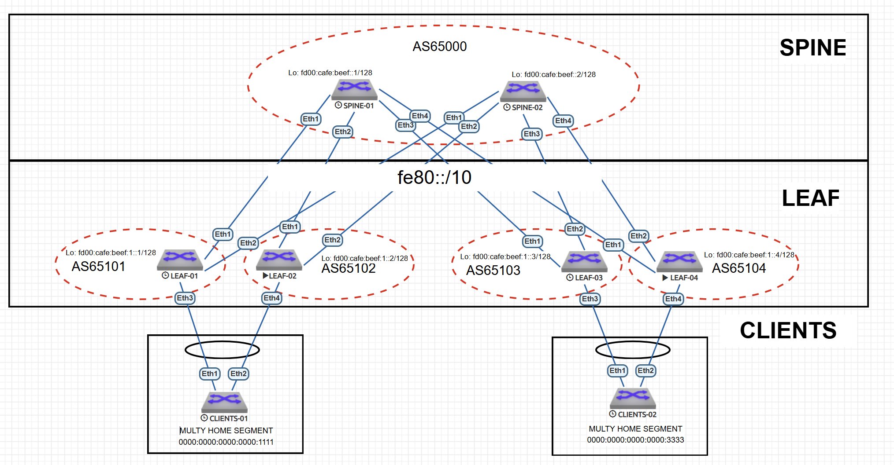

# eBGP Underlay сеть на unnumbered IPv6. MultyHome

---

## 1. План работ  

### Настройка Multy Home для clients-01, clients-02
- [ ] Подключить клиентов 2-я линками к различным Leaf
- [ ] Настроить агрегированный канал со стороны клиента
- [ ] Настроить multihoming для работы в Overlay сети
- [ ] Настроить fail over group для защиты от потери аплинков у leaf

### Тестирование и проверка  
- [ ] протестировать отказоустойчивость - убедиться, что связнность не теряется при отключении одного из линков
- [ ] протестирова fail over group - убедиться, что даунлинки переходит в состояние down 

---

## 2. Адресное пространство  

### 2.1. Loopback интерфейсы
Для уникальных локальных адресов (ULA) используется префикс FD00::/8. Мы выделим блок /48 для лупбэков из ULA. 

**Адрес сети:** `fd00:cafe:beef::/48`  

| Устройство | IPv6-адрес       |
|------------|----------------|
| Spine-1    | fd00:cafe:beef::1/128 |
| Spine-2    | fd00:cafe:beef::2/128  |
| Leaf-1     | fd00:cafe:beef:1::1/128 |
| Leaf-2     | fd00:cafe:beef:1::2/128 |
| Leaf-3     | fd00:cafe:beef:1::3/128 |

### 2.2. Point-to-Point интерфейсы   

Для IPv6 Unnumbered не требуются статические адреса. Достаточно включить ipv6 address auto-config для генерации линк-локал адресов. 

---

## 3. Схема Underlay и Overlay сети на eBGP  

### 3.1. Топология  



### 3.2. Параметры eBGP  

#### Общие настройки:  
- **AS SPINE** Для спайн выделим AS `65000`
- **AS LEAF** Для лиф выделим диапазон AS `65100-65200`. Так как каждый лиф находится в своей AS
- **ipv6** Для работы ipv6 маршрутизации включим ipv6 unicast-routing
 - **multi-agent** Для работы несколько AFI\SAFI включим на каждом коммутаторе - service routing protocols model multi-agent

### 3.3. Таблица Автономных систем  

| Устройство | AS |
|------------|-----------|
| **Spine-1**| 65000    | 
| **Spine-2**| 65000    |
| **Leaf-01** | 65101    | 
| **Leaf-02** | 65102    | 
| **Leaf-03** | 65103    |
| **Leaf-04** | 65104    | 


## 4. Конфигурация протокола eBGP и интерфейсов.  

### 4.0. SPINE
На спайн настраиваем фильтр автоновных систем лифов, с которыми будем устанавливать соединения. 
```
peer-filter LEAVES_ASN
   10 match as-range 65100-65300 result accept

```

### 4.1. SPINE-1 
```
interface Ethernet1
   description TO-LEAF-1
   mtu 9000
   no switchport
   ipv6 enable
   ipv6 address auto-config
!
interface Ethernet2
   description TO-LEAF-2
   mtu 9000
   no switchport
   ipv6 enable
   ipv6 address auto-config
!
interface Ethernet3
   description TO-LEAF-3
   mtu 9000
   no switchport
   ipv6 enable
   ipv6 address auto-config
!
interface Ethernet4
   description TO-LEAF-04
   mtu 9000
   no switchport
   ipv6 enable
   ipv6 address auto-config
!
interface Loopback0
   description Router-ID
   ipv6 enable
   ipv6 address fd00:cafe:beef::1/128
```
```
router bgp 65000
   router-id 10.255.255.1
   no bgp default ipv4-unicast
   timers bgp 1 3
   distance bgp 20 200 200
   maximum-paths 2
   bgp listen range fe80::/10 peer-group UNDERLAY peer-filter LEAVES_ASN
   neighbor OVERLAY peer group
   neighbor OVERLAY next-hop-unchanged
   neighbor OVERLAY out-delay 0
   neighbor OVERLAY update-source Loopback0
   neighbor OVERLAY ebgp-multihop 3
   neighbor OVERLAY send-community extended
   neighbor UNDERLAY peer group
   neighbor UNDERLAY out-delay 0
   neighbor fd00:cafe:beef:1::1 peer group OVERLAY
   neighbor fd00:cafe:beef:1::1 remote-as 65101
   neighbor fd00:cafe:beef:1::2 peer group OVERLAY
   neighbor fd00:cafe:beef:1::2 remote-as 65102
   neighbor fd00:cafe:beef:1::3 peer group OVERLAY
   neighbor fd00:cafe:beef:1::3 remote-as 65103
   neighbor fd00:cafe:beef:1::4 peer group OVERLAY
   neighbor fd00:cafe:beef:1::4 remote-as 65104
   !
   address-family evpn
      neighbor OVERLAY activate
   !
   address-family ipv6
      neighbor UNDERLAY activate
      network fd00:cafe:beef::1/128
!
end
```
### 4.2. SPINE-2
```
interface Ethernet1
   description TO-LEAF-1
   mtu 9000
   no switchport
   ipv6 enable
   ipv6 address auto-config
!
interface Ethernet2
   description TO-LEAF-2
   mtu 9000
   no switchport
   ipv6 enable
   ipv6 address auto-config
!
interface Ethernet3
   description TO-LEAF-3
   mtu 9000
   no switchport
   ipv6 enable
   ipv6 address auto-config
!
interface Ethernet4
   description TO-LEAF-04
   mtu 9000
   no switchport
   ipv6 enable
   ipv6 address auto-config
!
interface Loopback0
   description Router-ID
   ipv6 enable
   ipv6 address fd00:cafe:beef::2/128
!
```
```
router bgp 65000
   router-id 10.255.255.2
   no bgp default ipv4-unicast
   timers bgp 1 3
   distance bgp 20 200 200
   maximum-paths 2
   bgp listen range fe80::/10 peer-group UNDERLAY peer-filter LEAVES_ASN
   neighbor OVERLAY peer group
   neighbor OVERLAY next-hop-unchanged
   neighbor OVERLAY out-delay 0
   neighbor OVERLAY update-source Loopback0
   neighbor OVERLAY ebgp-multihop 3
   neighbor OVERLAY send-community extended
   neighbor UNDERLAY peer group
   neighbor UNDERLAY out-delay 0
   neighbor fd00:cafe:beef:1::1 peer group OVERLAY
   neighbor fd00:cafe:beef:1::1 remote-as 65101
   neighbor fd00:cafe:beef:1::2 peer group OVERLAY
   neighbor fd00:cafe:beef:1::2 remote-as 65102
   neighbor fd00:cafe:beef:1::3 peer group OVERLAY
   neighbor fd00:cafe:beef:1::3 remote-as 65103
   neighbor fd00:cafe:beef:1::4 peer group OVERLAY
   neighbor fd00:cafe:beef:1::4 remote-as 65104
   !
   address-family evpn
      neighbor OVERLAY activate
   !
   address-family ipv6
      neighbor UNDERLAY activate
      network fd00:cafe:beef::2/128

```
### 4.3. LEAF-1
```
vlan 100
   name vlan-100
!
ip routing vrf vrf-red
vrf instance vrf-red
!
interface Port-Channel1
   description TO_CLIENTS-01
   switchport access vlan 100
   !
   evpn ethernet-segment
      identifier 0000:0000:0000:0000:1111
      route-target import 00:00:00:00:11:11
   lacp system-id 0000.0000.1111
   link tracking group UPLINKS downstream
!
interface Ethernet1
   description TO-SPINE-1
   mtu 9000
   no switchport
   ipv6 enable
   ipv6 address auto-config
   link tracking group UPLINKS upstream
!
interface Ethernet2
   description TO-SPINE-2
   mtu 9000
   no switchport
   ipv6 enable
   ipv6 address auto-config
   link tracking group UPLINKS upstream
!
interface Ethernet3
   description TO-CLIENTS-1
   channel-group 1 mode active
!
interface Loopback0
   description Router-ID & Overlay Endpoint
   ipv6 enable
   ipv6 address fd00:cafe:beef:1::1/128
!
interface Vlan100
   vrf vrf-red
   ip address virtual 10.10.10.254/24
!
interface Vxlan1
   vxlan source-interface Loopback0
   vxlan udp-port 4789
   vxlan encapsulation ipv6
   vxlan vlan 100 vni 19100
   vxlan vrf vrf-red vni 3089
!
ip virtual-router mac-address 00:00:00:00:00:12

```
```
router bgp 65101
   router-id 10.255.255.11
   no bgp default ipv4-unicast
   timers bgp 1 3
   distance bgp 20 200 200
   maximum-paths 2
   neighbor OVERLAY peer group
   neighbor OVERLAY remote-as 65000
   no neighbor OVERLAY next-hop-unchanged
   neighbor OVERLAY out-delay 0
   neighbor OVERLAY update-source Loopback0
   neighbor OVERLAY ebgp-multihop 3
   neighbor OVERLAY send-community extended
   neighbor UNDERLAY peer group
   neighbor UNDERLAY out-delay 0
   neighbor UNDERLAY send-community extended
   neighbor fd00:cafe:beef::1 peer group OVERLAY
   neighbor fd00:cafe:beef::2 peer group OVERLAY
   neighbor interface Et1-2 peer-group UNDERLAY remote-as 65000
   !
   vlan 100
      rd auto
      route-target both 65101:19100
      redistribute learned
   !
   address-family evpn
      neighbor OVERLAY activate
   !
   address-family ipv6
      neighbor UNDERLAY activate
      network fd00:cafe:beef:1::1/128
   !
   vrf vrf-red
      rd 10.255.255.11:3089
      route-target import evpn 65000:3089
      route-target export evpn 65000:3089
!
end
```

### 4.4. LEAF-2
```
vlan 100
   name vlan-100
!
ip routing vrf vrf-red
vrf instance vrf-red
!
interface Port-Channel1
   description TO_CLIENTS-01
   switchport access vlan 100
   !
   evpn ethernet-segment
      identifier 0000:0000:0000:0000:1111
      route-target import 00:00:00:00:11:11
   lacp system-id 0000.0000.1111
   link tracking group UPLINKS downstream
!
interface Ethernet1
   description TO-SPINE-1
   mtu 9000
   no switchport
   ipv6 enable
   ipv6 address auto-config
   link tracking group UPLINKS upstream
!
interface Ethernet2
   description TO-SPINE-2
   mtu 9000
   no switchport
   ipv6 enable
   ipv6 address auto-config
   link tracking group UPLINKS upstream
!
interface Ethernet4
   description TO_CLIENTS-01
   channel-group 1 mode active
!
interface Loopback0
   description Router-ID & Overlay Endpoint
   ipv6 enable
   ipv6 address fd00:cafe:beef:1::2/128
!
interface Vlan100
   vrf vrf-red
   ip address virtual 10.10.10.254/24
!
interface Vxlan1
   vxlan source-interface Loopback0
   vxlan udp-port 4789
   vxlan encapsulation ipv6
   vxlan vlan 100 vni 19100
   vxlan vrf vrf-red vni 3089
!
ip virtual-router mac-address 00:00:00:00:00:12
```
```
router bgp 65102
   router-id 10.255.255.12
   no bgp default ipv4-unicast
   timers bgp 1 3
   distance bgp 20 200 200
   maximum-paths 2
   neighbor OVERLAY peer group
   neighbor OVERLAY remote-as 65000
   neighbor OVERLAY out-delay 0
   neighbor OVERLAY update-source Loopback0
   neighbor OVERLAY ebgp-multihop 3
   neighbor OVERLAY send-community extended
   neighbor UNDERLAY peer group
   neighbor UNDERLAY out-delay 0
   neighbor UNDERLAY send-community extended
   neighbor fd00:cafe:beef::1 peer group OVERLAY
   neighbor fd00:cafe:beef::2 peer group OVERLAY
   redistribute connected
   neighbor interface Et1-2 peer-group UNDERLAY remote-as 65000
   !
   vlan 100
      rd auto
      route-target both 65101:19100
   !
   address-family evpn
      neighbor OVERLAY activate
   !
   address-family ipv6
      neighbor UNDERLAY activate
      network fd00:cafe:beef:1::2/128
   !
   vrf vrf-red
      rd 10.255.255.12:3089
      route-target import evpn 65000:3089
      route-target export evpn 65000:3089
!
end
```

### 4.5. LEAF-3
```
vlan 300
   name vlan-300
!
ip routing vrf vrf-red
vrf instance vrf-red
!
interface Port-Channel1
   description TO_CLIENTS-02
   switchport access vlan 300
   !
   evpn ethernet-segment
      identifier 0000:0000:0000:0000:3333
      route-target import 00:00:00:00:33:33
   lacp system-id 0000.0000.3333
   link tracking group UPLINKS downstream
!
interface Ethernet1
   description TO-SPINE-1
   mtu 9000
   no switchport
   ipv6 enable
   ipv6 address auto-config
   link tracking group UPLINKS upstream
!
interface Ethernet2
   description TO-SPINE-2
   mtu 9000
   no switchport
   ipv6 enable
   ipv6 address auto-config
   link tracking group UPLINKS upstream
!
interface Ethernet3
   description TO_CLIENTS_02
   channel-group 1 mode active
!
interface Loopback0
   ipv6 enable
   ipv6 address fd00:cafe:beef:1::3/128
!
interface Vlan300
   vrf vrf-red
   ip address virtual 30.30.30.254/24
!
interface Vxlan1
   vxlan source-interface Loopback0
   vxlan udp-port 4789
   vxlan encapsulation ipv6
   vxlan vlan 300 vni 19300
   vxlan vrf vrf-red vni 3089
!
ip virtual-router mac-address 00:00:00:00:00:34

```
```
router bgp 65103
   router-id 10.255.255.13
   no bgp default ipv4-unicast
   timers bgp 1 3
   distance bgp 20 200 200
   maximum-paths 2
   neighbor OVERLAY peer group
   neighbor OVERLAY remote-as 65000
   neighbor OVERLAY out-delay 0
   neighbor OVERLAY update-source Loopback0
   neighbor OVERLAY ebgp-multihop 3
   neighbor OVERLAY send-community extended
   neighbor UNDERLAY peer group
   neighbor UNDERLAY out-delay 0
   neighbor UNDERLAY send-community extended
   neighbor fd00:cafe:beef::1 peer group OVERLAY
   neighbor fd00:cafe:beef::2 peer group OVERLAY
   neighbor interface Et1-2 peer-group UNDERLAY remote-as 65000
   !
   vlan 300
      rd auto
      route-target both 65103:19300
      redistribute learned
   !
   address-family evpn
      neighbor OVERLAY activate
   !
   address-family ipv6
      neighbor UNDERLAY activate
      network fd00:cafe:beef:1::3/128
   !
   vrf vrf-red
      rd 10.255.255.13:3089
      route-target import evpn 65000:3089
      route-target export evpn 65000:3089
!
end
```
### 4.5. LEAF-4

```
vlan 300
   name vlan-300
!
ip routing vrf vrf-red
vrf instance vrf-red
!
interface Port-Channel1
   description TO_CLIENTS-02
   switchport access vlan 300
   !
   evpn ethernet-segment
      identifier 0000:0000:0000:0000:3333
      route-target import 00:00:00:00:33:33
   lacp system-id 0000.0000.3333
   link tracking group UPLINKS downstream
!
interface Ethernet1
   description TO-SPINE-1
   mtu 9000
   no switchport
   ipv6 enable
   ipv6 address auto-config
!
interface Ethernet2
   description TO-SPINE-2
   mtu 9000
   no switchport
   ipv6 enable
   ipv6 address auto-config
!
interface Ethernet3
!
interface Ethernet4
   description TO_CLIENTS_02
   channel-group 1 mode active
!
interface Loopback0
   ipv6 enable
   ipv6 address fd00:cafe:beef:1::4/128
!
interface Vlan300
   vrf vrf-red
   ip address virtual 30.30.30.254/24
!
interface Vxlan1
   vxlan source-interface Loopback0
   vxlan udp-port 4789
   vxlan encapsulation ipv6
   vxlan vlan 300 vni 19300
   vxlan vrf vrf-red vni 3089
!
ip virtual-router mac-address 00:00:00:00:00:34

```
```
router bgp 65104
   router-id 10.255.255.14
   no bgp default ipv4-unicast
   timers bgp 1 3
   distance bgp 20 200 200
   maximum-paths 2
   neighbor OVERLAY peer group
   neighbor OVERLAY remote-as 65000
   neighbor OVERLAY out-delay 0
   neighbor OVERLAY update-source Loopback0
   neighbor OVERLAY ebgp-multihop 3
   neighbor OVERLAY send-community extended
   neighbor UNDERLAY peer group
   neighbor UNDERLAY out-delay 0
   neighbor UNDERLAY send-community extended
   neighbor fd00:cafe:beef::1 peer group OVERLAY
   neighbor fd00:cafe:beef::2 peer group OVERLAY
   neighbor interface Et1-2 peer-group UNDERLAY remote-as 65000
   !
   vlan 300
      rd auto
      route-target both 65103:19300
      redistribute learned
   !
   address-family evpn
      neighbor OVERLAY activate
   !
   address-family ipv6
      neighbor UNDERLAY activate
      network fd00:cafe:beef:1::4/128
   !
   vrf vrf-red
      rd 10.255.255.14:3089
      route-target import evpn 65000:3089
      route-target export evpn 65000:3089
!
end
```

### 4.6. CLIENTS-1
```
vlan 100
   name vlan-100
!
interface Port-Channel1
   description TO_FABRIC
   switchport access vlan 100
!
interface Ethernet1
   channel-group 1 mode active
!
interface Ethernet2
   description TO_LEAF-02
   channel-group 1 mode active
!
interface Vlan100
   description CLIENTS_NETWORK
   ip address 10.10.10.1/24
!
ip routing
!
ip route 0.0.0.0/0 10.10.10.254
!
end

```
### 4.6. CLIENTS-2
```
vlan 300
   name vlane-300
!
interface Port-Channel1
   description TO_FABRIC
   switchport access vlan 300
!
interface Ethernet1
   description TO-LEAF-03
   channel-group 1 mode active
!
interface Ethernet2
   description TO-LEAF-04
   channel-group 1 mode active
!
interface Vlan300
   ip address 30.30.30.1/24
!
ip routing
!
ip route 0.0.0.0/0 30.30.30.254
!
end

```
## 5. Тестирование и проверка eBGP

### 5.0 Проверка eBGP маршрутов на LEAF-01

```
LEAF-1(config-router-bgp)#show bgp evpn vni 3089
BGP routing table information for VRF default
Router identifier 10.255.255.11, local AS number 65101
Route status codes: * - valid, > - active, S - Stale, E - ECMP head, e - ECMP
                    c - Contributing to ECMP, % - Pending BGP convergence
Origin codes: i - IGP, e - EGP, ? - incomplete
AS Path Attributes: Or-ID - Originator ID, C-LST - Cluster List, LL Nexthop - Link Local Nexthop

          Network                Next Hop              Metric  LocPref Weight  Path
 * >Ec    RD: 10.255.255.13:300 mac-ip 5000.001b.5e8d 30.30.30.1
                                 fd00:cafe:beef:1::3   -       100     0       65000 65103 i
 *  ec    RD: 10.255.255.13:300 mac-ip 5000.001b.5e8d 30.30.30.1
                                 fd00:cafe:beef:1::3   -       100     0       65000 65103 i
 * >      RD: 10.255.255.11:100 mac-ip 5000.0072.8b31 10.10.10.1
                                 -                     -       -       0       i
```
Видим, что на LEAF-01 изучены все клиентские адреса в l3-vni 3089.


### 5.1 Проверка таблицы маршрутизации на клиентах 

```
CLIENTS-01#show ip route

VRF: default
Codes: C - connected, S - static, K - kernel,
       O - OSPF, IA - OSPF inter area, E1 - OSPF external type 1,
       E2 - OSPF external type 2, N1 - OSPF NSSA external type 1,
       N2 - OSPF NSSA external type2, B - Other BGP Routes,
       B I - iBGP, B E - eBGP, R - RIP, I L1 - IS-IS level 1,
       I L2 - IS-IS level 2, O3 - OSPFv3, A B - BGP Aggregate,
       A O - OSPF Summary, NG - Nexthop Group Static Route,
       V - VXLAN Control Service, M - Martian,
       DH - DHCP client installed default route,
       DP - Dynamic Policy Route, L - VRF Leaked,
       G  - gRIBI, RC - Route Cache Route

Gateway of last resort:
 S        0.0.0.0/0 [1/0] via 10.10.10.254, Vlan100

 C        10.10.10.0/24 is directly connected, Vlan100

 CLIENTS-02#show  ip route

VRF: default
Codes: C - connected, S - static, K - kernel,
       O - OSPF, IA - OSPF inter area, E1 - OSPF external type 1,
       E2 - OSPF external type 2, N1 - OSPF NSSA external type 1,
       N2 - OSPF NSSA external type2, B - Other BGP Routes,
       B I - iBGP, B E - eBGP, R - RIP, I L1 - IS-IS level 1,
       I L2 - IS-IS level 2, O3 - OSPFv3, A B - BGP Aggregate,
       A O - OSPF Summary, NG - Nexthop Group Static Route,
       V - VXLAN Control Service, M - Martian,
       DH - DHCP client installed default route,
       DP - Dynamic Policy Route, L - VRF Leaked,
       G  - gRIBI, RC - Route Cache Route

Gateway of last resort:
 S        0.0.0.0/0 [1/0] via 30.30.30.254, Vlan300

 C        30.30.30.0/24 is directly connected, Vlan300


```
 

### 5.2 Проверка табицы маршрутизации в vrf-red на LEAF-01 и LEAF-03
```
LEAF-1(config-router-bgp)#show ip route vrf vrf-red

VRF: vrf-red
Codes: C - connected, S - static, K - kernel,
       O - OSPF, IA - OSPF inter area, E1 - OSPF external type 1,
       E2 - OSPF external type 2, N1 - OSPF NSSA external type 1,
       N2 - OSPF NSSA external type2, B - Other BGP Routes,
       B I - iBGP, B E - eBGP, R - RIP, I L1 - IS-IS level 1,
       I L2 - IS-IS level 2, O3 - OSPFv3, A B - BGP Aggregate,
       A O - OSPF Summary, NG - Nexthop Group Static Route,
       V - VXLAN Control Service, M - Martian,
       DH - DHCP client installed default route,
       DP - Dynamic Policy Route, L - VRF Leaked,
       G  - gRIBI, RC - Route Cache Route

Gateway of last resort is not set

 C        10.10.10.0/24 is directly connected, Vlan100
 B E      30.30.30.1/32 [20/0] via VTEP fd00:cafe:beef:1::3 VNI 3089 router-mac 50:00:00:15:f4:e8 local-interface Vxlan1

---------------------------------------------------------------------------------------------------------------------------------------
LEAF-3(config-router-bgp)#show ip route vrf vrf-red

VRF: vrf-red
Codes: C - connected, S - static, K - kernel,
       O - OSPF, IA - OSPF inter area, E1 - OSPF external type 1,
       E2 - OSPF external type 2, N1 - OSPF NSSA external type 1,
       N2 - OSPF NSSA external type2, B - Other BGP Routes,
       B I - iBGP, B E - eBGP, R - RIP, I L1 - IS-IS level 1,
       I L2 - IS-IS level 2, O3 - OSPFv3, A B - BGP Aggregate,
       A O - OSPF Summary, NG - Nexthop Group Static Route,
       V - VXLAN Control Service, M - Martian,
       DH - DHCP client installed default route,
       DP - Dynamic Policy Route, L - VRF Leaked,
       G  - gRIBI, RC - Route Cache Route

Gateway of last resort is not set

 B E      10.10.10.1/32 [20/0] via VTEP fd00:cafe:beef:1::1 VNI 3089 router-mac 50:00:00:d5:5d:c0 local-interface Vxlan1
 C        30.30.30.0/24 is directly connected, Vlan300

```
Видим что в vrf-red клиентские маршруты установлены. Отметим что используется балансировка к удалённой сети. 

### 5.3 Проверка связи между Client-1 -> Client-2

```
CLIENTS-01#ping 30.30.30.1
PING 30.30.30.1 (30.30.30.1) 72(100) bytes of data.
80 bytes from 30.30.30.1: icmp_seq=1 ttl=62 time=1391 ms
80 bytes from 30.30.30.1: icmp_seq=2 ttl=62 time=1413 ms
80 bytes from 30.30.30.1: icmp_seq=3 ttl=62 time=1431 ms
80 bytes from 30.30.30.1: icmp_seq=4 ttl=62 time=1452 ms
80 bytes from 30.30.30.1: icmp_seq=5 ttl=62 time=1461 ms

--- 30.30.30.1 ping statistics ---
5 packets transmitted, 5 received, 0% packet loss, time 53ms
rtt min/avg/max/mdev = 1391.088/1430.101/1461.522/25.778 ms, pipe 5, ipg/ewma 1s
```
Пинг проходит через Vxlan тонель поверх ipv6 фабрики в топологии с all-active мультихоум подключением.

### 5.4 Проверка мультихоум esi сегментов

```
LEAF-1#show bgp evpn instance
EVPN instance: VLAN 100
  Route distinguisher: 0:0
  Route target import: Route-Target-AS:65101:19100
  Route target export: Route-Target-AS:65101:19100
  Service interface: VLAN-based
  Local VXLAN IP address: fd00:cafe:beef:1::1
  VXLAN: enabled
  MPLS: disabled
  Local ethernet segment:
    ESI: 0000:0000:0000:0000:1111
      Interface: Port-Channel1
      Mode: all-active
      State: up
      ES-Import RT: 00:00:00:00:11:11
      DF election algorithm: modulus
      Designated forwarder: fd00:cafe:beef:1::1
      Non-Designated forwarder: fd00:cafe:beef:1::2

```
Видим, что в сегменте leaf-1,leaf-2 выбран в качестве DF leaf-1. А в сегменте leaf-3,leaf-4 выбран leaf-3 в качестве DF

### 6 Тесты

### 6.1 Отключение LEAF-01
```
---------------------------------------------------------------------------------------------------------------------------------------
Отключаем leaf-01 и проверяем что у leaf-03 остался один путь 
---------------------------------------------------------------------------------------------------------------------------------------
LEAF-3(config)#show ip route vrf vrf-red

VRF: vrf-red
Codes: C - connected, S - static, K - kernel,
       O - OSPF, IA - OSPF inter area, E1 - OSPF external type 1,
       E2 - OSPF external type 2, N1 - OSPF NSSA external type 1,
       N2 - OSPF NSSA external type2, B - Other BGP Routes,
       B I - iBGP, B E - eBGP, R - RIP, I L1 - IS-IS level 1,
       I L2 - IS-IS level 2, O3 - OSPFv3, A B - BGP Aggregate,
       A O - OSPF Summary, NG - Nexthop Group Static Route,
       V - VXLAN Control Service, M - Martian,
       DH - DHCP client installed default route,
       DP - Dynamic Policy Route, L - VRF Leaked,
       G  - gRIBI, RC - Route Cache Route

Gateway of last resort is not set

 B E      10.10.10.0/24 [20/0] via VTEP fd00:cafe:beef:1::2 VNI 3089 router-mac 50:00:00:03:37:66 local-interface Vxlan1
 C        30.30.30.0/24 is directly connected, Vlan300
---------------------------------------------------------------------------------------------------------------------------------------
проверям связь между клиентами 
---------------------------------------------------------------------------------------------------------------------------------------

CLIENTS-01#ping 30.30.30.1
PING 30.30.30.1 (30.30.30.1) 72(100) bytes of data.
80 bytes from 30.30.30.1: icmp_seq=1 ttl=62 time=507 ms
80 bytes from 30.30.30.1: icmp_seq=2 ttl=62 time=626 ms
80 bytes from 30.30.30.1: icmp_seq=3 ttl=62 time=638 ms
80 bytes from 30.30.30.1: icmp_seq=4 ttl=62 time=758 ms
80 bytes from 30.30.30.1: icmp_seq=5 ttl=62 time=783 ms

---------------------------------------------------------------------------------------------------------------------------------------
Проверяем Local ethernet segment
---------------------------------------------------------------------------------------------------------------------------------------

LEAF-2#show bgp evpn instance
EVPN instance: VLAN 100
  Route distinguisher: 0:0
  Route target import: Route-Target-AS:65101:19100
  Route target export: Route-Target-AS:65101:19100
  Service interface: VLAN-based
  Local VXLAN IP address: fd00:cafe:beef:1::2
  VXLAN: enabled
  MPLS: disabled
  Local ethernet segment:
    ESI: 0000:0000:0000:0000:1111
      Interface: Port-Channel1
      Mode: all-active
      State: up
      ES-Import RT: 00:00:00:00:11:11
      Designated forwarder: fd00:cafe:beef:1::2


```
Видим что резервирование отработало. На leaf-03 остался только один маршрут к 10.10.10.0/24, leaf-2 остался один в паре MH

### 6.2 Отключение даунлинков на SPINE в сторону LEAF-2
```
---------------------------------------------------------------------------------------------------------------------------------------
Проверяем ink tracking group UPLINKS на LEAF-2
---------------------------------------------------------------------------------------------------------------------------------------

LEAF-2#show link tracking group UPLINKS
   Link State Group    Status
---------------------- ------
   UPLINKS                 up

---------------------------------------------------------------------------------------------------------------------------------------
Выключаем порты eth2 на спайнах
---------------------------------------------------------------------------------------------------------------------------------------
SPINE-1(config-if-Et2)#show int description
Interface                      Status         Protocol           Description
Et1                            up             up                 TO-LEAF-1
Et2                            admin down     down               TO-LEAF-2
Et3                            up             up                 TO-LEAF-3
Et4                            up             up                 TO-LEAF-04


SPINE-2(config-if-Et2)#show int description
Interface                      Status         Protocol           Description
Et1                            up             up                 TO-LEAF-1
Et2                            admin down     down               TO-LEAF-2
Et3                            up             up                 TO-LEAF-3
Et4                            up             up                 TO-LEAF-04

---------------------------------------------------------------------------------------------------------------------------------------
Проверяем link tracking group UPLINKS на LEAF-2
---------------------------------------------------------------------------------------------------------------------------------------

LEAF-2#show link tracking group UPLINKS
   Link State Group    Status
---------------------- ------
   UPLINKS               down

LEAF-2#show interfaces po1
Port-Channel1 is down, line protocol is down (errdisabled)
  Hardware is Port-Channel, address is 5000.0004.0004
  Description: TO_CLIENTS-01
  Ethernet MTU 9214 bytes
  Full-duplex, Unconfigured
  Active members in this channel: 0
  Fallback mode is: off
  Down 17 seconds
  4 link status changes since last clear
  Last clearing of "show interface" counters never
  5 minutes input rate 0 bps (- with framing overhead), 0 packets/sec
  5 minutes output rate 0 bps (- with framing overhead), 0 packets/sec
     1095 packets input, 139397 bytes
     Received 0 broadcasts, 277 multicast
     0 input errors, 0 input discards
     2759 packets output, 346395 bytes
     Sent 1 broadcasts, 2278 multicast
     0 output errors, 0 output discards

```
Видим, что защита от падения аплников сработала на leaf-02 