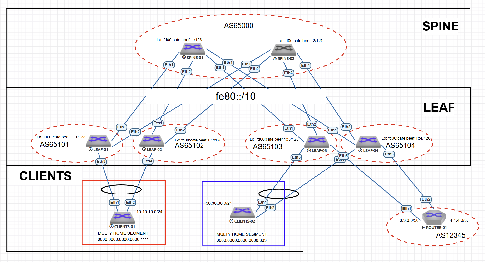

# eBGP Underlay сеть на unnumbered IPv6. VxLAN. Routing via external Router.

---

## 1. План работ  

### Настройка VRF для clients-01, clients-02
- [ ] Разместить двух "клиентов" в разных VRF в рамках одной фабрики.
- [ ] Настроить маршрутизацию между клиентами через внешнее устройство (граничный роутер\фаерволл\etc).
- [ ] Реализовать ликинг маршрутов между VRF, c целью изоляции прямой связи клиентов друг с другом. 


### Тестирование и проверка  
- [ ] Проверить маршруты 5 типа на коммутаторах фабрики
- [ ] Проверить связь между клиентами

---

## 2. Адресное пространство  

### 2.1. Loopback интерфейсы
Для уникальных локальных адресов (ULA) используется префикс FD00::/8. Мы выделим блок /48 для лупбэков из ULA. 

**Адрес сети:** `fd00:cafe:beef::/48`  

| Устройство | IPv6-адрес       |
|------------|----------------|
| Spine-1    | fd00:cafe:beef::1/128 |
| Spine-2    | fd00:cafe:beef::2/128  |
| Leaf-1     | fd00:cafe:beef:1::1/128 |
| Leaf-2     | fd00:cafe:beef:1::2/128 |
| Leaf-3     | fd00:cafe:beef:1::3/128 |
| Leaf-4     | fd00:cafe:beef:1::4/128 |

### 2.2. Point-to-Point интерфейсы   

Для IPv6 Unnumbered не требуются статические адреса. Достаточно включить ipv6 address auto-config для генерации линк-локал адресов. 
Для Point-to-Point на стыке с роутером выбраны следующие адреса 

| Соединение        | Подсеть       | Устройство | IP-адрес     |
|-------------------|---------------|------------|--------------|
| Leaf-03 ↔ Router-1  | 10.0.0.0/31   | Leaf-03    | 10.0.0.1/30  |
|                   |               | Router-1     | 10.0.0.2/30  |
| Leaf-03 ↔ Router-1  | 10.0.0.4/31   | Leaf-03    | 10.0.0.5/30  |
|                   |               | Router-1     | 10.0.0.6/30  |
| Leaf-04 ↔ Router-1  | 10.0.0.8/31   | Leaf-04    | 10.0.0.9/30  |
|                   |               | Router-1     | 10.0.0.10/30  |
| Leaf-04 ↔ Router-1  | 10.0.0.12/31   | Leaf-04    | 10.0.0.13/30  |
|                   |               | Router-1     | 10.0.0.14/30 |

Для проведения тестов, использованы клиентские подсети 10.10.10.0/24 и 30.30.30.0/24 

---

## 3. Схема Underlay и Overlay сети на eBGP  

### 3.1. Топология  



### 3.2. Параметры eBGP  

#### Общие настройки:  
- **AS SPINE** Для спайн выделим AS `65000`
- **AS LEAF** Для лиф выделим диапазон AS `65100-65200`. Так как каждый лиф находится в своей AS
- **ipv6** Для работы ipv6 маршрутизации включим ipv6 unicast-routing
- **multi-agent** Для работы несколько AFI\SAFI включим на каждом коммутаторе - service routing protocols model multi-agent
- **timers bgp 1 3** таймеры для виртуальной лабы отключены, однако рекомендуется их использовать для реального оборудования. 

### 3.3. Таблица Автономных систем  

| Устройство | AS |
|------------|-----------|
| **Spine-1**| 65000    | 
| **Spine-2**| 65000    |
| **Leaf-01** | 65101    | 
| **Leaf-02** | 65102    | 
| **Leaf-03** | 65103    |
| **Leaf-04** | 65104    | 


## 4. Конфигурация протокола eBGP и интерфейсов.  

### 4.0. SPINE
На спайн настраиваем фильтр автоновных систем лифов, с которыми будем устанавливать соединения. 
```
peer-filter LEAVES_ASN
   10 match as-range 65100-65300 result accept

```

### 4.1. SPINE-1 
```
interface Ethernet1
   description TO-LEAF-1
   mtu 9000
   no switchport
   ipv6 enable
   ipv6 address auto-config
!
interface Ethernet2
   description TO-LEAF-2
   mtu 9000
   no switchport
   ipv6 enable
   ipv6 address auto-config
!
interface Ethernet3
   description TO-LEAF-3
   mtu 9000
   no switchport
   ipv6 enable
   ipv6 address auto-config
!
interface Ethernet4
   description TO-LEAF-04
   mtu 9000
   no switchport
   ipv6 enable
   ipv6 address auto-config
!
interface Loopback0
   description Router-ID
   ipv6 enable
   ipv6 address fd00:cafe:beef::1/128
```
```
router bgp 65000
   router-id 10.255.255.1
   no bgp default ipv4-unicast
   distance bgp 20 200 200
   maximum-paths 2
   bgp listen range fe80::/10 peer-group UNDERLAY peer-filter LEAVES_ASN
   neighbor OVERLAY peer group
   neighbor OVERLAY next-hop-unchanged
   neighbor OVERLAY out-delay 0
   neighbor OVERLAY update-source Loopback0
   neighbor OVERLAY ebgp-multihop 3
   neighbor OVERLAY send-community extended
   neighbor UNDERLAY peer group
   neighbor UNDERLAY out-delay 0
   neighbor fd00:cafe:beef:1::1 peer group OVERLAY
   neighbor fd00:cafe:beef:1::1 remote-as 65101
   neighbor fd00:cafe:beef:1::2 peer group OVERLAY
   neighbor fd00:cafe:beef:1::2 remote-as 65102
   neighbor fd00:cafe:beef:1::3 peer group OVERLAY
   neighbor fd00:cafe:beef:1::3 remote-as 65103
   neighbor fd00:cafe:beef:1::4 peer group OVERLAY
   neighbor fd00:cafe:beef:1::4 remote-as 65104
   !
   address-family evpn
      neighbor OVERLAY activate
   !
   address-family ipv6
      neighbor UNDERLAY activate
      network fd00:cafe:beef::1/128
!
end
```
### 4.2. SPINE-2
```
interface Ethernet1
   description TO-LEAF-1
   mtu 9000
   no switchport
   ipv6 enable
   ipv6 address auto-config
!
interface Ethernet2
   description TO-LEAF-2
   mtu 9000
   no switchport
   ipv6 enable
   ipv6 address auto-config
!
interface Ethernet3
   description TO-LEAF-3
   mtu 9000
   no switchport
   ipv6 enable
   ipv6 address auto-config
!
interface Ethernet4
   description TO-LEAF-04
   mtu 9000
   no switchport
   ipv6 enable
   ipv6 address auto-config
!
interface Loopback0
   description Router-ID
   ipv6 enable
   ipv6 address fd00:cafe:beef::2/128
!
```
```
router bgp 65000
   router-id 10.255.255.2
   no bgp default ipv4-unicast
   distance bgp 20 200 200
   maximum-paths 2
   bgp listen range fe80::/10 peer-group UNDERLAY peer-filter LEAVES_ASN
   neighbor OVERLAY peer group
   neighbor OVERLAY next-hop-unchanged
   neighbor OVERLAY out-delay 0
   neighbor OVERLAY update-source Loopback0
   neighbor OVERLAY ebgp-multihop 3
   neighbor OVERLAY send-community extended
   neighbor UNDERLAY peer group
   neighbor UNDERLAY out-delay 0
   neighbor fd00:cafe:beef:1::1 peer group OVERLAY
   neighbor fd00:cafe:beef:1::1 remote-as 65101
   neighbor fd00:cafe:beef:1::2 peer group OVERLAY
   neighbor fd00:cafe:beef:1::2 remote-as 65102
   neighbor fd00:cafe:beef:1::3 peer group OVERLAY
   neighbor fd00:cafe:beef:1::3 remote-as 65103
   neighbor fd00:cafe:beef:1::4 peer group OVERLAY
   neighbor fd00:cafe:beef:1::4 remote-as 65104
   !
   address-family evpn
      neighbor OVERLAY activate
   !
   address-family ipv6
      neighbor UNDERLAY activate
      network fd00:cafe:beef::2/128

```
### 4.3. LEAF-1
```
!
service routing protocols model multi-agent
!
link tracking group UPLINKS
   recovery delay 60
!
vlan 100
   name vlan-100
!
vrf instance vrf-red
!
interface Port-Channel1
   description TO_CLIENTS-01
   switchport access vlan 100
   !
   evpn ethernet-segment
      identifier 0000:0000:0000:0000:1111
      route-target import 00:00:00:00:11:11
   lacp system-id 0000.0000.1111
   link tracking group UPLINKS downstream
!
interface Ethernet1
   description TO-SPINE-1
   mtu 9000
   no switchport
   ipv6 enable
   ipv6 address auto-config
   link tracking group UPLINKS upstream
!
interface Ethernet2
   description TO-SPINE-2
   mtu 9000
   no switchport
   ipv6 enable
   ipv6 address auto-config
   link tracking group UPLINKS upstream
!
interface Ethernet3
   description TO-CLIENTS-1
   channel-group 1 mode active
!
interface Loopback0
   description Router-ID & Overlay Endpoint
   ipv6 enable
   ipv6 address fd00:cafe:beef:1::1/128
!
interface Vlan100
   vrf vrf-red
   ip address virtual 10.10.10.254/24
!
interface Vxlan1
   vxlan source-interface Loopback0
   vxlan udp-port 4789
   vxlan encapsulation ipv6
   vxlan vlan 100 vni 19100
   vxlan vrf vrf-red vni 3089
!
ip virtual-router mac-address 00:00:00:00:00:12
!
ip routing 
ip routing vrf vrf-red
!
ipv6 unicast-routing
```
```
router bgp 65101
   router-id 10.255.255.11
   no bgp default ipv4-unicast
   distance bgp 20 200 200
   maximum-paths 2
   neighbor OVERLAY peer group
   neighbor OVERLAY remote-as 65000
   no neighbor OVERLAY next-hop-unchanged
   neighbor OVERLAY out-delay 0
   neighbor OVERLAY update-source Loopback0
   neighbor OVERLAY ebgp-multihop 3
   neighbor OVERLAY send-community extended
   neighbor UNDERLAY peer group
   neighbor UNDERLAY out-delay 0
   neighbor UNDERLAY send-community extended
   neighbor fd00:cafe:beef::1 peer group OVERLAY
   neighbor fd00:cafe:beef::2 peer group OVERLAY
   neighbor interface Et1-2 peer-group UNDERLAY remote-as 65000
   !
   vlan 100
      rd auto
      route-target both 65101:19100
      redistribute learned
   !
   address-family evpn
      neighbor OVERLAY activate
   !
   address-family ipv6
      neighbor UNDERLAY activate
      network fd00:cafe:beef:1::1/128
   !
   vrf vrf-red
      rd 10.255.255.11:3089
      route-target import evpn 65000:2000
      route-target import evpn 65000:3089
      route-target export evpn 65000:1000
      route-target export evpn 65000:3089
      redistribute connected
!
end
```

### 4.4. LEAF-2
```
service routing protocols model multi-agent
!
link tracking group UPLINKS
   recovery delay 60
!
vlan 100
   name vlan-100
!
vrf instance vrf-red
!
interface Port-Channel1
   description TO_CLIENTS-01
   switchport access vlan 100
   !
   evpn ethernet-segment
      identifier 0000:0000:0000:0000:1111
      route-target import 00:00:00:00:11:11
   lacp system-id 0000.0000.1111
   link tracking group UPLINKS downstream
!
interface Ethernet1
   description TO-SPINE-1
   mtu 9000
   no switchport
   ipv6 enable
   ipv6 address auto-config
   link tracking group UPLINKS upstream
!
interface Ethernet2
   description TO-SPINE-2
   mtu 9000
   no switchport
   ipv6 enable
   ipv6 address auto-config
   link tracking group UPLINKS upstream
!
interface Ethernet4
   description TO_CLIENTS-01
   channel-group 1 mode active
!
interface Loopback0
   description Router-ID & Overlay Endpoint
   ipv6 enable
   ipv6 address fd00:cafe:beef:1::2/128
!
interface Vlan100
   vrf vrf-red
   ip address virtual 10.10.10.254/24
!
interface Vxlan1
   vxlan source-interface Loopback0
   vxlan udp-port 4789
   vxlan encapsulation ipv6
   vxlan vlan 100 vni 19100
   vxlan vrf vrf-red vni 3089
!
ip virtual-router mac-address 00:00:00:00:00:12
!
ip routing
ip routing vrf vrf-red
!
ipv6 unicast-routing
```
```
router bgp 65102
   router-id 10.255.255.12
   no bgp default ipv4-unicast
   distance bgp 20 200 200
   maximum-paths 2
   neighbor OVERLAY peer group
   neighbor OVERLAY remote-as 65000
   neighbor OVERLAY out-delay 0
   neighbor OVERLAY update-source Loopback0
   neighbor OVERLAY ebgp-multihop 3
   neighbor OVERLAY send-community extended
   neighbor UNDERLAY peer group
   neighbor UNDERLAY out-delay 0
   neighbor UNDERLAY send-community extended
   neighbor fd00:cafe:beef::1 peer group OVERLAY
   neighbor fd00:cafe:beef::2 peer group OVERLAY
   redistribute connected
   neighbor interface Et1-2 peer-group UNDERLAY remote-as 65000
   !
   vlan 100
      rd auto
      route-target both 65101:19100
   !
   address-family evpn
      neighbor OVERLAY activate
   !
   address-family ipv6
      neighbor UNDERLAY activate
      network fd00:cafe:beef:1::2/128
   !
   vrf vrf-red
      rd 10.255.255.12:3089
      route-target import evpn 65000:2000
      route-target import evpn 65000:3089
      route-target export evpn 65000:1000
      route-target export evpn 65000:3089
      redistribute connected
!
end

```

### 4.5. LEAF-3
```
!
service routing protocols model multi-agent
!
link tracking group UPLINKS
   recovery delay 60
!
vlan 300
   name vlan-300
!
vlan 1000
   name router_peering_input_to_fabric
!
vlan 2000
   name router_peering_output_from_fabri
!
vrf instance vrf-red
!
vrf instance vrf-tech-traffic-from-fabric
!
vrf instance vrf-tech-traffic-to-fabric
!
interface Port-Channel1
   description TO_CLIENTS-02
   switchport access vlan 300
   !
   evpn ethernet-segment
      identifier 0000:0000:0000:0000:3333
      route-target import 00:00:00:00:33:33
   lacp system-id 0000.0000.3333
   link tracking group UPLINKS downstream
!
interface Ethernet1
   description TO-SPINE-1
   mtu 9000
   no switchport
   ipv6 enable
   ipv6 address auto-config
   link tracking group UPLINKS upstream
!
interface Ethernet2
   description TO-SPINE-2
   mtu 9000
   no switchport
   ipv6 enable
   ipv6 address auto-config
   link tracking group UPLINKS upstream
!
interface Ethernet3
   description TO_CLIENTS_02
   channel-group 1 mode active
!
interface Ethernet5
   description TO-ROUTER-01-ETH1
   switchport trunk allowed vlan 1000,2000
   switchport mode trunk
!
interface Loopback0
   ipv6 enable
   ipv6 address fd00:cafe:beef:1::3/128
!
interface Vlan300
   vrf vrf-blue
   ip address 30.30.30.254/24
!
interface Vlan1000
   description INCOMING
   vrf vrf-tech-traffic-to-fabric
   ip address 10.0.0.1/30
!
interface Vlan2000
   description OUTGOIN
   vrf vrf-tech-traffic-from-fabric
   ip address 10.0.0.5/30
!
interface Vxlan1
   vxlan source-interface Loopback0
   vxlan udp-port 4789
   vxlan encapsulation ipv6
   vxlan vlan 300 vni 19300
   vxlan vlan 1000 vni 191000
   vxlan vlan 2000 vni 192000
   vxlan vrf vrf-blue vni 4089
   vxlan vrf vrf-tech-traffic-from-fabric vni 2000
   vxlan vrf vrf-tech-traffic-to-fabric vni 1000
!
ip virtual-router mac-address 00:00:00:00:00:34
!
ip routing
ip routing vrf vrf-blue
ip routing vrf vrf-tech-traffic-from-fabric
ip routing vrf vrf-tech-traffic-to-fabric
!
ipv6 unicast-routing
!
```
```
router bgp 65103
   router-id 10.255.255.13
   no bgp default ipv4-unicast
   distance bgp 20 200 200
   maximum-paths 2
   neighbor OVERLAY peer group
   neighbor OVERLAY remote-as 65000
   neighbor OVERLAY out-delay 0
   neighbor OVERLAY update-source Loopback0
   neighbor OVERLAY ebgp-multihop 3
   neighbor OVERLAY send-community extended
   neighbor UNDERLAY peer group
   neighbor UNDERLAY out-delay 0
   neighbor UNDERLAY send-community extended
   neighbor fd00:cafe:beef::1 peer group OVERLAY
   neighbor fd00:cafe:beef::2 peer group OVERLAY
   neighbor interface Et1-2 peer-group UNDERLAY remote-as 65000
   !
   vlan 1000
      rd auto
      route-target both 65103:1000
      redistribute learned
   !
   vlan 2000
      rd auto
      route-target both 65103:2000
      redistribute learned
   !
   vlan 300
      rd auto
      route-target both 65103:19300
      redistribute learned
   !
   address-family evpn
      neighbor OVERLAY activate
   !
   address-family ipv6
      neighbor UNDERLAY activate
      network fd00:cafe:beef:1::3/128
   !
   vrf vrf-blue
      rd 10.255.255.13:4089
      route-target import evpn 65000:2000
      route-target import evpn 65000:4089
      route-target export evpn 65000:1000
      route-target export evpn 65000:4089
      redistribute connected
   !
   vrf vrf-tech-traffic-from-fabric
      rd 10.255.255.13:2000
      route-target import evpn 65000:2000
      route-target export evpn 65000:2000
      timers bgp 60 180 min-hold-time 3
      neighbor 10.0.0.6 remote-as 12345
      !
      address-family ipv4
         neighbor 10.0.0.6 activate
   !
   vrf vrf-tech-traffic-to-fabric
      rd 10.255.255.13:1000
      route-target import evpn 65000:1000
      route-target export evpn 65000:1000
      timers bgp 60 180 min-hold-time 3
      neighbor 10.0.0.2 remote-as 12345
      !
      address-family ipv4
         neighbor 10.0.0.2 activate
!
end

```
### 4.5. LEAF-4

```
!
service routing protocols model multi-agent
!
link tracking group UPLINKS
   recovery delay 60
!
vlan 300
   name vlan-300
!
vlan 1001
   name router_peering_input_to_fabric
!
vlan 2001
   name router_peering_output_from_fabri
!
vrf instance vrf-blue
!
vrf instance vrf-tech-traffic-from-fabric
!
vrf instance vrf-tech-traffic-to-fabric
!

interface Port-Channel1
   description TO_CLIENTS-02
   switchport access vlan 300
   !
   evpn ethernet-segment
      identifier 0000:0000:0000:0000:3333
      route-target import 00:00:00:00:33:33
   lacp system-id 0000.0000.3333
   link tracking group UPLINKS downstream
!
interface Ethernet1
   description TO-SPINE-1
   mtu 9000
   no switchport
   ipv6 enable
   ipv6 address auto-config
!
interface Ethernet2
   description TO-SPINE-2
   mtu 9000
   no switchport
   ipv6 enable
   ipv6 address auto-config
!
interface Ethernet3
!
interface Ethernet4
   description TO_CLIENTS_02
   channel-group 1 mode active
!
interface Ethernet5
   description TO_ROUTER-01-ETH5
   switchport trunk allowed vlan 1001,2001
   switchport mode trunk
!
interface Loopback0
   ipv6 enable
   ipv6 address fd00:cafe:beef:1::4/128
!
interface Vlan300
   vrf vrf-blue
   ip address 30.30.30.254/24
!
interface Vlan1001
   description INCOMING
   vrf vrf-tech-traffic-to-fabric
   ip address 10.0.0.9/30
!
interface Vlan2001
   description OUTGOING
   vrf vrf-tech-traffic-from-fabric
   ip address 10.0.0.13/30

!
interface Vxlan1
   vxlan source-interface Loopback0
   vxlan udp-port 4789
   vxlan encapsulation ipv6
   vxlan vlan 300 vni 19300
   vxlan vlan 1001 vni 191001
   vxlan vlan 2001 vni 192001
   vxlan vrf vrf-blue vni 4089
   vxlan vrf vrf-tech-traffic-from-fabric vni 2000
   vxlan vrf vrf-tech-traffic-to-fabric vni 1000
!
ip virtual-router mac-address 00:00:00:00:00:34
!
ip routing
ip routing vrf vrf-blue
ip routing vrf vrf-tech-traffic-from-fabric
ip routing vrf vrf-tech-traffic-to-fabric
!
ipv6 unicast-routing
!
```
```
router bgp 65104
   router-id 10.255.255.14
   no bgp default ipv4-unicast
   distance bgp 20 200 200
   maximum-paths 2
   neighbor OVERLAY peer group
   neighbor OVERLAY remote-as 65000
   neighbor OVERLAY out-delay 0
   neighbor OVERLAY update-source Loopback0
   neighbor OVERLAY ebgp-multihop 3
   neighbor OVERLAY send-community extended
   neighbor ROUTER peer group
   neighbor ROUTER remote-as 12345
   neighbor UNDERLAY peer group
   neighbor UNDERLAY out-delay 0
   neighbor UNDERLAY send-community extended
   neighbor fd00:cafe:beef::1 peer group OVERLAY
   neighbor fd00:cafe:beef::2 peer group OVERLAY
   neighbor interface Et1-2 peer-group UNDERLAY remote-as 65000
   !
   vlan 1001
      rd auto
      route-target both 65104:1001
      redistribute learned
   !
   vlan 2001
      rd auto
      route-target both 65104:2001
      redistribute learned
   !
   vlan 300
      rd auto
      route-target both 65103:19300
      redistribute learned
   !
   address-family evpn
      neighbor OVERLAY activate
   !
   address-family ipv4
      neighbor ROUTER activate
   !
   address-family ipv6
      neighbor UNDERLAY activate
      network fd00:cafe:beef:1::4/128
   !
   vrf vrf-blue
      rd 10.255.255.14:4089
      route-target import evpn 65000:2000
      route-target import evpn 65000:4089
      route-target export evpn 65000:1000
      route-target export evpn 65000:4089
      redistribute connected
   !
   vrf vrf-tech-traffic-from-fabric
      rd 10.255.255.14:2000
      route-target import evpn 65000:2000
      route-target export evpn 65000:2000
      neighbor 10.0.0.14 remote-as 12345
      !
      address-family ipv4
         neighbor 10.0.0.14 activate
   !
   vrf vrf-tech-traffic-to-fabric
      rd 10.255.255.14:1000
      route-target import evpn 65000:1000
      route-target export evpn 65000:1000
      neighbor 10.0.0.10 remote-as 12345
      !
      address-family ipv4
         neighbor 10.0.0.10 activate
!
end
```

### 4.6. CLIENTS-1
```
vlan 100
   name vlan-100
!
interface Port-Channel1
   description TO_FABRIC
   switchport access vlan 100
!
interface Ethernet1
   channel-group 1 mode active
!
interface Ethernet2
   description TO_LEAF-02
   channel-group 1 mode active
!
interface Vlan100
   description CLIENTS_NETWORK
   ip address 10.10.10.1/24
!
ip routing
!
ip route 0.0.0.0/0 10.10.10.254
!
end

```
### 4.7. CLIENTS-2
```
vlan 300
   name vlane-300
!
interface Port-Channel1
   description TO_FABRIC
   switchport access vlan 300
!
interface Ethernet1
   description TO-LEAF-03
   channel-group 1 mode active
!
interface Ethernet2
   description TO-LEAF-04
   channel-group 1 mode active
!
interface Vlan300
   ip address 30.30.30.1/24
!
ip routing
!
ip route 0.0.0.0/0 30.30.30.254
!
end

```
### 4.8. ROUTER-1
```
!
vlan 1000
   name TO-FABRIC-LEAF03
!
vlan 1001
   name TO-FABRIC-LEAF04
!
vlan 2000
   name FROM-FABRIC-LEAF03
!
vlan 2001
   name FROM-FABRIC-LEAF04
!
interface Ethernet1
   description TO_LEAF-03
   switchport trunk allowed vlan 1000,2000
   switchport mode trunk
!
interface Ethernet2
   description TO_LEAF-04
   switchport trunk allowed vlan 1001,2001
   switchport mode trunk
!
interface Loopback0
   description Router-ID
   ip address 1.1.1.1/32
!
interface Vlan1000
   description INCOMING-LEAF03
   ip address 10.0.0.2/30
!
interface Vlan1001
   description INCOMING-LEAF04
   ip address 10.0.0.10/30
!
interface Vlan2000
   description OUTGOING-LEAF03
   ip address 10.0.0.6/30
!
interface Vlan2001
   description OUTGOING-LEAF04
   ip address 10.0.0.14/30
!
ip routing
!
ip prefix-list DENY-ANY
   seq 20 deny 0.0.0.0/0 le 32
!
ip prefix-list ONLY-DEFAULT
   seq 10 permit 0.0.0.0/0
   seq 1000 deny 0.0.0.0/0 le 32
!
ip route 0.0.0.0/0 Null0
!
router bgp 12345
   router-id 1.1.1.1
   distance bgp 20 200 200
   maximum-paths 2
   neighbor LEAF-03-INPUT peer group
   neighbor LEAF-03-INPUT remote-as 65103
   neighbor LEAF-03-OUTPUT peer group
   neighbor LEAF-03-OUTPUT remote-as 65103
   neighbor LEAF-04-INPUT peer group
   neighbor LEAF-04-INPUT remote-as 65104
   neighbor LEAF-04-OUTPUT peer group
   neighbor LEAF-04-OUTPUT remote-as 65104
   neighbor 10.0.0.1 peer group LEAF-03-INPUT
   neighbor 10.0.0.5 peer group LEAF-03-OUTPUT
   neighbor 10.0.0.9 peer group LEAF-04-INPUT
   neighbor 10.0.0.13 peer group LEAF-04-OUTPUT
   redistribute static
   !
   address-family ipv4
      neighbor LEAF-03-INPUT activate
      neighbor LEAF-03-INPUT prefix-list DENY-ANY out
      neighbor LEAF-03-OUTPUT activate
      neighbor LEAF-03-OUTPUT prefix-list DENY-ANY in
      neighbor LEAF-03-OUTPUT prefix-list ONLY-DEFAULT out
      neighbor LEAF-04-INPUT activate
      neighbor LEAF-04-INPUT prefix-list DENY-ANY out
      neighbor LEAF-04-OUTPUT activate
      neighbor LEAF-04-OUTPUT prefix-list DENY-ANY in
      neighbor LEAF-04-OUTPUT prefix-list ONLY-DEFAULT out
!
end

```

## 5. Тестирование и проверка

Проверка маршрутной информации выполняется только на LEAF-01, LEAF-03. Общее состояние EVPN\VXLAN не проверяется в данной лабе, так как было рассмотрено ранее. 

### 5.0 Проверить то что приходит от ROUTER-1 на LEAF-03 в технологических VPN
```
LEAF-3#
LEAF-3#show ip bgp neighbors 10.0.0.6 received-routes vrf vrf-tech-traffic-from-fabric
BGP routing table information for VRF vrf-tech-traffic-from-fabric
Router identifier 10.0.0.5, local AS number 65103
Route status codes: s - suppressed contributor, * - valid, > - active, E - ECMP head, e - ECMP
                    S - Stale, c - Contributing to ECMP, b - backup, L - labeled-unicast
                    % - Pending BGP convergence
Origin codes: i - IGP, e - EGP, ? - incomplete
RPKI Origin Validation codes: V - valid, I - invalid, U - unknown
AS Path Attributes: Or-ID - Originator ID, C-LST - Cluster List, LL Nexthop - Link Local Nexthop

          Network                Next Hop              Metric  AIGP       LocPref Weight  Path
 * >      0.0.0.0/0              10.0.0.6              -       -          -       -       12345 ?

-----------------------------------------------------------------------------------------------------------------------

LEAF-3#
LEAF-3#show ip bgp neighbors 10.0.0.2 advertised-routes vrf vrf-tech-traffic-to-fabric
BGP routing table information for VRF vrf-tech-traffic-to-fabric
Router identifier 10.0.0.1, local AS number 65103
Route status codes: s - suppressed contributor, * - valid, > - active, E - ECMP head, e - ECMP
                    S - Stale, c - Contributing to ECMP, b - backup, L - labeled-unicast, q - Queued for advertisement
                    % - Pending BGP convergence
Origin codes: i - IGP, e - EGP, ? - incomplete
RPKI Origin Validation codes: V - valid, I - invalid, U - unknown
AS Path Attributes: Or-ID - Originator ID, C-LST - Cluster List, LL Nexthop - Link Local Nexthop

          Network                Next Hop              Metric  AIGP       LocPref Weight  Path
 * >      10.0.0.10/32           10.0.0.1              -       -          -       -       65103 65000 65104 i
 * >Ec    10.10.10.0/24          10.0.0.1              -       -          -       -       65103 65000 65102 i
 * >      10.10.10.1/32          10.0.0.1              -       -          -       -       65103 65000 65101 i
 * >      30.30.30.0/24          10.0.0.1              -       -          -       -       65103 i


```

Видим, что в VRF vrf-tech-traffic-from-fabric от соседа 10.0.0.6 получаем маршрут по умолчанию от ROUTER-01. Таким образом весь трафик из фабрики будем выпускать по этому маршруту. 
Дополнительно проверяем в VRF vrf-tech-traffic-to-fabric к соседу 10.0.0.2 то, что специфичиные сети фабрики уходят на роутер. Так роутер будет знать как вернуть трафик на фабрику. 

### 5.1 Проверить маршруты на ROUTER-01
```
ROUTER-01#show ip route

VRF: default
Codes: C - connected, S - static, K - kernel,
       O - OSPF, IA - OSPF inter area, E1 - OSPF external type 1,
       E2 - OSPF external type 2, N1 - OSPF NSSA external type 1,
       N2 - OSPF NSSA external type2, B - Other BGP Routes,
       B I - iBGP, B E - eBGP, R - RIP, I L1 - IS-IS level 1,
       I L2 - IS-IS level 2, O3 - OSPFv3, A B - BGP Aggregate,
       A O - OSPF Summary, NG - Nexthop Group Static Route,
       V - VXLAN Control Service, M - Martian,
       DH - DHCP client installed default route,
       DP - Dynamic Policy Route, L - VRF Leaked,
       G  - gRIBI, RC - Route Cache Route

Gateway of last resort:
 S        0.0.0.0/0 is directly connected, Null0

 C        1.1.1.1/32 is directly connected, Loopback0
 C        10.0.0.0/30 is directly connected, Vlan1000
 C        10.0.0.4/30 is directly connected, Vlan2000
 C        10.0.0.8/30 is directly connected, Vlan1001
 C        10.0.0.12/30 is directly connected, Vlan2001
 B E      10.10.10.1/32 [20/0] via 10.0.0.1, Vlan1000
                               via 10.0.0.9, Vlan1001
 B E      10.10.10.0/24 [20/0] via 10.0.0.1, Vlan1000
                               via 10.0.0.9, Vlan1001
 B E      30.30.30.0/24 [20/0] via 10.0.0.1, Vlan1000
                               via 10.0.0.9, Vlan1001
```
На роутере все маршруты устанавливаются в Global routing table. Видим, что есть маршруты как специфичные /32 так и общие /24. Отметим что на роутере будет выполняться балансировка так как есть два некстхопа к сетям фабрики.  

### 5.2 Проверить маршруты 5-го типа на LEAF-01, LEAF-03 
```
LEAF-1#show bgp evpn route-type ip-prefix ipv4
BGP routing table information for VRF default
Router identifier 10.255.255.11, local AS number 65101
Route status codes: * - valid, > - active, S - Stale, E - ECMP head, e - ECMP
                    c - Contributing to ECMP, % - Pending BGP convergence
Origin codes: i - IGP, e - EGP, ? - incomplete
AS Path Attributes: Or-ID - Originator ID, C-LST - Cluster List, LL Nexthop - Link Local Nexthop

          Network                Next Hop              Metric  LocPref Weight  Path
 * >      RD: 10.255.255.13:2000 ip-prefix 0.0.0.0/0
                                 fd00:cafe:beef:1::3   -       100     0       65000 65103 12345 ?
 * >      RD: 10.255.255.14:2000 ip-prefix 0.0.0.0/0
                                 fd00:cafe:beef:1::4   -       100     0       65000 65104 12345 ?
 * >      RD: 10.255.255.11:3089 ip-prefix 10.10.10.0/24
                                 -                     -       -       0       i
 * >      RD: 10.255.255.12:3089 ip-prefix 10.10.10.0/24
                                 fd00:cafe:beef:1::2   -       100     0       65000 65102 i
 * >      RD: 10.255.255.13:4089 ip-prefix 30.30.30.0/24
                                 fd00:cafe:beef:1::3   -       100     0       65000 65103 i
 * >      RD: 10.255.255.14:4089 ip-prefix 30.30.30.0/24
                                 fd00:cafe:beef:1::4   -       100     0       65000 65104 i

------------------------------------------------------------------------------------------------------------------

LEAF-3#show bgp evpn route-type ip-prefix ipv4
BGP routing table information for VRF default
Router identifier 10.255.255.13, local AS number 65103
Route status codes: * - valid, > - active, S - Stale, E - ECMP head, e - ECMP
                    c - Contributing to ECMP, % - Pending BGP convergence
Origin codes: i - IGP, e - EGP, ? - incomplete
AS Path Attributes: Or-ID - Originator ID, C-LST - Cluster List, LL Nexthop - Link Local Nexthop

          Network                Next Hop              Metric  LocPref Weight  Path
 * >      RD: 10.255.255.13:2000 ip-prefix 0.0.0.0/0
                                 -                     -       100     0       12345 ?
 * >      RD: 10.255.255.14:2000 ip-prefix 0.0.0.0/0
                                 fd00:cafe:beef:1::4   -       100     0       65000 65104 12345 ?
 * >      RD: 10.255.255.11:3089 ip-prefix 10.10.10.0/24
                                 fd00:cafe:beef:1::1   -       100     0       65000 65101 i
 * >      RD: 10.255.255.12:3089 ip-prefix 10.10.10.0/24
                                 fd00:cafe:beef:1::2   -       100     0       65000 65102 i
 * >      RD: 10.255.255.13:4089 ip-prefix 30.30.30.0/24
                                 -                     -       -       0       i
 * >      RD: 10.255.255.14:4089 ip-prefix 30.30.30.0/24
                                 fd00:cafe:beef:1::4   -       100     0       65000 65104 i
```
На LEAF-1 видим маршруты 5-го типа, среди которых маршрут по умолчанию и маршрут к vrf-blue (30.30.30.0/24) от двух VTEP fd00:cafe:beef:1::3 и fd00:cafe:beef:1::4 (leaf-03(04)). Как мы и ожидали маршрут по умолчанию приходит из автономной системы 12345 с транзитом через spine и leaf-03(04). 

На LEAF-3 видим маршрут по умолчанию без указания некст-хопа, т.е маршрут который является локальным для leaf-03, а так же маршрут от соседа leaf-04, что позволяет нам резервировать выход на роутера в случае обрыва локальной сессии. Отметим что сеть 10.10.10.0/24 к vrf-red так же видна от leaf-01(02)

### 5.3 Проверить маршруты в vrf-red на LEAF-01
```
LEAF-1#show ip route vrf vrf-red

VRF: vrf-red
Codes: C - connected, S - static, K - kernel,
       O - OSPF, IA - OSPF inter area, E1 - OSPF external type 1,
       E2 - OSPF external type 2, N1 - OSPF NSSA external type 1,
       N2 - OSPF NSSA external type2, B - Other BGP Routes,
       B I - iBGP, B E - eBGP, R - RIP, I L1 - IS-IS level 1,
       I L2 - IS-IS level 2, O3 - OSPFv3, A B - BGP Aggregate,
       A O - OSPF Summary, NG - Nexthop Group Static Route,
       V - VXLAN Control Service, M - Martian,
       DH - DHCP client installed default route,
       DP - Dynamic Policy Route, L - VRF Leaked,
       G  - gRIBI, RC - Route Cache Route

Gateway of last resort:
 B E      0.0.0.0/0 [20/0] via VTEP fd00:cafe:beef:1::3 VNI 2000 router-mac 50:00:00:15:f4:e8 local-interface Vxlan1
                           via VTEP fd00:cafe:beef:1::4 VNI 2000 router-mac 50:00:00:6b:2e:70 local-interface Vxlan1

 B E      10.0.0.6/32 [20/0] via VTEP fd00:cafe:beef:1::3 VNI 2000 router-mac 50:00:00:15:f4:e8 local-interface Vxlan1
 B E      10.0.0.14/32 [20/0] via VTEP fd00:cafe:beef:1::4 VNI 2000 router-mac 50:00:00:6b:2e:70 local-interface Vxlan1
 C        10.10.10.0/24 is directly connected, Vlan100

```
В таблицу маршрутизации vrf-red установился только один маршрут тайп5, маршрут по умолчанию.Это предсказуемо, так как мы указали соответсвующие route-target из технологическиго vrf (route-target import evpn 65000:2000)

### 5.4 Проверить маршруты в vrf-blue на LEAF-03
```
LEAF-3#show ip route vrf vrf-blue

VRF: vrf-blue
Codes: C - connected, S - static, K - kernel,
       O - OSPF, IA - OSPF inter area, E1 - OSPF external type 1,
       E2 - OSPF external type 2, N1 - OSPF NSSA external type 1,
       N2 - OSPF NSSA external type2, B - Other BGP Routes,
       B I - iBGP, B E - eBGP, R - RIP, I L1 - IS-IS level 1,
       I L2 - IS-IS level 2, O3 - OSPFv3, A B - BGP Aggregate,
       A O - OSPF Summary, NG - Nexthop Group Static Route,
       V - VXLAN Control Service, M - Martian,
       DH - DHCP client installed default route,
       DP - Dynamic Policy Route, L - VRF Leaked,
       G  - gRIBI, RC - Route Cache Route

Gateway of last resort:
 B L      0.0.0.0/0 [20/0] (source VRF vrf-tech-traffic-from-fabric) via 10.0.0.6, Vlan2000 (egress VRF vrf-tech-traffic-from-fabric)

 B E      10.0.0.14/32 [20/0] via VTEP fd00:cafe:beef:1::4 VNI 2000 router-mac 50:00:00:6b:2e:70 local-interface Vxlan1
 C        30.30.30.0/24 is directly connected, Vlan300

```
В таблицу маршрутизации vrf-blue установлен только локально-полученный маршрут по умолчанию из автономной системы 12345

### 5.5 Проверить связь между клиентами CLIENTS-01, CLIENTS-02

Вся необходимая маршрутная информация распространена, осталось проверить связи между клиентами 1 и 2. 

```
CLIENTS-01#ping 30.30.30.1 source 10.10.10.1
PING 30.30.30.1 (30.30.30.1) from 10.10.10.1 : 72(100) bytes of data.
80 bytes from 30.30.30.1: icmp_seq=1 ttl=60 time=508 ms
80 bytes from 30.30.30.1: icmp_seq=2 ttl=60 time=634 ms
80 bytes from 30.30.30.1: icmp_seq=3 ttl=60 time=634 ms
80 bytes from 30.30.30.1: icmp_seq=4 ttl=60 time=640 ms
80 bytes from 30.30.30.1: icmp_seq=5 ttl=60 time=644 ms

--- 30.30.30.1 ping statistics ---
5 packets transmitted, 5 received, 0% packet loss, time 52ms
rtt min/avg/max/mdev = 508.076/612.501/644.641/52.345 ms, pipe 5, ipg/ewma 13.174/562.335 ms

```
Ping между CLIENTS-01 и CLIENTS-02 есть. 

### 6 Вывод

В результате мы получили конфигурацию IP фабрики, которая позволяет изолировать трафик разных клиентов между собой и не создавать большое количество BGP сессий с внешним устройством по типу Option-A. В качестве роутера может выступать firewall в подобной топологии, что позволит гибко управлять доступом клиентов, на внешнем по отношению к фабрике устройстве.   
