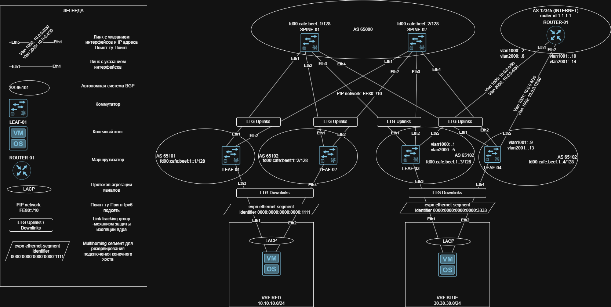
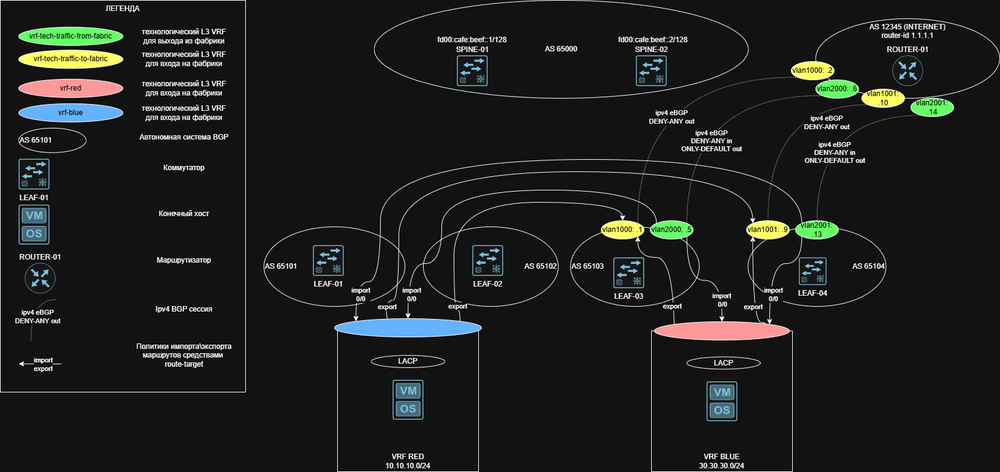

# Проектирование отказоустойчивой сетевой фабрики на базе протокола IPv6 с обеспечением внешнего подключения к сети Интернет.

---

## Введение

Целью данной работы является проектирование и реализация современной, масштабируемой и отказоустойчивой сетевой инфраструктуры центра обработки данных (ЦОД) или крупного предприятия. В основе проекта лежит технология VXLAN (Virtual Extensible LAN) в сочетании с протоколом EVPN (Ethernet VPN) для построения оверлейной (overlay) сети поверх физической транспортной (underlay) сети.

Ключевые требования, реализованные в проекте:

Отказоустойчивость: Архитектура не имеет единых точек отказа. Используется избыточное количество коммутаторов (2 Spine, 4 Leaf) и резервирование каналов (Link Tracking, EVPN Multihoming).

IPv6: Underlay сеть построена полностью на IPv6, что является современным стандартом и решает проблему нехватки IPv4-адресов на сетях ЦОД.

Мультиарендность (VRF): В фабрике созданы два клиентских VRF (vrf-red и vrf-blue) для изоляции трафика разных клиентов или сегментов сети. Количество VRF является демонстрационным и не ограничевается в будущем использовании решения. 

Внешнее подключение (Internet): Разработана схема подключения фабрики к внешнему маршрутизатору (или межсетевому экрану) для предоставления клиентам доступа в интернет. Реализована политика маршрутизации, исключающая прямой обмен трафиком между изолированными клиентами внутри фабрики.

---

## 1. Архитектура сети и адресное пространство

### 1.1. Топология "Spine-Leaf"

Сеть построена по классической двухуровневой топологии "Spine-Leaf", которая является стандартом для современных ЦОД благодаря своей предсказуемости, масштабируемости и высокой пропускной способности.

Spine-уровень: Два коммутатора (Spine-1, Spine-2) выполняют функцию ядра фабрики. Они не связаны между собой и служат только для транзита трафика между Leaf-коммутаторами. Все соединения между Spine и Leaf являются транками и используют протокол eBGP без каких-либо фильтраций для максимальной производительности.

Leaf-уровень: Четыре коммутатора (Leaf-01..04) являются точками подключения конечных устройств (серверов, клиентов) и внешнего маршрутизатора.

### 1.2. Адресное пространство и IPv6

Underlay (Физическая сеть): Для идентификации устройств и маршрутизации в underlay сети используются Loopback-интерфейсы с адресами из диапазона ULA (Unique Local Address) fd00::/8. Это позволяет построить изолированную и стабильную IP-сеть, не зависящую от глобальной интернет-связности.

**Адрес сети:** `fd00:cafe:beef::/48`  

| Устройство | IPv6-адрес       |
|------------|----------------|
| Spine-1    | fd00:cafe:beef::1/128 |
| Spine-2    | fd00:cafe:beef::2/128  |
| Leaf-1     | fd00:cafe:beef:1::1/128 |
| Leaf-2     | fd00:cafe:beef:1::2/128 |
| Leaf-3     | fd00:cafe:beef:1::3/128 |
| Leaf-4     | fd00:cafe:beef:1::4/128 |

PtP (Point-to-Point) линки: Для экономии адресного пространства и упрощения конфигурации на всех соединениях Spine-Leaf используется ipv6 address auto-config. Это позволяет коммутаторам динамически генерировать Link-Local адреса и строить BGP-сессии на их основе.

#### Интерфейсы SPINE-1
```
interface Ethernet1
   description TO-LEAF-1
   mtu 9000
   no switchport
   ipv6 enable
   ipv6 address auto-config
!
interface Ethernet2
   description TO-LEAF-2
   mtu 9000
   no switchport
   ipv6 enable
   ipv6 address auto-config
!
interface Ethernet3
   description TO-LEAF-3
   mtu 9000
   no switchport
   ipv6 enable
   ipv6 address auto-config
!
interface Ethernet4
   description TO-LEAF-04
   mtu 9000
   no switchport
   ipv6 enable
   ipv6 address auto-config
!
interface Loopback0
   description Router-ID
   ipv6 enable
   ipv6 address fd00:cafe:beef::1/128
```
#### Интерфейсы SPINE-2
```
interface Ethernet1
   description TO-LEAF-1
   mtu 9000
   no switchport
   ipv6 enable
   ipv6 address auto-config
!
interface Ethernet2
   description TO-LEAF-2
   mtu 9000
   no switchport
   ipv6 enable
   ipv6 address auto-config
!
interface Ethernet3
   description TO-LEAF-3
   mtu 9000
   no switchport
   ipv6 enable
   ipv6 address auto-config
!
interface Ethernet4
   description TO-LEAF-04
   mtu 9000
   no switchport
   ipv6 enable
   ipv6 address auto-config
!
interface Loopback0
   description Router-ID
   ipv6 enable
   ipv6 address fd00:cafe:beef::2/128
!
```

Для противодействия проблемы изоляции ядра, когда leaf остаётся без доступа к spine но не прекращает взаимодействие с ниже стоящим сегментом, использован механизм link tracking group

#### Интерфейсы LEAF-01

```
service routing protocols model multi-agent
!
link tracking group UPLINKS
   recovery delay 60
!
interface Ethernet1
   description TO-SPINE-1
   mtu 9000
   no switchport
   ipv6 enable
   ipv6 address auto-config
   link tracking group UPLINKS upstream
!
interface Ethernet2
   description TO-SPINE-2
   mtu 9000
   no switchport
   ipv6 enable
   ipv6 address auto-config
   link tracking group UPLINKS upstream
!
interface Ethernet3
   description TO-CLIENTS-1
   channel-group 1 mode active
!
interface Loopback0
   description Router-ID & Overlay Endpoint
   ipv6 enable
   ipv6 address fd00:cafe:beef:1::1/128
!
ipv6 unicast-routing
```

#### Интерфейсы LEAF-02

```
service routing protocols model multi-agent
!
link tracking group UPLINKS
   recovery delay 60
!
interface Ethernet1
   description TO-SPINE-1
   mtu 9000
   no switchport
   ipv6 enable
   ipv6 address auto-config
   link tracking group UPLINKS upstream
!
interface Ethernet2
   description TO-SPINE-2
   mtu 9000
   no switchport
   ipv6 enable
   ipv6 address auto-config
   link tracking group UPLINKS upstream
!
interface Ethernet4
   description TO_CLIENTS-01
   channel-group 1 mode active
!
interface Loopback0
   description Router-ID & Overlay Endpoint
   ipv6 enable
   ipv6 address fd00:cafe:beef:1::2/128
!
ipv6 unicast-routing
```

#### Интерфейсы LEAF-03

```
service routing protocols model multi-agent
!
link tracking group UPLINKS
   recovery delay 60
!
interface Ethernet1
   description TO-SPINE-1
   mtu 9000
   no switchport
   ipv6 enable
   ipv6 address auto-config
   link tracking group UPLINKS upstream
!
interface Ethernet2
   description TO-SPINE-2
   mtu 9000
   no switchport
   ipv6 enable
   ipv6 address auto-config
   link tracking group UPLINKS upstream
!
interface Ethernet3
   description TO_CLIENTS_02
   channel-group 1 mode active
!
interface Ethernet5
   description TO-ROUTER-01-ETH1
   switchport trunk allowed vlan 1000,2000
   switchport mode trunk
!
interface Loopback0
   ipv6 enable
   ipv6 address fd00:cafe:beef:1::3/128
!
ipv6 unicast-routing
!
```

#### Интерфейсы LEAF-04

```
service routing protocols model multi-agent
!
link tracking group UPLINKS
   recovery delay 60
!
interface Ethernet1
   description TO-SPINE-1
   mtu 9000
   no switchport
   ipv6 enable
   ipv6 address auto-config
!
interface Ethernet2
   description TO-SPINE-2
   mtu 9000
   no switchport
   ipv6 enable
   ipv6 address auto-config
!
interface Ethernet4
   description TO_CLIENTS_02
   channel-group 1 mode active
!
interface Ethernet5
   description TO_ROUTER-01-ETH5
   switchport trunk allowed vlan 1001,2001
   switchport mode trunk
!
interface Loopback0
   ipv6 enable
   ipv6 address fd00:cafe:beef:1::4/128
!
ipv6 unicast-routing
!
```

Подключение к роутеру: Так как роутер, не является частью IP фабрики, связь с ним осуществляется через VLANы с использованием обычных IPv4-адресов /30 подсетей. 

**Point-to-Point линки с роутером:**

| Соединение        | Подсеть       | Устройство | IP-адрес     |
|-------------------|---------------|------------|--------------|
| Leaf-03 ↔ Router-1  | 10.0.0.0/31   | Leaf-03    | 10.0.0.1/30  |
|                   |               | Router-1     | 10.0.0.2/30  |
| Leaf-03 ↔ Router-1  | 10.0.0.4/31   | Leaf-03    | 10.0.0.5/30  |
|                   |               | Router-1     | 10.0.0.6/30  |
| Leaf-04 ↔ Router-1  | 10.0.0.8/31   | Leaf-04    | 10.0.0.9/30  |
|                   |               | Router-1     | 10.0.0.10/30  |
| Leaf-04 ↔ Router-1  | 10.0.0.12/31   | Leaf-04    | 10.0.0.13/30  |
|                   |               | Router-1     | 10.0.0.14/30 |

### 1.3. Клиентские сети

Для тестирования используются IPv4-подсети клиентов (10.10.10.0/24, 30.30.30.0/24). Это демонстрирует способность VXLAN/EVPN фабрики инкапсулировать и прозрачно передавать как IPv4, так и IPv6 трафик клиентов.

#### CLIENTS-1
```
vlan 100
   name vlan-100
!
interface Port-Channel1
   description TO_FABRIC
   switchport access vlan 100
!
interface Ethernet1
   description TO_LEAF-01
   channel-group 1 mode active
!
interface Ethernet2
   description TO_LEAF-02
   channel-group 1 mode active
!
interface Vlan100
   description CLIENTS_NETWORK
   ip address 10.10.10.1/24
!
ip routing
!
ip route 0.0.0.0/0 10.10.10.254
!
end

```
#### CLIENTS-2
```
vlan 300
   name vlane-300
!
interface Port-Channel1
   description TO_FABRIC
   switchport access vlan 300
!
interface Ethernet1
   description TO-LEAF-03
   channel-group 1 mode active
!
interface Ethernet2
   description TO-LEAF-04
   channel-group 1 mode active
!
interface Vlan300
   ip address 30.30.30.1/24
!
ip routing
!
ip route 0.0.0.0/0 30.30.30.254
!
end

```

Со стороны leaf-01, leaf-04 используется MLAG (на основе evpn ethernet-segment). Что обеспечивает резервирование подключения клиентских сетей к IP фабрике.

#### LEAF-01 MH
```
!
interface Port-Channel1
   description TO_CLIENTS-01
   switchport access vlan 100
   !
   evpn ethernet-segment
      identifier 0000:0000:0000:0000:1111
      route-target import 00:00:00:00:11:11
   lacp system-id 0000.0000.1111
   link tracking group UPLINKS downstream
!
```

#### LEAF-02 MH
```
!
interface Port-Channel1
   description TO_CLIENTS-01
   switchport access vlan 100
   !
   evpn ethernet-segment
      identifier 0000:0000:0000:0000:1111
      route-target import 00:00:00:00:11:11
   lacp system-id 0000.0000.1111
   link tracking group UPLINKS downstream
!
```

#### LEAF-03 MH
```
!
interface Port-Channel1
   description TO_CLIENTS-02
   switchport access vlan 300
   !
   evpn ethernet-segment
      identifier 0000:0000:0000:0000:3333
      route-target import 00:00:00:00:33:33
   lacp system-id 0000.0000.3333
   link tracking group UPLINKS downstream
!
```

#### LEAF-04 MH
```
!
interface Port-Channel1
   description TO_CLIENTS-02
   switchport access vlan 300
   !
   evpn ethernet-segment
      identifier 0000:0000:0000:0000:3333
      route-target import 00:00:00:00:33:33
   lacp system-id 0000.0000.3333
   link tracking group UPLINKS downstream
!
```
---

## 3. Логическая схема IP 



---

## 4. Реализация Underlay и Overlay сети

### 4.1. Протокол маршрутизации Underlay: eBGP с IPv6

В качестве протокола динамической маршрутизации для underlay выбран eBGP.

Автономные системы (AS): Используется нумерация "Private AS Number". Всем Leaf-коммутаторам присвоены уникальные номера AS (из диапазона 65000-65534), а Spine-коммутаторы находятся в одной AS 65000. Это соответствует передовой практике RFC 7938, которая рекомендует eBGP в центрах обработки данных для упрощения работы и повышения предсказуемости.

**Таблица автономных систем:**

| Устройство | AS |
|------------|-----------|
| **Spine-1**| 65000    | 
| **Spine-2**| 65000    |
| **Leaf-01** | 65101    | 
| **Leaf-02** | 65102    | 
| **Leaf-03** | 65103    |
| **Leaf-04** | 65104    | 

### 4.2. eBGP на Spine:

Настроена динамическая листен-сессия (bgp listen range), что позволяет Spine автоматически устанавливать пиринг с новыми Leaf-коммутаторами по мере их подключения.

Пиринг устанавливается на основе Link-Local адресов, что избавляет от необходимости назначать PtP адреса.

Созданы две пир-группы: UNDERLAY (для обмена IPv6 маршрутами через прямые линки) и OVERLAY (для обмена EVPN маршрутами через Loopback-интерфейсы).

#### SPINE-1 BGP
```
router bgp 65000
   router-id 10.255.255.1
   no bgp default ipv4-unicast
   distance bgp 20 200 200
   maximum-paths 2
   bgp listen range fe80::/10 peer-group UNDERLAY peer-filter LEAVES_ASN
   neighbor OVERLAY peer group
   neighbor OVERLAY next-hop-unchanged
   neighbor OVERLAY out-delay 0
   neighbor OVERLAY update-source Loopback0
   neighbor OVERLAY ebgp-multihop 3
   neighbor OVERLAY send-community extended
   neighbor UNDERLAY peer group
   neighbor UNDERLAY out-delay 0
   neighbor fd00:cafe:beef:1::1 peer group OVERLAY
   neighbor fd00:cafe:beef:1::1 remote-as 65101
   neighbor fd00:cafe:beef:1::2 peer group OVERLAY
   neighbor fd00:cafe:beef:1::2 remote-as 65102
   neighbor fd00:cafe:beef:1::3 peer group OVERLAY
   neighbor fd00:cafe:beef:1::3 remote-as 65103
   neighbor fd00:cafe:beef:1::4 peer group OVERLAY
   neighbor fd00:cafe:beef:1::4 remote-as 65104
   !
   address-family evpn
      neighbor OVERLAY activate
   !
   address-family ipv6
      neighbor UNDERLAY activate
      network fd00:cafe:beef::1/128
!
end
```

#### SPINE-2 BGP
```
router bgp 65000
   router-id 10.255.255.2
   no bgp default ipv4-unicast
   distance bgp 20 200 200
   maximum-paths 2
   bgp listen range fe80::/10 peer-group UNDERLAY peer-filter LEAVES_ASN
   neighbor OVERLAY peer group
   neighbor OVERLAY next-hop-unchanged
   neighbor OVERLAY out-delay 0
   neighbor OVERLAY update-source Loopback0
   neighbor OVERLAY ebgp-multihop 3
   neighbor OVERLAY send-community extended
   neighbor UNDERLAY peer group
   neighbor UNDERLAY out-delay 0
   neighbor fd00:cafe:beef:1::1 peer group OVERLAY
   neighbor fd00:cafe:beef:1::1 remote-as 65101
   neighbor fd00:cafe:beef:1::2 peer group OVERLAY
   neighbor fd00:cafe:beef:1::2 remote-as 65102
   neighbor fd00:cafe:beef:1::3 peer group OVERLAY
   neighbor fd00:cafe:beef:1::3 remote-as 65103
   neighbor fd00:cafe:beef:1::4 peer group OVERLAY
   neighbor fd00:cafe:beef:1::4 remote-as 65104
   !
   address-family evpn
      neighbor OVERLAY activate
   !
   address-family ipv6
      neighbor UNDERLAY activate
      network fd00:cafe:beef::2/128

```

Настроены BGP-сессии в address-family evpn между Loopback-интерфейсами всех Leaf и Spine. Spine выступают в роли маршрутных отражателей (Route Reflectors), что значительно упрощает конфигурацию на Leaf (им не нужно строить сессии друг с другом).

neighbor OVERLAY next-hop-unchanged на Spine - критически важная настройка для EVPN, которая гарантирует, что в качестве следующего перехода (next-hop) для маршрутов всегда будет указан оригинальный Leaf-VTEP, а не Spine.

### 4.3. eBGP на Leaf:

Устанавливают сессии с соседними Spine-коммутаторами.

Анонсируют свой Loopback-адрес (network fd00:cafe:beef:1::X/128) в underlay BGP, чтобы он был достижим для всех остальных устройств фабрики.

#### LEAF-01 BGP
```
router bgp 65101
   router-id 10.255.255.11
   no bgp default ipv4-unicast
   distance bgp 20 200 200
   maximum-paths 2
   neighbor OVERLAY peer group
   neighbor OVERLAY remote-as 65000
   no neighbor OVERLAY next-hop-unchanged
   neighbor OVERLAY out-delay 0
   neighbor OVERLAY update-source Loopback0
   neighbor OVERLAY ebgp-multihop 3
   neighbor OVERLAY send-community extended
   neighbor UNDERLAY peer group
   neighbor UNDERLAY out-delay 0
   neighbor UNDERLAY send-community extended
   neighbor fd00:cafe:beef::1 peer group OVERLAY
   neighbor fd00:cafe:beef::2 peer group OVERLAY
   neighbor interface Et1-2 peer-group UNDERLAY remote-as 65000
   !
   address-family evpn
      neighbor OVERLAY activate
   !
   address-family ipv6
      neighbor UNDERLAY activate
      network fd00:cafe:beef:1::1/128
   !
!
end
```

#### LEAF-02 BGP
```
router bgp 65102
   router-id 10.255.255.12
   no bgp default ipv4-unicast
   distance bgp 20 200 200
   maximum-paths 2
   neighbor OVERLAY peer group
   neighbor OVERLAY remote-as 65000
   neighbor OVERLAY out-delay 0
   neighbor OVERLAY update-source Loopback0
   neighbor OVERLAY ebgp-multihop 3
   neighbor OVERLAY send-community extended
   neighbor UNDERLAY peer group
   neighbor UNDERLAY out-delay 0
   neighbor UNDERLAY send-community extended
   neighbor fd00:cafe:beef::1 peer group OVERLAY
   neighbor fd00:cafe:beef::2 peer group OVERLAY
   redistribute connected
   neighbor interface Et1-2 peer-group UNDERLAY remote-as 65000
   !
   address-family evpn
      neighbor OVERLAY activate
   !
   address-family ipv6
      neighbor UNDERLAY activate
      network fd00:cafe:beef:1::2/128
!
end

```

#### LEAF-03 BGP
```
router bgp 65103
   router-id 10.255.255.13
   no bgp default ipv4-unicast
   distance bgp 20 200 200
   maximum-paths 2
   neighbor OVERLAY peer group
   neighbor OVERLAY remote-as 65000
   neighbor OVERLAY out-delay 0
   neighbor OVERLAY update-source Loopback0
   neighbor OVERLAY ebgp-multihop 3
   neighbor OVERLAY send-community extended
   neighbor UNDERLAY peer group
   neighbor UNDERLAY out-delay 0
   neighbor UNDERLAY send-community extended
   neighbor fd00:cafe:beef::1 peer group OVERLAY
   neighbor fd00:cafe:beef::2 peer group OVERLAY
   neighbor interface Et1-2 peer-group UNDERLAY remote-as 65000
   !
   address-family evpn
      neighbor OVERLAY activate
   !
   address-family ipv6
      neighbor UNDERLAY activate
      network fd00:cafe:beef:1::3/128
!
end

```

#### LEAF-04 BGP
```
router bgp 65104
   router-id 10.255.255.14
   no bgp default ipv4-unicast
   distance bgp 20 200 200
   maximum-paths 2
   neighbor OVERLAY peer group
   neighbor OVERLAY remote-as 65000
   neighbor OVERLAY out-delay 0
   neighbor OVERLAY update-source Loopback0
   neighbor OVERLAY ebgp-multihop 3
   neighbor OVERLAY send-community extended
   neighbor ROUTER peer group
   neighbor ROUTER remote-as 12345
   neighbor UNDERLAY peer group
   neighbor UNDERLAY out-delay 0
   neighbor UNDERLAY send-community extended
   neighbor fd00:cafe:beef::1 peer group OVERLAY
   neighbor fd00:cafe:beef::2 peer group OVERLAY
   neighbor interface Et1-2 peer-group UNDERLAY remote-as 65000
   !
   address-family evpn
      neighbor OVERLAY activate
   !
   address-family ipv6
      neighbor UNDERLAY activate
      network fd00:cafe:beef:1::4/128
!
end
```

### 4.4. Оверлейная сеть: VXLAN с управлением EVPN

VXLAN используется для создания туннелей между Leaf-коммутаторами (VTEP - VXLAN Tunnel End Points), инкапсулируя трафик клиентов в UDP-пакеты и передавая его через underlay сеть.
EVPN служит контрольной плоскостью для VXLAN, распространяя информацию о MAC-адресах, маршрутах и VNI (VXLAN Network Identifier) через BGP.

#### LEAF-01 BGP-OVERLAY
```
router bgp 65101
   !
   vlan 100
      rd auto
      route-target both 65101:19100
      redistribute learned
   !
   vrf vrf-red
      rd 10.255.255.11:3089
      route-target import evpn 65000:2000
      route-target import evpn 65000:3089
      route-target export evpn 65000:1000
      route-target export evpn 65000:3089
      redistribute connected
!
end

---------------------------------------------------------------------------
                                      VXLAN
---------------------------------------------------------------------------

vlan 100
   name vlan-100
!
vrf instance vrf-red
!
interface Vlan100
   vrf vrf-red
   ip address virtual 10.10.10.254/24
!
interface Vxlan1
   vxlan source-interface Loopback0
   vxlan udp-port 4789
   vxlan encapsulation ipv6
   vxlan vlan 100 vni 19100
   vxlan vrf vrf-red vni 3089
!
ip virtual-router mac-address 00:00:00:00:00:12
!
ip routing 
ip routing vrf vrf-red
!
```
#### LEAF-02 BGP-OVERLAY
```
router bgp 65102
   !
   vlan 100
      rd auto
      route-target both 65101:19100
   !
   vrf vrf-red
      rd 10.255.255.12:3089
      route-target import evpn 65000:2000
      route-target import evpn 65000:3089
      route-target export evpn 65000:1000
      route-target export evpn 65000:3089
      redistribute connected
!
end

---------------------------------------------------------------------------
                                      VXLAN
---------------------------------------------------------------------------

vlan 100
   name vlan-100
!
vrf instance vrf-red
!
interface Vlan100
   vrf vrf-red
   ip address virtual 10.10.10.254/24
!
interface Vxlan1
   vxlan source-interface Loopback0
   vxlan udp-port 4789
   vxlan encapsulation ipv6
   vxlan vlan 100 vni 19100
   vxlan vrf vrf-red vni 3089
!
ip virtual-router mac-address 00:00:00:00:00:12
!
ip routing
ip routing vrf vrf-red
!
ipv6 unicast-routing
```

#### LEAF-03 BGP-OVERLAY
```
router bgp 65103
   !
   vlan 300
      rd auto
      route-target both 65103:19300
      redistribute learned
   !
   vrf vrf-blue
      rd 10.255.255.13:4089
      route-target import evpn 65000:2000
      route-target import evpn 65000:4089
      route-target export evpn 65000:1000
      route-target export evpn 65000:4089
      redistribute connected
!
end

---------------------------------------------------------------------------
                                      VXLAN
---------------------------------------------------------------------------

vlan 300
   name vlan-300
!
vlan 1000
   name router_peering_input_to_fabric
!
vlan 2000
   name router_peering_output_from_fabri
!
vrf instance vrf-red
!
vrf instance vrf-tech-traffic-from-fabric
!
vrf instance vrf-tech-traffic-to-fabric
!
interface Vlan300
   vrf vrf-blue
   ip address 30.30.30.254/24
!
interface Vlan1000
   description INCOMING
   vrf vrf-tech-traffic-to-fabric
   ip address 10.0.0.1/30
!
interface Vlan2000
   description OUTGOIN
   vrf vrf-tech-traffic-from-fabric
   ip address 10.0.0.5/30
!
interface Vxlan1
   vxlan source-interface Loopback0
   vxlan udp-port 4789
   vxlan encapsulation ipv6
   vxlan vlan 300 vni 19300
   vxlan vlan 1000 vni 191000
   vxlan vlan 2000 vni 192000
   vxlan vrf vrf-blue vni 4089
   vxlan vrf vrf-tech-traffic-from-fabric vni 2000
   vxlan vrf vrf-tech-traffic-to-fabric vni 1000
!
ip virtual-router mac-address 00:00:00:00:00:34
!
ip routing
ip routing vrf vrf-blue
ip routing vrf vrf-tech-traffic-from-fabric
ip routing vrf vrf-tech-traffic-to-fabric
!
ipv6 unicast-routing
!

```

#### LEAF-04 BGP-OVERLAY

```
router bgp 65104
   !
   vlan 300
      rd auto
      route-target both 65103:19300
      redistribute learned
   !
   vrf vrf-blue
      rd 10.255.255.14:4089
      route-target import evpn 65000:2000
      route-target import evpn 65000:4089
      route-target export evpn 65000:1000
      route-target export evpn 65000:4089
      redistribute connected
!
end

---------------------------------------------------------------------------
                                      VXLAN
---------------------------------------------------------------------------

vlan 300
   name vlan-300
!
vlan 1001
   name router_peering_input_to_fabric
!
vlan 2001
   name router_peering_output_from_fabri
!
vrf instance vrf-blue
!
vrf instance vrf-tech-traffic-from-fabric
!
vrf instance vrf-tech-traffic-to-fabric
!
interface Vlan300
   vrf vrf-blue
   ip address 30.30.30.254/24
!
interface Vlan1001
   description INCOMING
   vrf vrf-tech-traffic-to-fabric
   ip address 10.0.0.9/30
!
interface Vlan2001
   description OUTGOING
   vrf vrf-tech-traffic-from-fabric
   ip address 10.0.0.13/30

!
interface Vxlan1
   vxlan source-interface Loopback0
   vxlan udp-port 4789
   vxlan encapsulation ipv6
   vxlan vlan 300 vni 19300
   vxlan vlan 1001 vni 191001
   vxlan vlan 2001 vni 192001
   vxlan vrf vrf-blue vni 4089
   vxlan vrf vrf-tech-traffic-from-fabric vni 2000
   vxlan vrf vrf-tech-traffic-to-fabric vni 1000
!
ip virtual-router mac-address 00:00:00:00:00:34
!
ip routing
ip routing vrf vrf-blue
ip routing vrf vrf-tech-traffic-from-fabric
ip routing vrf vrf-tech-traffic-to-fabric

```
VXLAN Configuration:

vxlan source-interface Loopback0 - указывает, что IP-адрес Loopback0 будет использоваться как источник для VXLAN-туннелей.

vxlan vlan <VLAN> vni <VNI> - маппинг клиентских VLAN на VNI в фабрике (например, VLAN 100 -> VNI 19100).

vxlan vrf <VRF> vni <L3VNI> - маппинг клиентских VRF на L3VNI (например, vrf-red -> VNI 3089). L3VNI используется для организации маршрутизации между разными VLAN внутри одного VRF или между разными VRF.

---

## 5. Обеспечение внешнего подключения (Internet)

Для подключения фабрики к внешнему миру используется граничный маршрутизатор Router-1.

### 5.1. Модель подключения (Option A)

Реализована модель, аналогичная "Option A" (VRF-to-VRF или "back-to-back VRF") в контексте MPLS L3VPN. Поскольку роутер не является частью VXLAN/EVPN домена, связь с ним осуществляется через обычные VLAN и IP-интерфейсы на граничных Leaf-03 и Leaf-04.

#### LEAF-03 BGP-CONNECT-INTERNET
```
router bgp 65103
   !
   vlan 1000
      rd auto
      route-target both 65103:1000
      redistribute learned
   !
   vlan 2000
      rd auto
      route-target both 65103:2000
      redistribute learned
   !
   address-family ipv4
      neighbor ROUTER activate
   !
   vrf vrf-tech-traffic-from-fabric
      rd 10.255.255.13:2000
      route-target import evpn 65000:2000
      route-target export evpn 65000:2000
      timers bgp 60 180 min-hold-time 3
      neighbor 10.0.0.6 remote-as 12345
      !
      address-family ipv4
         neighbor 10.0.0.6 activate
   !
   vrf vrf-tech-traffic-to-fabric
      rd 10.255.255.13:1000
      route-target import evpn 65000:1000
      route-target export evpn 65000:1000
      timers bgp 60 180 min-hold-time 3
      neighbor 10.0.0.2 remote-as 12345
      !
      address-family ipv4
         neighbor 10.0.0.2 activate
!
end

```

#### LEAF-04 BGP-CONNECT-INTERNET

```
router bgp 65104
   !
   vlan 1001
      rd auto
      route-target both 65104:1001
      redistribute learned
   !
   vlan 2001
      rd auto
      route-target both 65104:2001
      redistribute learned
   !
   address-family ipv4
      neighbor ROUTER activate
   !
   vrf vrf-tech-traffic-from-fabric
      rd 10.255.255.14:2000
      route-target import evpn 65000:2000
      route-target export evpn 65000:2000
      neighbor 10.0.0.14 remote-as 12345
      !
      address-family ipv4
         neighbor 10.0.0.14 activate
   !
   vrf vrf-tech-traffic-to-fabric
      rd 10.255.255.14:1000
      route-target import evpn 65000:1000
      route-target export evpn 65000:1000
      neighbor 10.0.0.10 remote-as 12345
      !
      address-family ipv4
         neighbor 10.0.0.10 activate
!
end
```


### 5.2. Архитектура подключения

Специализированные VRF: На Leaf-03 и Leaf-04 созданы два технологических VRF:

vrf-tech-traffic-to-fabric: предназначен для маршрутов, которые импортируются из фабрики и передаются на роутер.

vrf-tech-traffic-from-fabric: предназначен для маршрутов, получаемых от роутера (включая маршрут по умолчанию), которые затем экспортируются в фабрику.

VLAN и VNI: Каждому из этих VRF на каждом Leaf соответствует свой VLAN и свой VNI:

VRF "to-fabric": VLAN 1000/1001, VNI 191000/191001.

VRF "from-fabric": VLAN 2000/2001, VNI 192000/192001.

BGP-сессии с роутером: На каждом из Leaf-03/04 в технологических VRF поднимаются обычные eBGP IPv4 сессии с Router-1.

Управление маршрутами через Route Target:

Leaf-03 и Leaf-04 импортируют в свои клиентские VRF (vrf-red, vrf-blue) маршруты, которые имеют Route Target 65000:2000 (это RT, с которым экспортируются маршруты из VRF "from-fabric").

Клиентские VRF, в свою очередь, экспортируют свои маршруты с RT 65000:1000, которые импортируются в VRF "to-fabric" на Leaf-03/04.

Таким образом, маршруты клиентов 10.10.10.0/24 и 30.30.30.0/24 автоматически появляются в VRF "to-fabric" и передаются на Router-1, а маршрут по умолчанию от Router-1 (0.0.0.0/0) попадает в VRF "from-fabric" и затем редистрибутится в клиентские VRF через RT 65000:2000.

### 5.3. Политика на Router-1

На Router-1 настроены жесткие префикс-листы, чтобы гарантировать, что:

В фабрику анонсируется только маршрут по умолчанию (0.0.0.0/0).

От фабрики принимаются только специфические маршруты клиентских подсетей, но ни в коем случае не маршрут по умолчанию или другие служебные маршруты. Это предотвращает петли маршрутизации.

#### ROUTER-1
```
!
vlan 1000
   name TO-FABRIC-LEAF03
!
vlan 1001
   name TO-FABRIC-LEAF04
!
vlan 2000
   name FROM-FABRIC-LEAF03
!
vlan 2001
   name FROM-FABRIC-LEAF04
!
interface Ethernet1
   description TO_LEAF-03
   switchport trunk allowed vlan 1000,2000
   switchport mode trunk
!
interface Ethernet2
   description TO_LEAF-04
   switchport trunk allowed vlan 1001,2001
   switchport mode trunk
!
interface Loopback0
   description Router-ID
   ip address 1.1.1.1/32
!
interface Vlan1000
   description INCOMING-LEAF03
   ip address 10.0.0.2/30
!
interface Vlan1001
   description INCOMING-LEAF04
   ip address 10.0.0.10/30
!
interface Vlan2000
   description OUTGOING-LEAF03
   ip address 10.0.0.6/30
!
interface Vlan2001
   description OUTGOING-LEAF04
   ip address 10.0.0.14/30
!
ip routing
!
ip prefix-list DENY-ANY
   seq 20 deny 0.0.0.0/0 le 32
!
ip prefix-list ONLY-DEFAULT
   seq 10 permit 0.0.0.0/0
   seq 1000 deny 0.0.0.0/0 le 32
!
ip route 0.0.0.0/0 Null0
!
router bgp 12345
   router-id 1.1.1.1
   distance bgp 20 200 200
   maximum-paths 2
   neighbor LEAF-03-INPUT peer group
   neighbor LEAF-03-INPUT remote-as 65103
   neighbor LEAF-03-OUTPUT peer group
   neighbor LEAF-03-OUTPUT remote-as 65103
   neighbor LEAF-04-INPUT peer group
   neighbor LEAF-04-INPUT remote-as 65104
   neighbor LEAF-04-OUTPUT peer group
   neighbor LEAF-04-OUTPUT remote-as 65104
   neighbor 10.0.0.1 peer group LEAF-03-INPUT
   neighbor 10.0.0.5 peer group LEAF-03-OUTPUT
   neighbor 10.0.0.9 peer group LEAF-04-INPUT
   neighbor 10.0.0.13 peer group LEAF-04-OUTPUT
   redistribute static
   !
   address-family ipv4
      neighbor LEAF-03-INPUT activate
      neighbor LEAF-03-INPUT prefix-list DENY-ANY out
      neighbor LEAF-03-OUTPUT activate
      neighbor LEAF-03-OUTPUT prefix-list DENY-ANY in
      neighbor LEAF-03-OUTPUT prefix-list ONLY-DEFAULT out
      neighbor LEAF-04-INPUT activate
      neighbor LEAF-04-INPUT prefix-list DENY-ANY out
      neighbor LEAF-04-OUTPUT activate
      neighbor LEAF-04-OUTPUT prefix-list DENY-ANY in
      neighbor LEAF-04-OUTPUT prefix-list ONLY-DEFAULT out
!
end

```
---

## 6. Логическая схема IP



---

## 7. Тестирование и проверка работоспособности
Проведенные тесты полностью подтверждают корректность работы спроектированной схемы:

Проверка обмена с роутером (Leaf-03): Команды show ip bgp neighbors ... received-routes и advertised-routes подтверждают, что Leaf-03 получает от роутера маршрут по умолчанию и успешно анонсирует ему все клиентские сети.

```
LEAF-3#
LEAF-3#show ip bgp neighbors 10.0.0.6 received-routes vrf vrf-tech-traffic-from-fabric
BGP routing table information for VRF vrf-tech-traffic-from-fabric
Router identifier 10.0.0.5, local AS number 65103
Route status codes: s - suppressed contributor, * - valid, > - active, E - ECMP head, e - ECMP
                    S - Stale, c - Contributing to ECMP, b - backup, L - labeled-unicast
                    % - Pending BGP convergence
Origin codes: i - IGP, e - EGP, ? - incomplete
RPKI Origin Validation codes: V - valid, I - invalid, U - unknown
AS Path Attributes: Or-ID - Originator ID, C-LST - Cluster List, LL Nexthop - Link Local Nexthop

          Network                Next Hop              Metric  AIGP       LocPref Weight  Path
 * >      0.0.0.0/0              10.0.0.6              -       -          -       -       12345 ?

-----------------------------------------------------------------------------------------------------------------------

LEAF-3#
LEAF-3#show ip bgp neighbors 10.0.0.2 advertised-routes vrf vrf-tech-traffic-to-fabric
BGP routing table information for VRF vrf-tech-traffic-to-fabric
Router identifier 10.0.0.1, local AS number 65103
Route status codes: s - suppressed contributor, * - valid, > - active, E - ECMP head, e - ECMP
                    S - Stale, c - Contributing to ECMP, b - backup, L - labeled-unicast, q - Queued for advertisement
                    % - Pending BGP convergence
Origin codes: i - IGP, e - EGP, ? - incomplete
RPKI Origin Validation codes: V - valid, I - invalid, U - unknown
AS Path Attributes: Or-ID - Originator ID, C-LST - Cluster List, LL Nexthop - Link Local Nexthop

          Network                Next Hop              Metric  AIGP       LocPref Weight  Path
 * >      10.0.0.10/32           10.0.0.1              -       -          -       -       65103 65000 65104 i
 * >Ec    10.10.10.0/24          10.0.0.1              -       -          -       -       65103 65000 65102 i
 * >      10.10.10.1/32          10.0.0.1              -       -          -       -       65103 65000 65101 i
 * >      30.30.30.0/24          10.0.0.1              -       -          -       -       65103 i


```

Проверка таблицы маршрутизации Router-1: На роутере видны все клиентские сети, причем с двумя равнозначными next-hop (10.0.0.1 и 10.0.0.9), что обеспечивает балансировку нагрузки и отказоустойчивость при подключении через два разных Leaf.

```
ROUTER-01#show ip route

VRF: default
Codes: C - connected, S - static, K - kernel,
       O - OSPF, IA - OSPF inter area, E1 - OSPF external type 1,
       E2 - OSPF external type 2, N1 - OSPF NSSA external type 1,
       N2 - OSPF NSSA external type2, B - Other BGP Routes,
       B I - iBGP, B E - eBGP, R - RIP, I L1 - IS-IS level 1,
       I L2 - IS-IS level 2, O3 - OSPFv3, A B - BGP Aggregate,
       A O - OSPF Summary, NG - Nexthop Group Static Route,
       V - VXLAN Control Service, M - Martian,
       DH - DHCP client installed default route,
       DP - Dynamic Policy Route, L - VRF Leaked,
       G  - gRIBI, RC - Route Cache Route

Gateway of last resort:
 S        0.0.0.0/0 is directly connected, Null0

 C        1.1.1.1/32 is directly connected, Loopback0
 C        10.0.0.0/30 is directly connected, Vlan1000
 C        10.0.0.4/30 is directly connected, Vlan2000
 C        10.0.0.8/30 is directly connected, Vlan1001
 C        10.0.0.12/30 is directly connected, Vlan2001
 B E      10.10.10.1/32 [20/0] via 10.0.0.1, Vlan1000
                               via 10.0.0.9, Vlan1001
 B E      10.10.10.0/24 [20/0] via 10.0.0.1, Vlan1000
                               via 10.0.0.9, Vlan1001
 B E      30.30.30.0/24 [20/0] via 10.0.0.1, Vlan1000
                               via 10.0.0.9, Vlan1001
```

Проверка EVPN маршрутов Type-5 (Leaf-01, Leaf-03): Вывод show bgp evpn route-type ip-prefix ipv4 демонстрирует, что Leaf получили все необходимые маршруты 5-го типа (IP Prefix). Критически важно, что Leaf-1 видит маршрут по умолчанию 0.0.0.0/0 с двумя next-hop fd00:cafe:beef:1::3 и fd00:cafe:beef:1::4 (Leaf-03 и Leaf-04), что гарантирует отказоустойчивость внешнего подключения.

```
LEAF-1#show bgp evpn route-type ip-prefix ipv4
BGP routing table information for VRF default
Router identifier 10.255.255.11, local AS number 65101
Route status codes: * - valid, > - active, S - Stale, E - ECMP head, e - ECMP
                    c - Contributing to ECMP, % - Pending BGP convergence
Origin codes: i - IGP, e - EGP, ? - incomplete
AS Path Attributes: Or-ID - Originator ID, C-LST - Cluster List, LL Nexthop - Link Local Nexthop

          Network                Next Hop              Metric  LocPref Weight  Path
 * >      RD: 10.255.255.13:2000 ip-prefix 0.0.0.0/0
                                 fd00:cafe:beef:1::3   -       100     0       65000 65103 12345 ?
 * >      RD: 10.255.255.14:2000 ip-prefix 0.0.0.0/0
                                 fd00:cafe:beef:1::4   -       100     0       65000 65104 12345 ?
 * >      RD: 10.255.255.11:3089 ip-prefix 10.10.10.0/24
                                 -                     -       -       0       i
 * >      RD: 10.255.255.12:3089 ip-prefix 10.10.10.0/24
                                 fd00:cafe:beef:1::2   -       100     0       65000 65102 i
 * >      RD: 10.255.255.13:4089 ip-prefix 30.30.30.0/24
                                 fd00:cafe:beef:1::3   -       100     0       65000 65103 i
 * >      RD: 10.255.255.14:4089 ip-prefix 30.30.30.0/24
                                 fd00:cafe:beef:1::4   -       100     0       65000 65104 i

------------------------------------------------------------------------------------------------------------------

LEAF-3#show bgp evpn route-type ip-prefix ipv4
BGP routing table information for VRF default
Router identifier 10.255.255.13, local AS number 65103
Route status codes: * - valid, > - active, S - Stale, E - ECMP head, e - ECMP
                    c - Contributing to ECMP, % - Pending BGP convergence
Origin codes: i - IGP, e - EGP, ? - incomplete
AS Path Attributes: Or-ID - Originator ID, C-LST - Cluster List, LL Nexthop - Link Local Nexthop

          Network                Next Hop              Metric  LocPref Weight  Path
 * >      RD: 10.255.255.13:2000 ip-prefix 0.0.0.0/0
                                 -                     -       100     0       12345 ?
 * >      RD: 10.255.255.14:2000 ip-prefix 0.0.0.0/0
                                 fd00:cafe:beef:1::4   -       100     0       65000 65104 12345 ?
 * >      RD: 10.255.255.11:3089 ip-prefix 10.10.10.0/24
                                 fd00:cafe:beef:1::1   -       100     0       65000 65101 i
 * >      RD: 10.255.255.12:3089 ip-prefix 10.10.10.0/24
                                 fd00:cafe:beef:1::2   -       100     0       65000 65102 i
 * >      RD: 10.255.255.13:4089 ip-prefix 30.30.30.0/24
                                 -                     -       -       0       i
 * >      RD: 10.255.255.14:4089 ip-prefix 30.30.30.0/24
                                 fd00:cafe:beef:1::4   -       100     0       65000 65104 i
```

Проверка VRF-таблиц клиентов (Leaf-01, Leaf-03):

В VRF vrf-red на Leaf-01 появился маршрут по умолчанию, указывающий на VXLAN-туннели к Leaf-03 и Leaf-04.

```
LEAF-1#show ip route vrf vrf-red

VRF: vrf-red
Codes: C - connected, S - static, K - kernel,
       O - OSPF, IA - OSPF inter area, E1 - OSPF external type 1,
       E2 - OSPF external type 2, N1 - OSPF NSSA external type 1,
       N2 - OSPF NSSA external type2, B - Other BGP Routes,
       B I - iBGP, B E - eBGP, R - RIP, I L1 - IS-IS level 1,
       I L2 - IS-IS level 2, O3 - OSPFv3, A B - BGP Aggregate,
       A O - OSPF Summary, NG - Nexthop Group Static Route,
       V - VXLAN Control Service, M - Martian,
       DH - DHCP client installed default route,
       DP - Dynamic Policy Route, L - VRF Leaked,
       G  - gRIBI, RC - Route Cache Route

Gateway of last resort:
 B E      0.0.0.0/0 [20/0] via VTEP fd00:cafe:beef:1::3 VNI 2000 router-mac 50:00:00:15:f4:e8 local-interface Vxlan1
                           via VTEP fd00:cafe:beef:1::4 VNI 2000 router-mac 50:00:00:6b:2e:70 local-interface Vxlan1

 B E      10.0.0.6/32 [20/0] via VTEP fd00:cafe:beef:1::3 VNI 2000 router-mac 50:00:00:15:f4:e8 local-interface Vxlan1
 B E      10.0.0.14/32 [20/0] via VTEP fd00:cafe:beef:1::4 VNI 2000 router-mac 50:00:00:6b:2e:70 local-interface Vxlan1
 C        10.10.10.0/24 is directly connected, Vlan100

```

В VRF vrf-blue на Leaf-03 появился локальный маршрут по умолчанию, полученный напрямую от роутера.
Это главное подтверждение того, что клиенты получают интернет, но при этом полностью изолированы друг от друга.

```
LEAF-3#show ip route vrf vrf-blue

VRF: vrf-blue
Codes: C - connected, S - static, K - kernel,
       O - OSPF, IA - OSPF inter area, E1 - OSPF external type 1,
       E2 - OSPF external type 2, N1 - OSPF NSSA external type 1,
       N2 - OSPF NSSA external type2, B - Other BGP Routes,
       B I - iBGP, B E - eBGP, R - RIP, I L1 - IS-IS level 1,
       I L2 - IS-IS level 2, O3 - OSPFv3, A B - BGP Aggregate,
       A O - OSPF Summary, NG - Nexthop Group Static Route,
       V - VXLAN Control Service, M - Martian,
       DH - DHCP client installed default route,
       DP - Dynamic Policy Route, L - VRF Leaked,
       G  - gRIBI, RC - Route Cache Route

Gateway of last resort:
 B L      0.0.0.0/0 [20/0] (source VRF vrf-tech-traffic-from-fabric) via 10.0.0.6, Vlan2000 (egress VRF vrf-tech-traffic-from-fabric)

 B E      10.0.0.14/32 [20/0] via VTEP fd00:cafe:beef:1::4 VNI 2000 router-mac 50:00:00:6b:2e:70 local-interface Vxlan1
 C        30.30.30.0/24 is directly connected, Vlan300

```

Проверка связи между клиентами (CLIENTS-01, CLIENTS-02):

```
CLIENTS-01#ping 30.30.30.1 source 10.10.10.1
PING 30.30.30.1 (30.30.30.1) from 10.10.10.1 : 72(100) bytes of data.
80 bytes from 30.30.30.1: icmp_seq=1 ttl=60 time=508 ms
80 bytes from 30.30.30.1: icmp_seq=2 ttl=60 time=634 ms
80 bytes from 30.30.30.1: icmp_seq=3 ttl=60 time=634 ms
80 bytes from 30.30.30.1: icmp_seq=4 ttl=60 time=640 ms
80 bytes from 30.30.30.1: icmp_seq=5 ttl=60 time=644 ms

--- 30.30.30.1 ping statistics ---
5 packets transmitted, 5 received, 0% packet loss, time 52ms
rtt min/avg/max/mdev = 508.076/612.501/644.641/52.345 ms, pipe 5, ipg/ewma 13.174/562.335 ms

```

Ping между CLIENTS-01 и CLIENTS-02 есть. Это показывает связность двух устройств через ROUTER-01, используя маршрут по умолчанию. 

---

## 8. Выводы

В ходе выполнения проектной работы была успешно спроектирована и сконфигурирована отказоустойчивая сетевая фабрика на базе протокола IPv6.

Основные достижения и выводы:

Построена надежная Underlay сеть: Использование eBGP с IPv6 и уникальной нумерацией AS обеспечило детерминированную и масштабируемую IP-связность между всеми сетевыми элементами.

Развернута масштабируемая Overlay сеть: Применение VXLAN с управляющей плоскостью EVPN позволило создать логические сегменты сети (L2 и L3), которые не зависят от физической топологии. Использование L3VNI обеспечило эффективную маршрутизацию между этими сегментами.

Реализована полная мультиарендность: Клиенты были успешно размещены в изолированных VRF (vrf-red и vrf-blue). С помощью Route Target-ов настроена политика импорта и экспорта маршрутов, гарантирующая, что клиенты не имеют прямой (в обход ROUTER-01) связи друг с другом.

Обеспечено отказоустойчивое внешнее подключение: Схема с двумя граничными Leaf-коммутаторами, каждый из которых имеет две BGP-сессии с внешним роутером в специальных технологических VRF, обеспечивает высокую доступность интернет-канала. Маршрут по умолчанию успешно распространяется во все клиентские VRF.

Достигнута высокая отказоустойчивость:

Два Spine-коммутатора исключают простой при выходе из строя одного из них.

MLAG (на основе evpn ethernet-segment) на Leaf-коммутаторах обеспечивает резервирование подключения серверов.

Link Tracking Groups связывают состояние аплинков (к Spine) и даунлинков (к серверам), позволяя быстро реагировать на аварии.

ECMP (Equal-Cost Multi-Path) балансирует трафик как в underlay, так и в overlay сетях.

Предложенное решение является современным, масштабируемым и полностью соответствует требованиям, предъявляемым к инфраструктуре крупных организаций и ЦОД. Оно может быть легко расширено для подключения новых клиентов, добавления новых сервисов и интеграции с межсетевыми экранами для реализации сложных политик безопасности.

## 9. Использованные инструменты и материалы

1. Для подготовки схем был использован инструмент draw.io (v29.6.1)
2. Для моделирования топологии использован инструмент eve.ng (Qemu version: 2.4.0, API version: 6.0.1-12)
3. В качестве сетевых устройств использовался виртуальный роутер производителя ARISTA (veos-4.29.2F)
4. Учебные матриеалы предоставлены образовательной организацией OTUS (otus.ru) по курсу "Дизайн сетей ЦОД от 26.11.2025"
5. Презентация подготовлна при помощи нейросети (deepseek.com)
6. Подготовка концепции, моделирование топологии, разработка схем, настройка и тестирование сетевых устройств, выполнена стундентом курса "Дизайн сетей ЦОД" Чайкин Сергей Сергеевич. (Телеграм: @schaykin) 